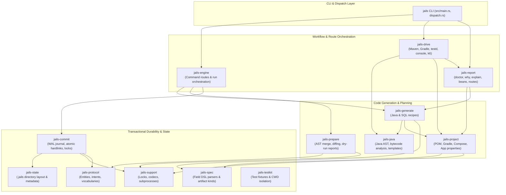
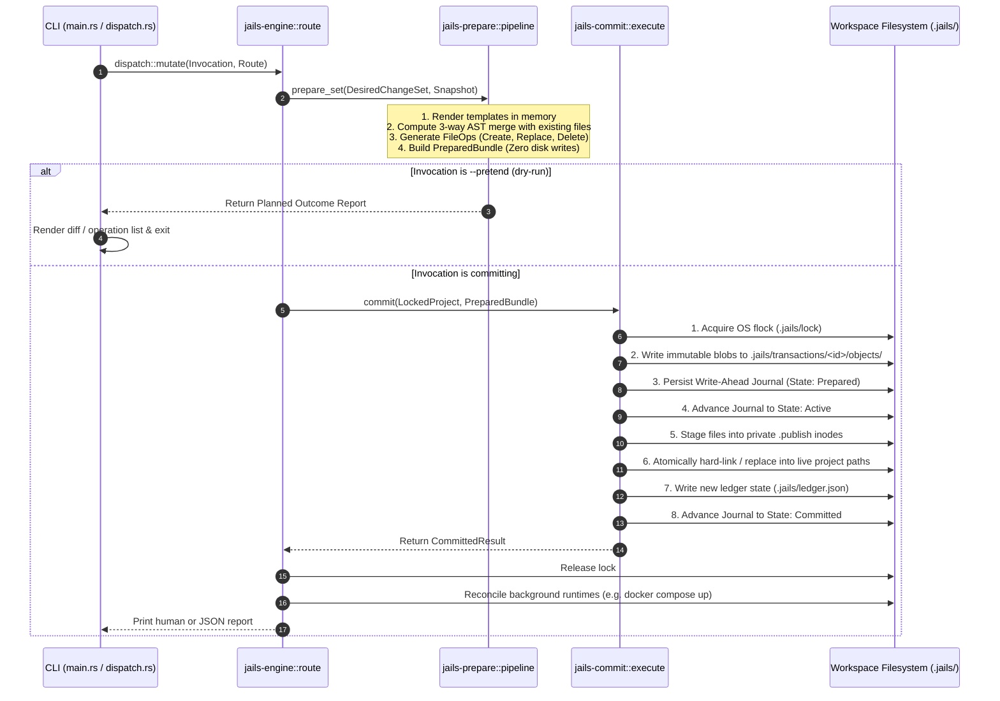
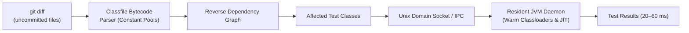

# Architecture of `jails`

This document provides a comprehensive guide to the internal architecture, design principles, crate boundaries, and execution lifecycle of **`jails`**. It is written for newcomers and contributors who want to understand how the codebase is organized and how each component fits together.

---

## 1. System Overview & Philosophy

[`jails`](file:///home/laith/code/jails/README.md) is an opinionated developer CLI and scaffolding tool for **Java / Spring Boot** and plain Maven projects, inspired by Rails' developer experience.

### Core Architectural Tenets
1. **Explicit Ports & Adapters (Hexagonal Architecture)**: Domain models are pure Java records. Persistence layers are explicit interfaces with derived raw-JDBC implementations (`JdbcClient`) and in-memory test fakes. No heavy ORMs (Hibernate/JPA) are generated.
2. **Transactional Codebase Mutations**: Every mutation—generating a scaffold, adding a capability, modifying `pom.xml` or `application.properties`—is treated as an atomic, journaled database transaction with full dry-run parity (`--pretend`).
3. **Two-Phase Commit & Roll-Forward Durability**: Multi-file writes are staged into private transaction inodes and hard-linked into the project root. Interrupted executions roll forward on the next invocation rather than leaving half-written files.
4. **Sub-Second Feedback Loops**: Includes a resident JVM test daemon ([`testd`](file:///home/laith/code/jails/crates/jails-drive/src/testd.rs)) that cuts JUnit turnaround time to **20–60ms** by analyzing constant pools in `.class` bytecode to test only affected files.

---

## 2. Layered Crate Architecture

The repository is organized into distinct crates in the [`crates/`](file:///home/laith/code/jails/crates) directory. Dependencies flow downward only; cycles are prevented at compile time.

---

## 3. Crate Responsibilities Index

| Crate | Directory | Purpose |
| :--- | :--- | :--- |
| [**`jails`**](file:///home/laith/code/jails/src/main.rs) | [`src/`](file:///home/laith/code/jails/src) | CLI argument parser ([Clap](file:///home/laith/code/jails/src/main.rs#L31-L69)), global flags (`--pretend`, `--output`), and [dispatch router](file:///home/laith/code/jails/src/dispatch.rs). |
| [**`jails-engine`**](file:///home/laith/code/jails/crates/jails-engine/README.md) | [`crates/jails-engine/`](file:///home/laith/code/jails/crates/jails-engine) | Connects parsed CLI requests to recipes, runs preparation, acquires project locks, and calls the commit engine. |
| [**`jails-prepare`**](file:///home/laith/code/jails/crates/jails-prepare/README.md) | [`crates/jails-prepare/`](file:///home/laith/code/jails/crates/jails-prepare) | In-memory transaction planner: calculates diffs, AST merges, file operations, and prepares execution bundles. |
| [**`jails-commit`**](file:///home/laith/code/jails/crates/jails-commit/README.md) | [`crates/jails-commit/`](file:///home/laith/code/jails/crates/jails-commit) | The durable transaction executor: handles file locks (`flock`), Write-Ahead Logging (`.jails/`), staged publishing, and crash recovery. |
| [**`jails-generate`**](file:///home/laith/code/jails/crates/jails-generate/README.md) | [`crates/jails-generate/`](file:///home/laith/code/jails/crates/jails-generate) | Code generation recipes for Java, Spring Boot, and PostgreSQL (scaffolds, repositories, controllers, migrations). |
| [**`jails-project`**](file:///home/laith/code/jails/crates/jails-project/README.md) | [`crates/jails-project/`](file:///home/laith/code/jails/crates/jails-project) | Project introspection and manipulation: Maven `pom.xml`, Gradle builds, `compose.yaml`, and `application.properties`. |
| [**`jails-java`**](file:///home/laith/code/jails/crates/jails-java/README.md) | [`crates/jails-java/`](file:///home/laith/code/jails/crates/jails-java) | Java AST syntax inspection, mustache-style template rendering, and `.class` bytecode constant-pool analysis. |
| [**`jails-drive`**](file:///home/laith/code/jails/crates/jails-drive/README.md) | [`crates/jails-drive/`](file:///home/laith/code/jails/crates/jails-drive) | Active runners: executes Maven/Gradle builds, manages the [`testd`](file:///home/laith/code/jails/crates/jails-drive/src/testd.rs) background JVM daemon, and interactive consoles (`psql`, Kafka). |
| [**`jails-report`**](file:///home/laith/code/jails/crates/jails-report/README.md) | [`crates/jails-report/`](file:///home/laith/code/jails/crates/jails-report) | Read-only diagnostic tools: [`doctor`](file:///home/laith/code/jails/crates/jails-report/src/doctor.rs) checks, [`why`](file:///home/laith/code/jails/crates/jails-report/src/why.rs) log diagnosis, routes, bean dependency graphs. |
| [**`jails-protocol`**](file:///home/laith/code/jails/crates/jails-protocol/README.md) | [`crates/jails-protocol/`](file:///home/laith/code/jails/crates/jails-protocol) | Domain types, strongly-typed newtypes, closed vocabularies, and transaction schema contracts. |
| [**`jails-spec`**](file:///home/laith/code/jails/crates/jails-spec/README.md) | [`crates/jails-spec/`](file:///home/laith/code/jails/crates/jails-spec) | Parser for the field specification DSL (`name:string!`, `user_id:uuid?`, `@scope`, `@index`). |
| [**`jails-state`**](file:///home/laith/code/jails/crates/jails-state/README.md) | [`crates/jails-state/`](file:///home/laith/code/jails/crates/jails-state) | Directory listing and state inspection underneath `.jails/`. |
| [**`jails-support`**](file:///home/laith/code/jails/crates/jails-support/README.md) | [`crates/jails-support/`](file:///home/laith/code/jails/crates/jails-support) | Reusable utilities: OS file locking (`flock`), process execution, error modeling. |
| [**`jails-testkit`**](file:///home/laith/code/jails/crates/jails-testkit/README.md) | [`crates/jails-testkit/`](file:///home/laith/code/jails/crates/jails-testkit) | Test infrastructure: atomic scratch directories, project fixtures, process-global CWD locking. |

---

## 4. The Mutation Lifecycle (Transaction Protocol)

Every state change in `jails` runs through the transaction protocol implemented in [`jails-engine`](file:///home/laith/code/jails/crates/jails-engine/src/route/commit.rs) and [`jails-commit`](file:///home/laith/code/jails/crates/jails-commit/src/execute.rs).

### Key Guarantees
1. **Zero Intermediate State**: A file is never written directly to its live path. It is staged in a private transaction directory and atomically linked into place.
2. **Crash Recovery (Roll Forward)**: If the process is terminated mid-commit, the journal on disk records the transaction ID and state. The next invocation runs recovery, detects the active journal, and finishes applying the remaining staged operations.
3. **Idempotence**: Re-running a generation or capability installation detects existing matching files and emits no-ops.

---

## 5. Fast Test Daemon (`testd`)

One of `jails`' most significant developer-experience features is [`jails testd`](file:///home/laith/code/jails/crates/jails-drive/src/testd.rs).

- **Warm JVM**: Cold `mvn test` costs 1–2 seconds per invocation because of JVM boot, Surefire plugin initialization, and classloading. A resident JVM keeps classloaders warm.
- **Bytecode Dependency Analysis**: [`jails-java::classfile`](file:///home/laith/code/jails/crates/jails-java/src/classfile.rs) reads compiled `.class` constant pools in `target/classes` to construct an in-memory reverse dependency graph. Running `jails testd --affected` identifies and runs *only* the test classes that transitively depend on what you just edited.

---

## 6. How to Explore the Codebase

1. **Start with the CLI entrypoint**: Read [`src/main.rs`](file:///home/laith/code/jails/src/main.rs) and [`src/dispatch.rs`](file:///home/laith/code/jails/src/dispatch.rs) to see how CLI subcommands are defined and routed.
2. **Follow a Generation Command**:
   - Inspect [`jails-generate::generate`](file:///home/laith/code/jails/crates/jails-generate/src/generate.rs) to see how domain records, DTOs, and controllers are constructed.
   - Inspect [`jails-engine::route::artifact`](file:///home/laith/code/jails/crates/jails-engine/src/route/artifact.rs) to trace how an artifact recipe turns into a transaction.
3. **Understand the Transaction Engine**:
   - Read [`jails-prepare::pipeline`](file:///home/laith/code/jails/crates/jails-prepare/src/pipeline.rs) to see how diffs and merges are prepared.
   - Read [`jails-commit::execute`](file:///home/laith/code/jails/crates/jails-commit/src/execute.rs) to see the 11-step atomic commit sequence.
4. **Explore Diagnostics & Driving**:
   - See [`jails-report::doctor`](file:///home/laith/code/jails/crates/jails-report/src/doctor.rs) for environment checking logic.
   - See [`jails-drive::run`](file:///home/laith/code/jails/crates/jails-drive/src/run.rs) and [`jails-drive::testd`](file:///home/laith/code/jails/crates/jails-drive/src/testd.rs) for build and test orchestration.
