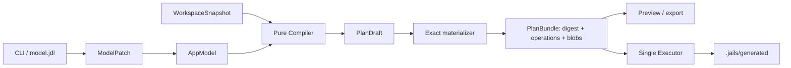
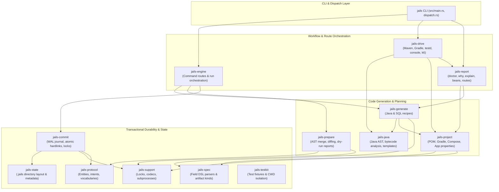
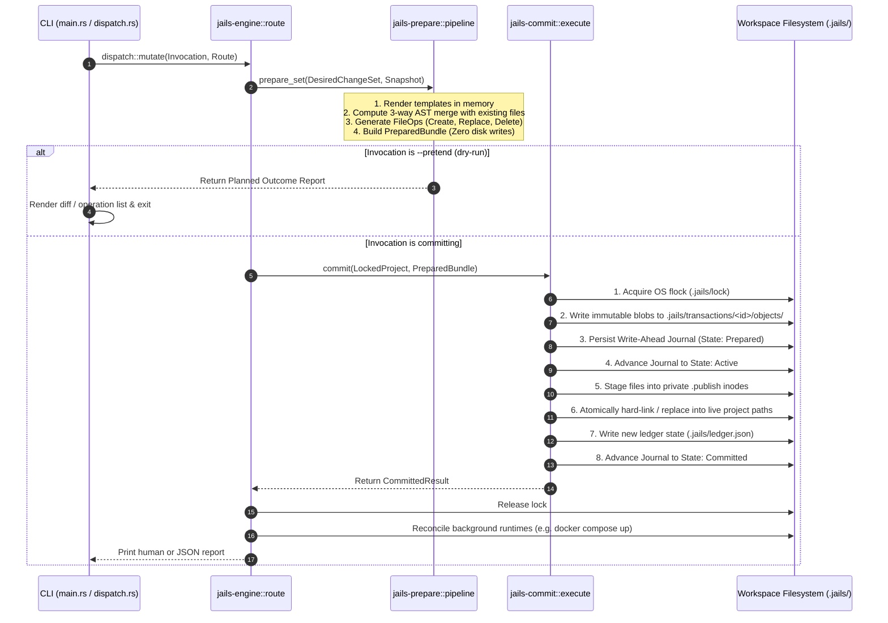
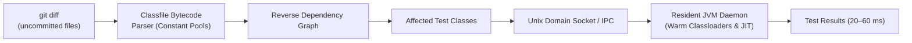

# Architecture of `jails`

This document provides a comprehensive guide to the internal architecture, design principles, crate boundaries, and execution lifecycle of **`jails`**. It is written for newcomers and contributors who want to understand how the codebase is organized and how each component fits together.

---

## Canonical compiler architecture (active cutover)

The target architecture is not another collection of generators. Jails owns
one semantic application model and compiles it into an exact managed tree:

The architecture has six load-bearing contracts:

1. `jails-model::AppModel` is the only desired-state authority. Explicit stable
   IDs survive renames; target-language names are projections.
2. `jails-contracts::WorkspaceSnapshot` captures external facts once. The
   compiler cannot read a project root, environment variable, or process.
3. `jails-compiler::Compiler` is deterministic semantic lowering, not a
   filesystem-aware generator.
4. `jails-contracts::PlanBundle` contains the exact content-addressed operation
   set the reader reviewed. Apply verifies it and does not compile again.
5. `jails-workspace::execute` is the only canonical project mutation owner.
   It checks captured preconditions, publishes exact after-images, and is
   convergent when retried.
6. Canonical `jails sync` is compile-and-execute over these contracts. It never
   constructs a legacy route, journal, object store, or receipt.

Tool features are model state too. In canonical projects, `test --fast`
declares a stable `fast-test` capability and lets the compiler reconcile the
JUnit console dependency; its inverse removes the node. Test launching is not
a hidden mutation side channel into the legacy engine.

Canonical mode remains explicit until every advertised new-project workflow
has a compiler backend. `new-cli` and `new --app` seed a model and are
canonical; ordinary `new`, offline Spring and Gradle stay on the compatibility
engine. `.jails/model.jdl` is
the human-source cutover boundary; `.jails/model.toml` is a temporary compiler
compatibility input for existing canonical projects. Implemented canonical
mutations and one-way import now write JDL. The two
editable inputs are mutually exclusive.

The first one-way importer covers legacy ledgers containing records and enums.
Adoption is a template-transition three-way merge per artifact: the legacy
object-store base, current reader file, and canonical compiler artifact. An
enum ABI and its Spring converter therefore move independently without losing
edits to either. Merged units enter the managed tree, their old reader paths are
removed, and the canonical model and lock are published by the same exact plan.
A source change after planning makes the whole import stale. The importer never
rewrites its legacy ledger, and refuses any declaration it cannot translate
losslessly.

Generated source is merge-managed below `.jails/generated`: the compiler lock
holds the one exact accepted projection as BASE, capture supplies OURS, and the
next model renders THEIRS. Persisting BASE is irreducible for generic merge
across emitter upgrades; it is one projection, not object history or a journal.
Clean merges become exact plan after-images; conflicts refuse before writes.
The lock records its compiler version and digests both the accepted model and
projection. It advances to THEIRS, not merged bytes, so hand edits remain
deltas. Irreversible migrations and explicit patches to
reader files are plan operations, not renderer side effects. `model eject`
transfers one implementation boundary into reader source, records the
ownership transfer, and excludes every artifact in that boundary from later managed
trees. Records and ports remain managed ABI.
Destinations must be captured as missing and collision refuses before a plan
exists; ownership is never guessed from file contents.
Artifact identity also survives path changes. Canonical preserve-table rename
updates only the Java projection, joins old and new rendered paths by stable
artifact ID, and merges the old live file into the new destination. The entity
ID and SQL projection stay unchanged. Destination collisions and overlapping
line edits refuse before the model or managed tree is written.

Field evolution is a typed `ModelPatch`, not lifecycle replay. A replacement
must keep the field ID and model label; Java and SQL names are independent
projections. Preserve-column rename advances the accepted model without a
migration, while single-cutover rename appends `rename column`. Safe type
change lowers only proven PostgreSQL widenings. Making a field required embeds
captured reader SQL before `set not null`; making it nullable emits `drop not
null`. Removal needs the exact accepted column name and is blocked by stable-ID
operation edges. The model syntax edit is byte-preserving outside the one
field declaration, and generated Java still goes through BASE/OURS/THEIRS.
Composite and ordered indexes are stable entity children, not renderer flags;
adding one appends exactly one forward `create index` migration. Removing one
requires its exact accepted SQL name and appends `drop index`; it never edits
the accepted create migration, and direct deletion without that semantic
policy refuses. Stored entity
retirement is also model state. Preserve marks the entity inactive and removes
its projections without SQL, exact-table revival reuses the preserved table,
and confirmed drop removes the node and appends `drop table`. Inactive entities
cannot acquire fields, indexes, or operation edges.

The cutover is currently partial in one direction only: **every advertised
generator (39 of 39) and capability (25 of 25) has a compiler backend**, held
by an exhaustive match over the `clap::ValueEnum` that defines each vocabulary,
so a word added without one fails to compile rather than at the cutover. What
is still partial is the *deletion* — the legacy crates are all still present,
and ordinary `jails new` still creates a project that uses them. `scaffold` is
a semantic profile over record, repository, service and HTTP facets rather than
a separate planner. All four operation kinds lower from linked stable identities to typed
managed Java ABI. Familiar `usecase`, `query`, `transition`, and `event`
frontends append those declarations as `ModelPatch` operations; executable
Spring HTTP adapters are compiler-owned by the `api` capability, while business
implementations remain reader-owned. Plain `class`, `interface`, `service`,
`sealed`, `test`, and `integration-test` generators lower to one typed
source-unit node; class, service, and exhaustive sealed companion tests and
standalone tests are ordinary merge-managed artifacts. Sealed variants evolve
by replacing that one semantic node, so the interface and exhaustive test move
together through the same three-way merge. `integration-test` additionally declares one
build-tool-neutral feature: the Maven adapter renders Failsafe, while the
Gradle adapter renders separate unit/integration tasks. Removing the last such
unit removes only the exact marked feature block, and edits to that block
refuse. `factory` is an entity facet, not a standalone recipe: its ejectable
testkit artifact recompiles from the entity fields on every evolution, while
the record remains a non-ejectable managed ABI. Stable generated sections give
the generic merge durable anchors for reader-added methods; edits to generated
state still refuse atomically. Unsupported generator kinds refuse in a canonical project. The
`repo` generator adds one `@repository` entity facet rather than recording a
port/JDBC/test recipe. The repository port remains managed ABI, while `fake`
and `db` implementations keep independently ejectable capability-scoped
artifacts. A stable reader-extension boundary lets the generic merge preserve
hand-added port methods while key-type evolution still refuses overlapping
signature edits. `strategy` is a typed open-set source unit: the port is a
non-ejectable ABI, the evaluator and each ordered implementation/test pair are
separate ejectable artifacts, and changing variants or signature types is one
semantic replacement through the generic merge. `controller` is a typed HTTP
adapter unit: method, path, request type, response type, and request format are
closed model values. Its controller and test have distinct merge artifact IDs
but share one ejection ID, so ordinary edits merge per file while ownership
transfer moves the complete HTTP adapter boundary. Unsupported generator kinds
refuse in a canonical project. Small capabilities use one declarative pack
registry for files, template class names, dependencies, placement, and
ejection boundaries. CSV, JSON, HTTP, Fake, Testkit, SQLite, and H2 share that engine;
Testkit also proves resources participate in the same merge and ownership
transfer as Java. SQLite deliberately lowers its initial SQL through the
append-only migration channel instead: removing or ejecting its Java
implementation cannot erase migration history.
H2 uses the same pack declaration for its test artifact, Boot-sensitive
dependencies, and main/test properties; reader-owned property lines remain
outside that owned key set.
The `dto` generator adds one `@dto` entity facet. It emits request, response,
and contract-test files with three
independent merge artifact IDs, so reader edits in each file survive later
field evolution independently. Those wire contracts remain non-ejectable
managed ABI; destroy removes the facet's three projections without removing
the domain record. The facet also declares its validation dependency through
the compiler's build-document intent. The
legacy graph described below remains operational for projects without
`.jails/model.jdl` (or temporary `.jails/model.toml` compatibility input) until
capabilities, multi-release schema campaigns, the remaining reader-document
adapters, operation backends, and compose have moved
and differential E2E proves the replacement. Maven and Gradle generated-source
root integration is source-set-aware and materializes exact `PatchReaderFile`
operations for main and test roots. Build features are likewise typed compiler
intents rather than Maven coordinates smuggled through Java emission.

Capabilities are global semantic profiles. `fake` emits in-memory repository
adapters, `db` emits JDBC repositories, owns schema migrations, and lowers
canonical commands, queries, and transitions to `JdbcClient` adapters, and `api`
emits Spring controllers for routed command/query/transition ABI. Every file
has a unique merge artifact ID; cohesive adapter files may share one ejection
boundary ID. The captured live bytes for the selected boundary are transferred
atomically so pre-ejection hand edits survive, while records and ports remain
managed. Database command, query, and transition implementations each carry a
separate capability-plus-operation artifact identity; ejecting one cannot move
another implementation or its ABI. Dependencies are separate semantic nodes,
never pseudo-capabilities:
the compiler lowers the complete dependency set to one exact, marked Maven or
Gradle document intent, so add, remove, repair and convergence share one path.
Settings are also semantic nodes keyed by stable identity and target. The
compiler lowers the complete main/test setting sets to exact properties
intents; the workspace adapter preserves unrelated lines, refuses reader-owned
key collisions, and can safely create a previously missing file because that
absence is part of the plan precondition.
Unsupported capabilities fail before legacy dispatch, so canonical projects
never mix transaction/state engines.

Canonical destroy is model subtraction or explicit retirement followed by
ordinary compilation. It removes an operation, retires a stored entity with
preserve/drop policy, validates that no stable-ID edge dangles, and invokes the
same compiler. The resulting managed-tree intent three-way merges every live
projection and deletes only a cleanly owned projection that disappeared;
exact-plan E2E proves preview, plan-out, apply and frozen convergence.

---

## 1. Legacy system overview during cutover

[`jails`](README.md) is an opinionated developer CLI and scaffolding tool for **Java / Spring Boot** and plain Maven projects, inspired by Rails' developer experience.

### Legacy architectural tenets
1. **Explicit Ports & Adapters (Hexagonal Architecture)**: Domain models are pure Java records. Persistence layers are explicit interfaces with derived raw-JDBC implementations (`JdbcClient`) and in-memory test fakes. No heavy ORMs (Hibernate/JPA) are generated.
2. **Transactional Codebase Mutations**: Every mutation—generating a scaffold, adding a capability, modifying `pom.xml` or `application.properties`—is treated as an atomic, journaled database transaction with full dry-run parity (`--pretend`).
3. **Two-Phase Commit & Roll-Forward Durability**: Multi-file writes are staged into private transaction inodes and hard-linked into the project root. Interrupted executions roll forward on the next invocation rather than leaving half-written files.
4. **Sub-Second Feedback Loops**: Includes a resident JVM test daemon ([`testd`](crates/jails-drive/src/testd.rs)) that cuts JUnit turnaround time to **20–60ms** by analyzing constant pools in `.class` bytecode to test only affected files.

---

## 2. Layered Crate Architecture

The repository is organized into distinct crates in the [`crates/`](crates) directory. Dependencies flow downward only; cycles are prevented at compile time.

---

## 3. Crate Responsibilities Index

Nineteen crates: the **four canonical** ones the cutover is building toward,
**thirteen legacy** ones the strangler will delete, and **two leaves** that
belong to neither ladder. A crate may only depend on one below it, and Cargo
enforces that; `no_module_depends_on_a_layer_above_its_own` in
`tests/architecture/` enforces the same rule for module-level edges the
compiler cannot see. The `LAYERS` table in `tests/architecture/rules.rs` is the
authority on which crate a module belongs to — this index is prose, and prose
is what goes stale.

### The canonical ladder, lowest first

| Crate | Directory | Contract |
| :--- | :--- | :--- |
| **`jails-model`** | [`crates/jails-model/`](crates/jails-model) | Closed source schema, stable IDs, linking, semantic diagnostics, `AppModel` and `ModelPatch`. Both JDL dialects parse here. |
| **`jails-contracts`** | [`crates/jails-contracts/`](crates/jails-contracts) | Portable `WorkspaceSnapshot`, `PlanDraft`, exact `Plan`, operations, trees and blobs. |
| **`jails-compiler`** | [`crates/jails-compiler/`](crates/jails-compiler) | Pure semantic lowering to a desired artifact tree. No filesystem, environment or subprocess access — held by `canonical_compiler_is_pure_after_capture`. |
| **`jails-workspace`** | [`crates/jails-workspace/`](crates/jails-workspace) | Capture, exact materialization, verification, and the single canonical executor. |

### Neither ladder

| Crate | Directory | Purpose |
| :--- | :--- | :--- |
| **`jails-codemod`** | [`crates/jails-codemod/`](crates/jails-codemod) | The marked block (`# jails:<marker>`), and only that. **No dependencies at all**, which is the point: it lived in `jails-project` until three more implementations appeared in crates that cannot depend on it. |
| **`jails-codec-derive`** | [`crates/jails-codec-derive/`](crates/jails-codec-derive) | The `#[derive(Codec)]` proc macro. |

### The legacy ladder, lowest first

| Crate | Directory | Purpose |
| :--- | :--- | :--- |
| [**`jails`**](src/main.rs) | [`src/`](src) | CLI argument parser ([`cli.rs`](src/cli.rs)), global flags (`--pretend`, `--output`), the [dispatch router](src/dispatch.rs), and the canonical `model_*` frontends. |
| [**`jails-engine`**](crates/jails-engine/README.md) | [`crates/jails-engine/`](crates/jails-engine) | Connects parsed CLI requests to recipes, runs preparation, acquires project locks, and calls the commit engine. |
| [**`jails-prepare`**](crates/jails-prepare/README.md) | [`crates/jails-prepare/`](crates/jails-prepare) | In-memory transaction planner: calculates diffs, AST merges, file operations, and prepares execution bundles. |
| [**`jails-commit`**](crates/jails-commit/README.md) | [`crates/jails-commit/`](crates/jails-commit) | The durable transaction executor: handles file locks (`flock`), Write-Ahead Logging (`.jails/`), staged publishing, and crash recovery. |
| [**`jails-generate`**](crates/jails-generate/README.md) | [`crates/jails-generate/`](crates/jails-generate) | Code generation recipes for Java, Spring Boot, and PostgreSQL (scaffolds, repositories, controllers, migrations). |
| [**`jails-project`**](crates/jails-project/README.md) | [`crates/jails-project/`](crates/jails-project) | Project introspection and manipulation: Maven `pom.xml`, Gradle builds, `compose.yaml`, and `application.properties`. |
| [**`jails-java`**](crates/jails-java/README.md) | [`crates/jails-java/`](crates/jails-java) | Java AST syntax inspection, mustache-style template rendering, and `.class` bytecode constant-pool analysis. |
| [**`jails-drive`**](crates/jails-drive/README.md) | [`crates/jails-drive/`](crates/jails-drive) | Active runners: executes Maven/Gradle builds, manages the [`testd`](crates/jails-drive/src/testd.rs) background JVM daemon, and interactive consoles (`psql`, Kafka). |
| [**`jails-report`**](crates/jails-report/README.md) | [`crates/jails-report/`](crates/jails-report) | Read-only diagnostic tools: [`doctor`](crates/jails-report/src/doctor.rs) checks, [`why`](crates/jails-report/src/why.rs) log diagnosis, routes, bean dependency graphs. |
| [**`jails-protocol`**](crates/jails-protocol/README.md) | [`crates/jails-protocol/`](crates/jails-protocol) | The plan/transition/effect vocabulary: recipes, intents, closed vocabularies, and transaction schema contracts. The validating newtypes it used to own now live in `jails-support`, because the crates that outlive the cutover need them and this one does not. |
| [**`jails-spec`**](crates/jails-spec/README.md) | [`crates/jails-spec/`](crates/jails-spec) | Parser for the field specification DSL (`name:string!`, `user_id:uuid?`, `@scope`, `@index`). |
| [**`jails-state`**](crates/jails-state/README.md) | [`crates/jails-state/`](crates/jails-state) | Directory listing and state inspection underneath `.jails/`. |
| [**`jails-support`**](crates/jails-support/README.md) | [`crates/jails-support/`](crates/jails-support) | Write, run, encode, and name: the apply layer (the only module that writes), OS file locking (`flock`), process execution, error modeling, and the validating newtypes (`identity`, `identifier`). |
| [**`jails-testkit`**](crates/jails-testkit/README.md) | [`crates/jails-testkit/`](crates/jails-testkit) | Test infrastructure: atomic scratch directories, project fixtures, process-global CWD locking. |

---

## 4. The Mutation Lifecycle (Transaction Protocol)

Every state change in `jails` runs through the transaction protocol implemented in [`jails-engine`](crates/jails-engine/src/route/commit.rs) and [`jails-commit`](crates/jails-commit/src/execute.rs).

### Key Guarantees
1. **Zero Intermediate State**: A file is never written directly to its live path. It is staged in a private transaction directory and atomically linked into place.
2. **Crash Recovery (Roll Forward)**: If the process is terminated mid-commit, the journal on disk records the transaction ID and state. The next invocation runs recovery, detects the active journal, and finishes applying the remaining staged operations.
3. **Idempotence**: Re-running a generation or capability installation detects existing matching files and emits no-ops.

---

## 5. Fast Test Daemon (`testd`)

One of `jails`' most significant developer-experience features is [`jails testd`](crates/jails-drive/src/testd.rs).

- **Warm JVM**: Cold `mvn test` costs 1–2 seconds per invocation because of JVM boot, Surefire plugin initialization, and classloading. A resident JVM keeps classloaders warm.
- **Bytecode Dependency Analysis**: [`jails-java::classfile`](crates/jails-java/src/classfile.rs) reads compiled `.class` constant pools in `target/classes` to construct an in-memory reverse dependency graph. Running `jails testd --affected` identifies and runs *only* the test classes that transitively depend on what you just edited.

---

## 6. How to Explore the Codebase

1. **Start with the CLI entrypoint**: Read [`src/main.rs`](src/main.rs) and [`src/dispatch.rs`](src/dispatch.rs) to see how CLI subcommands are defined and routed.
2. **Follow a Generation Command**:
   - Inspect [`jails-generate::generate`](crates/jails-generate/src/generate.rs) to see how domain records, DTOs, and controllers are constructed.
   - Inspect [`jails-engine::route::artifact`](crates/jails-engine/src/route/artifact.rs) to trace how an artifact recipe turns into a transaction.
3. **Understand the Transaction Engine**:
   - Read [`jails-prepare::pipeline`](crates/jails-prepare/src/pipeline.rs) to see how diffs and merges are prepared.
   - Read [`jails-commit::execute`](crates/jails-commit/src/execute.rs) to see the 11-step atomic commit sequence.
4. **Explore Diagnostics & Driving**:
   - See [`jails-report::doctor`](crates/jails-report/src/doctor.rs) for environment checking logic.
   - See [`jails-drive::run`](crates/jails-drive/src/run.rs) and [`jails-drive::testd`](crates/jails-drive/src/testd.rs) for build and test orchestration.
