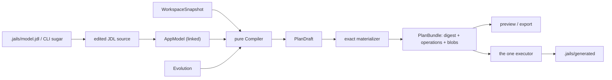

# Architecture of `jails`

`jails` is a semantic application compiler with a Rails-shaped command line.
Its source is one application model; its generated tree is merge-managed by
stable artifact identity; its irreversible output is an explicit evolution
plan; and its executor applies exactly the plan the reader reviewed.

`README.md` is the user-facing surface. `CLAUDE.md` describes what the code is
and the traps in it. `docs/` holds the contracts, the JDL specification and the
open work. This file is the map.

## The pipeline

Capture reads every external fact once into a `WorkspaceSnapshot`. The front
ends turn the CLI's sugar into an edit of `.jails/model.jdl`, and the model is
whatever the edited source links to; what the source cannot say -- how the
accepted schema reaches the next model -- is an `Evolution` passed beside it.
The linker resolves and validates the model. The compiler lowers it to a
desired artifact tree without touching the filesystem. Materialization freezes that tree into
one content-addressed `PlanBundle`. Preview renders the bundle; apply executes
it and never plans again.

## The five contracts

- **`AppModel` is desired-state authority.** Stable IDs carry identity; Java,
  SQL, route and configuration names are projections of it.
- **`WorkspaceSnapshot` captures every external fact once.** Code below the
  compiler may observe the filesystem; the compiler may not.
- **`Compiler` is pure.** Equal snapshot, model, evolution and compiler version produce
  equal desired artifacts.
- **`PlanBundle` is the exact reviewed transition.** Preview, export,
  confirmation and apply all refer to its digest.
- **`jails-workspace::execute` is the only project writer.** It locks, rechecks
  preconditions, publishes exact after-images, and converges on retry.

## Managed output

Reproducible output lives below `.jails/generated` and is merge-managed. The
accepted model renders BASE, capture supplies OURS, and the next model renders
THEIRS. Clean merges are frozen into the plan; conflicts refuse without writes.
The compiler lock records the accepted model and projection digests and
advances to THEIRS, so hand edits remain deltas.

Migrations, model revisions and explicit reader-file patches are irreproducible
operations and appear in the plan as themselves. `model eject <artifact-id>`
transfers one implementation boundary into reader source and excludes it from
later managed trees; records and ports remain managed ABI.

Every reader-owned file jails edits -- `pom.xml`, `build.gradle`,
`compose.yaml`, `application.properties`, `jails.toml` -- is changed by an
exact `PatchReaderFile` operation with a captured before-image, through a
marked block or a per-key adapter that preserves every unrelated byte.

## Crates

Dependencies flow downward only. Cargo enforces it between crates;
`no_module_depends_on_a_layer_above_its_own` in `tests/architecture/` enforces
it between modules, and the `LAYERS` table there is the authority on which
crate a module belongs to.

### The compiler ladder, lowest first

| crate | contract |
|---|---|
| `jails-model` | closed source schema, stable IDs, linking, semantic diagnostics, `AppModel` and `Evolution` |
| `jails-contracts` | portable `WorkspaceSnapshot`, `PlanDraft`, exact `Plan`, operations, trees and blobs |
| `jails-compiler` | pure semantic lowering to a desired artifact tree; no filesystem, environment or subprocess access |
| `jails-workspace` | capture, exact materialization, verification and the single executor |

### Shared leaves

| crate | contract |
|---|---|
| `jails-codemod` | the marked block and the `@Import` splice; no dependencies, so every crate can reach it |
| `jails-support` | write, run, encode and name: the apply layer (the only module that writes), process execution, locks, scratch directories, the validating newtypes |
| `jails-spec` | the closed CLI vocabularies and where a project is |
| `jails-java` | the small Java reader, the class-file constant-pool reader, template rendering |
| `jails-testkit` | test infrastructure a dependent crate's tests need |

### The tool crates

| crate | contract |
|---|---|
| `jails-project` | one resolved `Project`, and every reader-owned file jails reads or edits: `jails.toml`, `compose.yaml`, `pom.xml`, `build.gradle`, the SQL query workspace |
| `jails-drive` | commands that start something: `run`, `test`, `testd`, `migrate`, `kafka`, `console`, `bench`, `lint` |
| `jails-report` | commands that answer a question: `doctor`, `why`, `explain`, `src`, `commands`; read-only by construction, since the crate sits below `jails-drive` |
| `jails` (root) | the binary: the clap definition in `src/cli.rs`, the dispatch in `src/main.rs`, and the `src/model_*.rs` frontends that edit the model and run the pipeline |

## The gates

`mise run verify-rewrite` is the one answer to "is this green": format, clippy,
rustdoc with warnings denied, and `cargo test --workspace` with the
real-toolchain tier switched on. `.githooks/pre-push` and CI invoke it and
nothing else. `tests/architecture/` holds the structural rules as ratchets that
fail when a number rises above its ceiling or falls below it without the
ceiling being lowered.

## Where to start reading

1. `src/cli.rs` for what can be typed; `src/main.rs` for what each command does.
2. `src/model_generate_jdl.rs` for how a `jails g` becomes a model edit:
   `model_command::Current::load` reads the model, the frontend edits the
   source, and `src/model_generate.rs`'s `finish_generation` captures,
   compiles, materializes and executes once for every mutation.
3. `crates/jails-compiler/src/lib.rs` for `Compiler::compile`.
4. `crates/jails-workspace/src/execute.rs` for the executor and its crash
   sweep in `crates/jails-workspace/tests/crash.rs`.
5. `docs/00-contracts.md` for the contracts, the deletion map and the
   fitness rules; `docs/50-simplify.md` for the current work.
