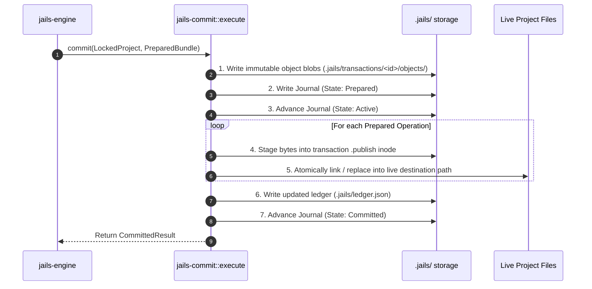

# `jails-commit`

The durable transaction executor: handles project locks, Write-Ahead Journaling (WAL), atomic file publishing, and crash recovery.

---

## Purpose & Overview

`jails-commit` takes an immutable [`PreparedBundle`](file:///home/laith/code/jails/crates/jails-prepare/src/pipeline.rs) from `jails-prepare` and applies it durably to disk.

### Core Guarantees
1. **Advisory Project Mutex**: Acquires `.jails/lock` to ensure only one mutating command runs per project root at any time.
2. **Two-Phase Write-Ahead Journaling (WAL)**: Records the transaction state in `.jails/transactions/<id>/journal.json` before touching live files.
3. **Atomic File Creation via Hard Links**: New files are staged in private transaction `.publish` inodes and hard-linked into place. Live paths never expose partially written files.
4. **Roll-Forward Crash Recovery**: If a process terminates mid-commit, the next command inspects the journal and completes the remaining operations.

---

## The Commit Sequence

---

## Key Modules

- [`execute`](file:///home/laith/code/jails/crates/jails-commit/src/execute.rs):
  - Manages [`LockedProject`](file:///home/laith/code/jails/crates/jails-commit/src/execute.rs#L93) lock acquisition and runs the 11-step commit algorithm.
- [`journal`](file:///home/laith/code/jails/crates/jails-commit/src/journal.rs):
  - Defines `JournalV1`, `JournalState` (`Prepared`, `Active`, `Committed`), and receipts.
- [`recover`](file:///home/laith/code/jails/crates/jails-commit/src/recover.rs):
  - Inspects uncommitted journals and rolls forward active transactions.
- [`store`](file:///home/laith/code/jails/crates/jails-commit/src/store.rs):
  - Content-addressable object store (`.jails/objects/`) and directory layout helpers.
- [`fault`](file:///home/laith/code/jails/crates/jails-commit/src/fault.rs):
  - Fault injection hooks for crash-recovery integration testing.

---

## How It Connects to Other Crates

- **Called by [`jails-engine`](file:///home/laith/code/jails/crates/jails-engine/README.md)**: Receives prepared bundles and returns committed results.
- **Uses [`jails-prepare`](file:///home/laith/code/jails/crates/jails-prepare/README.md)**: Reads prepared change definitions.
- **Uses [`jails-support`](file:///home/laith/code/jails/crates/jails-support/README.md)**: Acquires advisory filesystem locks.
