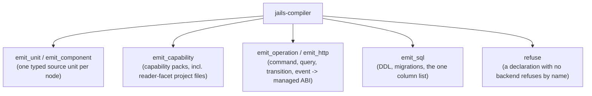

# `jails-compiler`

The pure application compiler: a linked `AppModel` and a `WorkspaceSnapshot` in, a `PlanDraft` out. No filesystem, environment, clock, network or subprocess.

---

## Purpose & Overview

- **Deterministic by contract.** Equal snapshot, patch and compiler version must produce equal desired artifacts. That is what lets the goldens be byte-compared and what makes an exported plan mean the same thing tomorrow.
- **Structurally pure, not pure by convention.** `canonical_compiler_is_pure_after_capture` in `tests/architecture/` fails the build on a filesystem, process or environment call inside this crate. The gate for *compiler passes reaching outside the captured snapshot* is held at zero.
- **Every advertised word has a backend.** 39 of 39 generator kinds, 25 of 25 capabilities, 23 of 23 component kinds — each held by an exhaustive match over the `clap::ValueEnum` that defines the vocabulary, so a kind added without a backend fails to compile rather than at the cutover.

---

## Key Modules & Types

### Emitters
One per shape rather than one per CLI word. `scaffold` is a typed entity profile over four facets, not a copied planner — which is why three of the last four generators needed no emitter at all: `search` and `association` already had a complete backend and only wanted the syntax editor in front of them.

### [`refuse`](../../crates/jails-compiler/src/refuse.rs)
A declaration the compiler cannot lower refuses **by name**, saying which type or capability it could not build. It never falls through to the legacy engine, and it never guesses — a tool that half-understands a build reporting a dependency the build does not have is the worst outcome available.

### Companion tests
`emit_unit::controller_test` drives a real request through the dispatcher (`MockMvcTester` on Boot 4, classic `perform(...)` below it) rather than reading the route back off the handler's annotation. A route jails cannot drive is emitted whole and `@Disabled`, asserting status only: guessing a value would not compile, and emitting nothing would drop the coverage silently.

---

## How It Connects to Other Crates

- **Reads [`jails-model`](../../crates/jails-model/README.md) and [`jails-contracts`](../../crates/jails-contracts/README.md), and nothing else.**
- **Its draft is materialized by [`jails-workspace`](../../crates/jails-workspace/README.md)**, which is the only thing allowed to touch a project.
