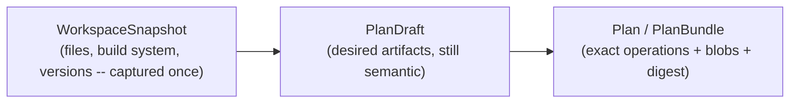

# `jails-contracts`

The values exchanged across the compiler/workspace boundary: the captured world going in, and the exact reviewed transition coming out.

---

## Purpose & Overview

`jails-contracts` exists so that [`jails-compiler`](../../crates/jails-compiler/README.md) can be pure. It holds bytes and observations, and deliberately holds **no** filesystem handles, project roots, parsers, renderers or executor implementations.

- **One capture of every external fact.** [`WorkspaceSnapshot`](../../crates/jails-contracts/src/snapshot.rs) is taken once, before compilation. Code *below* the compiler may observe the filesystem; the compiler may not, and `canonical_compiler_is_pure_after_capture` in `tests/architecture/` enforces it structurally.
- **The plan is the review.** [`Plan`](../../crates/jails-contracts/src/plan.rs) is content-addressed. Preview, export, confirmation and apply all refer to one digest, and **apply never replans** — so what a reader approved is what runs.
- **Portable by construction.** Nothing here can hold a live handle, which is what makes a plan something you can print, diff, store and hand to a different process.

---

## Key Modules & Types

### [`WorkspaceSnapshot`](../../crates/jails-contracts/src/snapshot.rs)
Every external fact the compiler is allowed to know: the captured files and their bytes, which build system owns the directory, the Spring Boot version if there is one. If a compiler pass needs something that is not in here, the answer is to capture it — not to read it.

### [`PlanDraft`](../../crates/jails-contracts/src/draft.rs)
What the compiler produces: desired artifacts, migrations and reader-file edits, still semantic. Materialization turns it into the exact plan.

### [`Plan`](../../crates/jails-contracts/src/plan.rs)
The exact transition: a list of operations, the blobs they need, and a digest over both. Equal snapshot, patch and compiler version must produce an equal plan — which is what makes the goldens byte-comparable.

### [`ProjectPath`](../../crates/jails-contracts/src/path.rs)
One constructor, and it **rejects rather than normalises**: absolute, empty, trailing-slash, backslash, NUL, `.` and `..` are all errors. Normalising would be the friendlier choice and the wrong one, because these values are *keys* — a plan's preconditions, its operations and its tree manifest all address the same file by this string, so two spellings that normalise to one path would be two keys addressing one file, and the plan would contain a contradiction its digest could not see. This is also why model paths stay project-relative and only the *read* is anchored to a root.

**There is a second `ProjectPath`**, in [`jails_support::identity`](../../crates/jails-support/src/identity.rs), and it is not an oversight: this crate depends on `jails-model`, `serde` and nothing else, so the canonical ladder cannot reach the legacy vocabulary's copy. It is the same shape as the marked block having grown three extra implementations before [`jails-codemod`](../../crates/jails-codemod/README.md) became a crate with no dependencies — a duplicate forced by a missing edge rather than by carelessness. Collapsing it is cutover work, not cleanup.

---

## How It Connects to Other Crates

- **Produced and consumed either side of [`jails-compiler`](../../crates/jails-compiler/README.md)**, which is why these types are in a crate of their own rather than in either.
- **Materialized and executed by [`jails-workspace`](../../crates/jails-workspace/README.md)**, the only canonical project writer.
