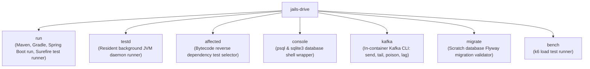

# `jails-drive`

Active toolchain execution: Maven/Gradle wrappers, the resident test daemon (`testd`), interactive database and Kafka consoles, and performance benchmarking (`k6`).

---

## Purpose & Overview

`jails-drive` executes commands that start external processes, build targets, or communicate with external services:
- **Build Tool Wrappers ([`run`](file:///home/laith/code/jails/crates/jails-drive/src/run.rs))**: Drives `./mvnw`, `./gradlew`, or system tools for `build`, `clean`, `check`, `fmt`, and `run`.
- **Resident Test Daemon ([`testd`](file:///home/laith/code/jails/crates/jails-drive/src/testd.rs))**: Spawns and manages a resident JVM daemon over a local IPC socket to run JUnit tests in **20–60ms** by eliminating JVM cold-boot overhead.
- **Affected Test Discovery ([`affected`](file:///home/laith/code/jails/crates/jails-drive/src/affected.rs))**: Uses `git diff` and compiled `.class` constant-pool dependency trees to run only the tests affected by working-tree edits.
- **Developer Consoles**: Provides interactive database terminals ([`console::db`](file:///home/laith/code/jails/crates/jails-drive/src/console.rs)) connected to Docker Compose Postgres or SQLite, and Kafka CLI inspection tools ([`kafka`](file:///home/laith/code/jails/crates/jails-drive/src/kafka.rs)).
- **Load Testing ([`bench`](file:///home/laith/code/jails/crates/jails-drive/src/bench.rs))**: Drives `k6` load test profiles and reports p95/p99 latencies.

---

## Key Modules

- [`testd`](file:///home/laith/code/jails/crates/jails-drive/src/testd.rs):
  - Communicates with a warm JVM daemon via UNIX domain sockets or named pipes.
  - Skips Maven compilation steps if `target/classes` is already up to date (e.g. built automatically by a language server like `jdtls`).
- [`affected`](file:///home/laith/code/jails/crates/jails-drive/src/affected.rs):
  - Traverses constant pool class references from `jails-java::classfile` to identify downstream test classes affected by source code changes.
- [`run`](file:///home/laith/code/jails/crates/jails-drive/src/run.rs):
  - Dispatches `jails test`, `jails run`, `jails build`, `jails check`.
  - Parses Surefire XML reports (`target/surefire-reports`) to support `--failed` (rerunning only failed tests) and `--slowest N`.
- [`kafka`](file:///home/laith/code/jails/crates/jails-drive/src/kafka.rs):
  - Executes Kafka commands directly inside the Compose broker container (`docker compose exec kafka ...`).

---

## How It Connects to Other Crates

- **Directly invoked by [`src/main.rs`](file:///home/laith/code/jails/src/main.rs)** for execution commands.
- **Uses [`jails-java`](file:///home/laith/code/jails/crates/jails-java/README.md)**: Inspects compiled `.class` files for `affected` test selection.
- **Uses [`jails-report`](file:///home/laith/code/jails/crates/jails-report/README.md)**: Explains application startup errors inline via `jails-report::why`.
