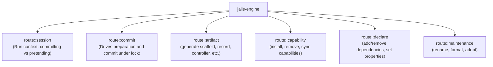

# `jails-engine`

Command route execution, request-to-transaction translation, and session orchestration.

---

## Purpose & Overview

`jails-engine` glues high-level CLI commands to the lower-level planning and commit infrastructure:
1. **Route Translation**: Converts user intentions into canonical protocol requests ([`Request`](../../crates/jails-engine/src/route/request.rs)).
2. **Session Context ([`Run`](../../crates/jails-engine/src/route/session.rs))**: Encapsulates runtime policy (`write`, `start`, `debug`) so individual routes cannot accidentally ignore flags like `--pretend` or `--no-start`.
3. **Execution Pipeline**: Drives the 7-step transition workflow: snapshot -> recipe planning -> preparation -> lock -> commit -> runtime reconciliation (e.g. `docker compose up`).

---

## Key Modules & Routes

- [`route::session`](../../crates/jails-engine/src/route/session.rs):
  - Defines `Run` (execution configuration) and `Outcome` (result wrapper containing `CommandEnvelope`).
- [`route::commit`](../../crates/jails-engine/src/route/commit.rs):
  - Primary driver for snapshotting, preparing changes, acquiring locks, committing transactions, and reconciling runtime services.
- [`route::artifact`](../../crates/jails-engine/src/route/artifact.rs):
  - Routes `jails generate <kind>` and `jails destroy <kind>`.
- [`route::capability`](../../crates/jails-engine/src/route/capability.rs):
  - Routes `jails add <capability>`, `jails remove <capability>`, and `jails sync`.
- [`route::declare`](../../crates/jails-engine/src/route/declare.rs):
  - Routes `jails add dependency`, `jails set <key>=<value>`, and `jails unset <key>`.

---

## How It Connects to Other Crates

- **Invoked by [`jails` CLI dispatch](../../src/dispatch.rs)**.
- **Calls [`jails-generate`](../../crates/jails-generate/README.md)**: Obtains generation recipes.
- **Calls [`jails-prepare`](../../crates/jails-prepare/README.md)**: Builds prepared bundles.
- **Calls [`jails-commit`](../../crates/jails-commit/README.md)**: Durably commits prepared bundles.
