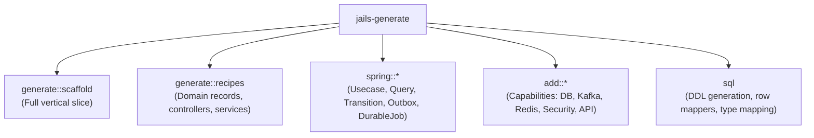

# `jails-generate`

Code generation recipes, Spring Boot templates, capability slices, and SQL/JDBC projections.

---

## Purpose & Overview

`jails-generate` is the heart of `jails`' code generation engine. It turns user specifications into complete, idiomatic, fully tested Java classes, SQL migrations, and infrastructure configurations.

### Key Capabilities
1. **Vertical Slice Generation (`scaffold`)**: Generates an immutable Java record, repository port, raw JDBC adapter (`JdbcClient`), in-memory test fake, request/response DTOs with validation, service, REST controller (201/204/404), Flyway SQL migration, `.http` collection, and companion tests.
2. **Specialized Artifact Generators**:
   - `record`: Immutable data carrier with compact constructor validations.
   - `repo`: Port and raw JDBC implementation.
   - `controller`: Spring `@RestController` with explicit HTTP method semantics.
   - `usecase`: Transactional write operation with optional event outbox.
   - `query`: Filtered read operation with stable sorting and row caps.
   - `transition`: Atomic compare-and-swap state transition with optimistic locking.
   - `durable-job`: PostgreSQL-backed durable queue with atomic leasing and `SKIP LOCKED`.
   - `http-sink`: Outbox webhook delivery with exponential backoff and idempotency keys.
   - `auth`: JWT token issuing and validation with default-deny expiration checks.
   - `search`: PostgreSQL full-text search using generated `tsvector` columns.
3. **Capability Slices (`add` / `remove`)**:
   - Provisions complete infrastructure: dependency in `pom.xml`, Java configuration class, integration test, properties in `application.properties`, and `compose.yaml` service.

---

## Architecture of Generators

### Key Submodules

- [`generate::scaffold`](../../crates/jails-generate/src/generate/scaffold.rs):
  - Emits the domain record, repository port, JDBC repository, in-memory repository fake, service, DTOs, controller, migration, and fixtures.
  - Automatically annotates only the JDBC repository as `@Repository` when a database starter is present; otherwise annotates the in-memory fake.
- [`spring::usecase`](../../crates/jails-generate/src/spring/resource.rs):
  - Generates command objects and application ports.
- [`spring::outbox`](../../crates/jails-generate/src/spring/outbox.rs):
  - Generates transactional outbox relay pattern for events.
- [`sql`](../../crates/jails-generate/src/sql.rs):
  - Unifies column DDL, parameter binding, and row mapping from a single field definition so SQL schema and Java code cannot drift.
- [`add`](../../crates/jails-generate/src/add.rs):
  - Defines preflight checks, installation recipes, and inverse uninstallation procedures for all capabilities.

---

## How It Connects to Other Crates

- **Orchestrated by [`jails-engine`](../../crates/jails-engine/README.md)**: Receives user input from CLI routes and returns planned file recipes.
- **Uses [`jails-project`](../../crates/jails-project/README.md)**: Splices dependencies into `pom.xml` and adds services to `compose.yaml`.
- **Uses [`jails-java`](../../crates/jails-java/README.md)**: Renders templates and formats Java AST imports.
