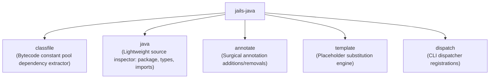

# `jails-java`

Lightweight Java AST inspection, `.class` bytecode constant-pool analysis, annotation manipulation, and template substitution.

---

## Purpose & Overview

`jails-java` handles lightweight Java source code analysis and bytecode parsing without invoking a heavy Java language server or external JVM:
- **Fast AST Tokenizer**: Inspects package declarations, imports, type names, annotations, and constructor parameters in `.java` source files.
- **Bytecode Dependency Extraction**: Reads constant pools from compiled `.class` files in `target/classes` to discover transitive type dependencies for [`jails testd --affected`](../../crates/jails-drive/src/testd.rs).
- **Template Substitution**: Lightweight placeholder substituter (`template_at!`) for expanding code templates.
- **Surgical AST Edits**: Adds or removes annotations (e.g. `@Import(TestcontainersConfig.class)`) on existing Java classes cleanly without disturbing surrounding code.

---

## Key Modules

- [`classfile`](../../crates/jails-java/src/classfile.rs):
  - Parses compiled Java `.class` headers and constant pool entries (`Utf8`, `Class`, `NameAndType`).
  - Discovers all referenced type names to build reverse-dependency graphs for targeted testing.
- [`java`](../../crates/jails-java/src/java.rs):
  - Extracts package names, import statements, record components, and class declarations.
  - Formats canonical Java imports and removes unused imports.
- [`annotate`](../../crates/jails-codemod/src/annotate.rs):
  - Splices annotations like `@Import(...)` onto `@SpringBootTest` test classes when installing capabilities like `db` or `kafka`.
- [`template`](../../crates/jails-java/src/template.rs):
  - Provides the `template_at!` macro for embedding and rendering project templates.

---

## How It Connects to Other Crates

- **Used by [`jails-generate`](../../crates/jails-generate/README.md)**: Generates Java classes, formats imports, and applies templates.
- **Used by [`jails-drive`](../../crates/jails-drive/README.md)**: Uses `classfile` to power [`testd --affected`](../../crates/jails-drive/src/testd.rs) dependency graphs.
- **Used by [`jails-report`](../../crates/jails-report/README.md)**: Inspects Spring annotations (`@Component`, `@Repository`, `@GetMapping`) for route and bean listings.
