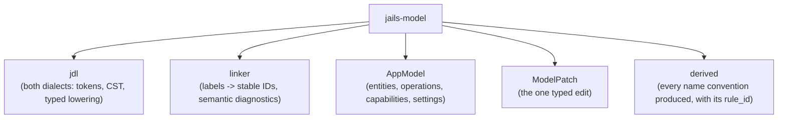

# `jails-model`

The semantic source of a Jails application: one closed model language, explicit stable identities, and the typed patch that edits them.

---

## Purpose & Overview

`jails-model` answers one question: **what does this application declare?**

- **Desired-state authority.** [`AppModel`](../../crates/jails-model/src/model.rs) is the only thing that says what a project contains. Java types, SQL tables, HTTP routes and configuration keys are *projections* of it, never inputs to it.
- **Identity survives renaming.** Every declaration carries an explicit stable ID (`ent_note`, `fld_note_title`, `op_create_note`). A human label is a projection like any other, which is what makes `rename resource ... --strategy preserve-table` a projection patch rather than a lifecycle replay.
- **Below everything.** This crate reads no files, renders no Java, runs no process and knows nothing about a workspace. It parses a language and links it.
- **Two dialects, one model.** The normative `jdl 1` grammar lowers through a lossless CST with spans; the pre-v1 spelling reaches the linker through intermediate TOML. Both state field order, because a record's positional constructor is ABI and one column list feeds the DDL, the select, the insert and the row mapper.

---

## Key Modules & Types

### [`AppModel`](../../crates/jails-model/src/model.rs)
The linked model. Carries `language_version`, `convention_version`, and `derived` — see below.

### [`ModelPatch`](../../crates/jails-model/src/patch.rs)
Every mutation is one of these. `ReplaceField` preserves the stable field ID and label and carries exactly one typed policy, so a preserve-column rename and a single-cutover rename are different values rather than different code paths.

### [`derived`](../../crates/jails-model/src/derived.rs)
Every name the convention produced rather than the author writing it — package, Java type, SQL table and column, HTTP route — keyed by owner and role, each carrying the `rule_id` that produced it. Being *in* the model is the point: it puts these records in the accepted-model and plan digest, so a convention that moves cannot move silently. `jails model explain` is the view.

Two rules keep it honest: it is **recomputed** from the model after linking, after every patch and after the layout arrives, never accumulated; and `pinned` is decided by comparing against the convention rather than by a flag carried from the source, because a flag would stop `derived` being a function of the model.

### [`diagnostic`](../../crates/jails-model/src/diagnostic.rs)
Semantic refusals with spans. The linker refuses rather than guessing — an unresolvable reference, a duplicate stable ID, an operation edge into an inactive entity.

---

## How It Connects to Other Crates

- **Read by [`jails-compiler`](../../crates/jails-compiler/README.md)**, which lowers a linked `AppModel` into a desired artifact tree and may not read anything else.
- **Patched by the `model_*` frontends** in [`src/`](../../src), one per CLI surface. A frontend's whole job is to turn a familiar command into a `ModelPatch`.
- **Depends on nothing legacy.** This crate and the three above it are already free of the crates the strangler deletes.
