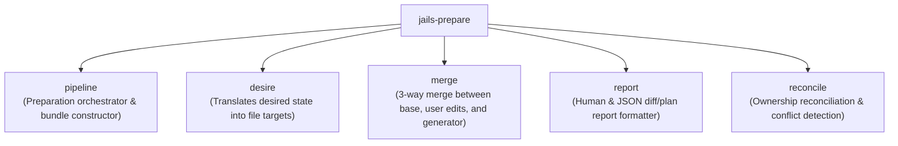

# `jails-prepare`

The pure, in-memory planning engine that transforms high-level desired state into an exact, executable transition bundle.

---

## Purpose & Overview

`jails-prepare` resolves all domain decisions, AST merges, diff calculations, and report generation **before anything is written to disk**:
- **Zero Disk Side-Effects**: Operates entirely in memory on captured project snapshots. Does not acquire filesystem locks or create files.
- **Complete Transaction Preparation**: Renders templates, merges AST splices, calculates 3-way text diffs, and constructs exact file operations ([`FileOp`](../../crates/jails-prepare/src/prepare.rs)).
- **Dry-Run Parity (`--pretend`)**: Generates the exact same [`PreparedBundle`](../../crates/jails-prepare/src/pipeline.rs) used by production commits. When `--pretend` is passed, `jails` simply prints the report from `PreparedBundle` without invoking the commit engine.

---

## Key Modules

- [`pipeline`](../../crates/jails-prepare/src/pipeline.rs):
  - Primary entry point: `pipeline::prepare(...)`.
  - Takes a project snapshot, template store, and desired change set, producing a [`PreparedBundle`](../../crates/jails-prepare/src/pipeline.rs).
- [`merge`](../../crates/jails-prepare/src/merge.rs):
  - Performs 3-way merges when re-generating or modifying existing files, preserving user changes made since the file was originally created.
- [`report`](../../crates/jails-prepare/src/report.rs):
  - Formats operation lists (`create`, `replace`, `delete`, `identical`) into human-readable terminal output or JSON envelopes.
- [`reconcile`](../../crates/jails-prepare/src/reconcile.rs):
  - Checks resource ownership rules to prevent collisions between capabilities.

---

## How It Connects to Other Crates

- **Input from [`jails-engine`](../../crates/jails-engine/README.md)**: Receives `DesiredChangeSet` and `Snapshot`.
- **Output to [`jails-commit`](../../crates/jails-commit/README.md)**: Produces the immutable `PreparedBundle` that `jails-commit` executes under the lock.
