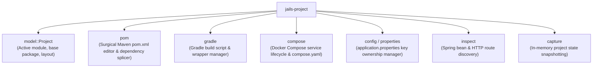

# `jails-project`

Project-level abstraction, build file manipulators (Maven `pom.xml`, Gradle), Docker Compose services, configuration properties, and source code introspection.

---

## Purpose & Overview

`jails-project` models a target Java project and manages non-code project files:
- **Project Model ([`model::Project`](../../crates/jails-project/src/model/mod.rs))**: Discovers active modules, base packages, Maven/Gradle wrappers, and target Java versions.
- **Surgical Build Splicing**: Adds/removes dependencies, plugins, and BOM imports in `pom.xml` and Gradle build scripts while strictly preserving formatting, XML comments, and indentation.
- **`compose.yaml` Service Management**: Adds and removes isolated Docker Compose service blocks (`postgres`, `kafka`, `redis`, `mailpit`, `toxiproxy`).
- **Configuration Management**: Parses and modifies `application.properties` with granular per-key ownership tracking without overriding user-written keys or comments.
- **Project Introspection ([`inspect`](../../crates/jails-project/src/inspect.rs))**: Analyzes Spring beans, dependency injection graphs, and HTTP endpoints declared in source files.

---

## Key Modules

- [`pom`](../../crates/jails-project/src/pom.rs):
  - Preserves exact XML structure.
  - Splicing dependencies (`<dependencies>`), plugins (`<plugins>`), and dependency management blocks.
  - Resolves managed vs unmanaged versions.
- [`compose`](../../crates/jails-project/src/compose.rs):
  - Manages `compose.yaml` with `# jails:<service>` demarcations.
  - Provides service definitions for PostgreSQL, Kafka, Redis, Mailpit, and Toxiproxy.
  - Starts and stops containers via Docker Compose CLI.
- [`config`](../../crates/jails-project/src/config.rs):
  - Tracks individual property key ownership (e.g. `spring.datasource.url`).
  - Supports separate test overlay properties (`src/test/resources/config/application.properties`).
- [`inspect`](../../crates/jails-project/src/inspect.rs):
  - Static code analyzer that discovers `@RestController` routes and `@Component` constructor injection graphs without running Spring.

---

## How It Connects to Other Crates

- **Used by [`jails-generate`](../../crates/jails-generate/README.md)**: Generators query `Project` for package roots and add dependencies via `pom`.
- **Used by [`jails-report`](../../crates/jails-report/README.md)**: Diagnostics query `inspect` to report declared routes and unresolvable beans.
- **Used by [`jails-engine`](../../crates/jails-engine/README.md)**: `capture` creates snapshots for planning transitions.
