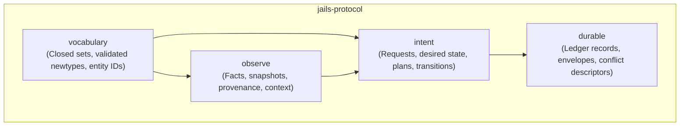

# `jails-protocol`

The vocabulary, value objects, domain entities, and schema definitions that form the shared protocol across all `jails` crates.

---

## Purpose & Design Philosophy

`jails-protocol` contains the plan, transition and effect vocabulary that all crates use. The validating newtypes it once owned are one crate lower, in [`jails-support`](../../crates/jails-support/README.md), and are re-exported here so `jails_protocol::identity::Name` still resolves — the links below point at their real home.
- **Strictly Typed Newtypes**: Types like [`Name`](../../crates/jails-support/src/identity.rs), [`Package`](../../crates/jails-support/src/identity.rs), [`ProjectPath`](../../crates/jails-support/src/identity.rs), [`FieldSpec`](../../crates/jails-protocol/src/vocabulary/declaration.rs), [`CapabilityId`](../../crates/jails-protocol/src/vocabulary/entity.rs), and [`EntityId`](../../crates/jails-protocol/src/vocabulary/entity.rs) are distinct types, not string aliases.
- **Single Validation Point**: Constructors validate invariants once. Decoders and CLI parsers call the exact same constructors to ensure wire schemas and CLI arguments never drift.
- **No Direct Filesystem Access**: Modules here represent semantic models and desired state; nothing in this crate performs file I/O.

---

## Four Core Module Groups

### 1. `vocabulary` (What a value is allowed to be)
- [`identity`](../../crates/jails-support/src/identity.rs): Validated identifiers:
  - `Name`: PascalCase or camelCase Java identifier names.
  - `Package`: Dot-separated Java package paths (e.g. `com.example.orders`).
  - `ProjectPath`: Normalized project-relative file paths.
  - `JavaType`: Fully qualified or simple Java type references.
  - `ObjectId`: Content-addressed SHA-256 hash representing an immutable object blob.
- [`declaration`](../../crates/jails-protocol/src/vocabulary/declaration.rs): Declarations of fields (`FieldSpec`), indexes (`IndexSpec`), and intent arguments.
- [`entity`](../../crates/jails-protocol/src/vocabulary/entity.rs): Identifiers for owned resources (`CapabilityId`, `OwnerId`, `EntityId`, `IntentId`).
- [`resource`](../../crates/jails-protocol/src/vocabulary/resource.rs): Key-value definitions for managed resources (`ResourceKey`, `ResourceValue`, `OneShotLifecycle`).

### 2. `intent` (What is being requested)
- [`request`](../../crates/jails-protocol/src/intent/request.rs): Canonical user mutation requests (`CanonicalGenerateRequest`, `CanonicalCapability`, `CanonicalMutationRequest`).
- [`ownership`](../../crates/jails-protocol/src/intent/ownership.rs): Desired state models (`DesiredState`, `DesiredEntity`, `ObservedEntity`, `ReconcileScope`).
- [`plan`](../../crates/jails-protocol/src/intent/plan.rs): Desired change sets (`DesiredChangeSet`, `PlannedSubject`, `LedgerIntent`).
- [`render`](../../crates/jails-protocol/src/intent/render.rs): Output specifications (`DesiredFile`, `DesiredBody`, `ManagedPath`).
- [`transition`](../../crates/jails-protocol/src/intent/transition.rs): The transition plan handed to preparation (`CommitPlan`).

### 3. `observe` (What a planner may know)
- [`snapshot`](../../crates/jails-protocol/src/observe/snapshot.rs): Read-only capture of workspace files and metadata prior to planning.
- [`context`](../../crates/jails-protocol/src/observe/context.rs): Context passed into template renderers.
- [`provenance`](../../crates/jails-protocol/src/observe/provenance.rs): Tracking the origin of generated files and capabilities (`RendererId`, `OneShotKind`).

### 4. `durable` (What survives a transaction)
- [`envelope`](../../crates/jails-protocol/src/durable/envelope.rs): The stable result envelope (`CommandEnvelope`) containing status, exit codes, and operation receipts.
- [`conflict`](../../crates/jails-protocol/src/durable/conflict.rs): Representation of file pre-images and collision states.
- [`record`](../../crates/jails-protocol/src/durable/record.rs): Ledger records written to `.jails/ledger.json`.

---

## How It Connects to Other Crates

- **Input to [`jails-prepare`](../../crates/jails-prepare/README.md)**: `jails-prepare` consumes `DesiredChangeSet` and `Snapshot` to calculate diffs and merges.
- **Output from [`jails-engine`](../../crates/jails-engine/README.md)**: `jails-engine` wraps user requests into protocol `CanonicalMutationRequest` types.
- **Persisted by [`jails-commit`](../../crates/jails-commit/README.md)**: `jails-commit` serializes protocol ledger records to disk upon successful transactions.
