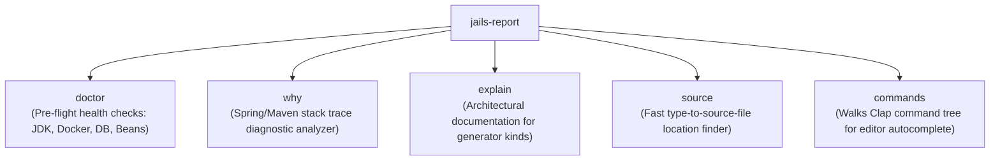

# `jails-report`

Read-only diagnostic reporting, health checks, log failure diagnosis, and artifact explanations.

---

## Purpose & Overview

`jails-report` answers questions about a project without changing anything on disk or starting external processes:
- **Structural Read-Only Guarantee**: `jails-report` does not depend on `jails-drive` or execution engines. It cannot start containers or modify files, making it completely safe to run mid-debug.
- **Environment Doctor ([`doctor`](../../crates/jails-report/src/doctor.rs))**: Validates JDK versions against POM targets, Docker daemon availability, compose container reachability, database TCP connectivity, Flyway migration state, and unresolvable Spring beans.
- **Failure Log Diagnostician ([`why`](../../crates/jails-report/src/why.rs))**: Analyzes Spring startup failure logs, stack traces, and Maven error logs to output human-readable causes and exact CLI commands to fix them.
- **Artifact Explanation ([`explain`](../../crates/jails-report/src/explain.rs))**: Explains why a generator kind is designed the way it is and common pitfalls it prevents.

---

## Key Modules

- [`doctor`](../../crates/jails-report/src/doctor.rs):
  - Checks 10+ common failure modes in one fast pass.
  - Returns exit code 0 on all green, non-zero on failure.
  - Supports `--json` output for automated CI pipelines.
- [`why`](../../crates/jails-report/src/why.rs):
  - Matches regex patterns against logs (e.g. `No qualifying bean of type`, `Address already in use`, `FlywayException`).
  - Prints clear, formatted explanation blocks with actionable `fix:` suggestions.
- [`explain`](../../crates/jails-report/src/explain.rs):
  - Prints documentation on generator semantics (e.g. `jails explain scaffold`).
- [`source`](../../crates/jails-report/src/source.rs):
  - Instantly finds source paths for a simple Java class name across local sources and dependency caches.

---

## How It Connects to Other Crates

- **Directly invoked by [`src/main.rs`](../../src/main.rs)** for `doctor`, `why`, `explain`, `commands`, `src`.
- **Used by [`jails-drive`](../../crates/jails-drive/README.md)**: `jails run` pipes failed application startup output through `jails-report::why` to explain failures inline.
