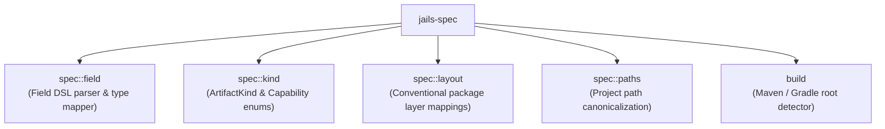

# `jails-spec`

Project specifications, field DSL parsing, artifact kind classifications, and project layout discovery.

---

## Purpose & Overview

`jails-spec` defines the structural contracts of a project before any code generation occurs:
1. **Build Tool Detection**: Identifies whether a directory is managed by Maven (`pom.xml`) or Gradle (`build.gradle`, `build.gradle.kts`) without parsing full project models.
2. **Field Specification DSL**: Parses typed field arguments passed to generators (e.g. `title:string!`, `amount:bigdecimal`, `tags:list<string>`).
3. **Artifact and Capability Kinds**: Classifies generator targets (`scaffold`, `record`, `controller`, `usecase`, etc.) and capabilities (`db`, `kafka`, `security`, `api`, etc.).
4. **Layout Conventions**: Determines package hierarchies for domain layers (`domain`, `service`, `repository`, `controller`, `dto`).

---

## Key Modules

- [`spec::field`](file:///home/laith/code/jails/crates/jails-spec/src/spec/field.rs):
  - Parses field syntax: `name:type[modifiers]`.
  - Recognizes built-in lowercase types: `string`, `int`, `long`, `double`, `boolean`, `uuid`, `instant`, `date`, `datetime`, `bigdecimal`, `duration`, `uri`, `path`, `zoneid`.
  - Recognizes collections: `list<T>`, `map<K,V>`, `set<T>`.
  - Modifiers:
    - `!` : Required and non-blank (Jakarta `@NotBlank` / `@NotNull`).
    - `?` : Optional component (maps to Java `Optional<T>`).
    - `@scope` : Multi-tenancy partition key.
    - `@unique` : Unique constraint in SQL migrations.
    - `@index` : Database index flag.
- [`spec::kind`](file:///home/laith/code/jails/crates/jails-spec/src/spec/kind.rs):
  - Defines [`ArtifactKind`](file:///home/laith/code/jails/crates/jails-spec/src/spec/kind.rs): `Scaffold`, `Record`, `Controller`, `Service`, `Repo`, `Usecase`, `Query`, `Transition`, `DurableJob`, `HttpSink`, `Webhook`, `Auth`, `Migration`, etc.
  - Defines [`Capability`](file:///home/laith/code/jails/crates/jails-spec/src/spec/kind.rs): `Db`, `Kafka`, `Redis`, `Api`, `Actuator`, `Cache`, `Observability`, `Security`, `Toxiproxy`, `Mail`, `Sse`, `H2`, `Docker`, `Ci`, `Testkit`, etc.
- [`build`](file:///home/laith/code/jails/crates/jails-spec/src/build.rs):
  - Discovers Maven reactors and Gradle multi-module root directories without executing JVM processes.
- [`spec::layout`](file:///home/laith/code/jails/crates/jails-spec/src/spec/layout.rs):
  - Resolves conventional target directories (`src/main/java`, `src/test/java`, `src/main/resources`).

---

## How It Connects to Other Crates

- **Used by [`jails-generate`](file:///home/laith/code/jails/crates/jails-generate/README.md)**: Generators query `spec::field` to construct typed Java record components, SQL columns, and validation annotations.
- **Used by [`jails-project`](file:///home/laith/code/jails/crates/jails-project/README.md)**: Project model discovery uses `build` to locate the active module and reactor root.
