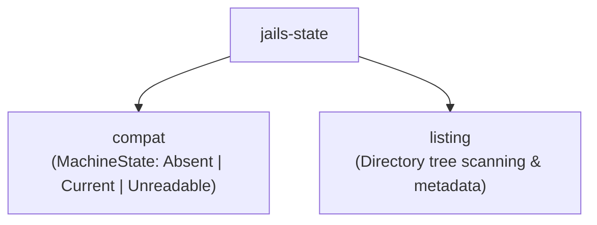

# `jails-state`

Read-only inspection and layout management for `jails`' internal machine state directory (`.jails/`).

---

## Purpose & Overview

`jails-state` answers one question: **What is the current machine state stored under `.jails/`?**
- **Strictly Read-Only**: `jails-state` never modifies, creates, or cleans up `.jails/`. Commands like `doctor`, `stats`, `--pretend`, or `why` can safely inspect machine state without side effects.
- **Explicit State Classification**: State is represented as an enum ([`MachineState`](../../crates/jails-state/src/compat.rs)) rather than a boolean to avoid fail-open bugs where corrupted metadata might be misidentified as an empty project.

---

## Key Modules & Types

### [`compat::MachineState`](../../crates/jails-state/src/compat.rs)
- `MachineState::Absent`: Project has never been managed by `jails` (no `.jails/` directory).
- `MachineState::Current(Box<LedgerV2>)`: A valid ledger file ([`ledger.json`](../../crates/jails-protocol/src/durable/envelope.rs)) is present and decoded.
- `MachineState::Unreadable(String)`: Machine state is present on disk but malformed or corrupted. Refuses execution loudly to prevent overwriting existing resources.

### [`listing`](../../crates/jails-state/src/listing.rs)
- Recursively lists project files and directories for state comparison.

---

## How It Connects to Other Crates

- **Decoupled from [`jails-commit`](../../crates/jails-commit/README.md)**: `jails-commit` writes transactions and journals, but reads machine state via `jails-state` to keep the executor clean of filesystem layout details.
- **Used by [`jails-report`](../../crates/jails-report/README.md)**: Diagnostics inspect `MachineState` to check ledger health.
