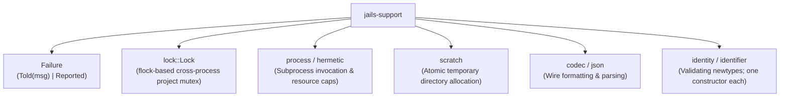

# `jails-support`

Foundational utilities, operating-system abstractions, file locks, process runners, shared error primitives, and the validating newtypes every closed jails format is built from.

---

## Purpose & Overview

`jails-support` is the lowest-level layer in the workspace. It contains general-purpose systems programming primitives that do not know about Java, Maven, or Spring:
- **Unified Result and Error Modeling**: Provides [`Result<T>`](../../crates/jails-support/src/lib.rs#L50) and [`Failure`](../../crates/jails-support/src/lib.rs#L53-L62) used across all crates.
- **Cross-Process File Locking**: Advisory file locks using `flock` ([`lock::Lock`](../../crates/jails-support/src/lock.rs)) to prevent concurrent mutations in the same project root.
- **Process Runners**: Standard process launching with `--debug` command echo ([`process`](../../crates/jails-support/src/process.rs)) and sandboxed runner with byte/time caps ([`hermetic`](../../crates/jails-support/src/hermetic.rs)).
- **Custom Codecs & Serialization**: Compact JSON and custom byte encoding utilities.
- **Validating Newtypes**: [`identity`](../../crates/jails-support/src/identity.rs) holds `ObjectId`, `Name`, `Package`, `JavaType`, `ProjectPath` and `SqlName` — one constructor each, and every wire decoder calls it, so a value rejected at the CLI cannot arrive through a recovered journal instead. They live here rather than in `jails-protocol` because they know nothing about a plan, and the crates that outlive the cutover need them without depending on one that dies with the legacy engine. [`identifier`](../../crates/jails-support/src/identifier.rs) had to follow: `SqlName` needs its `snake_case`, and a crate cannot depend upward.

---

## Key Modules

- [`lock`](../../crates/jails-support/src/lock.rs):
  - Acquires `.jails/lock` with custom owner descriptions.
  - Reports contention clearly (`Contention::Held(owner)`) rather than hanging indefinitely.
- [`Failure`](../../crates/jails-support/src/lib.rs#L53-L62):
  - `Failure::Told(String)`: Human-facing error message with actionable `fix:` instructions.
  - `Failure::Reported`: Indicates that a command (like `doctor`) has already printed its full report to stdout/stderr and requires a non-zero exit code without printing a duplicate error trailer.
- [`process`](../../crates/jails-support/src/process.rs):
  - Subprocess runner that automatically connects stdio, manages working directories, and formats command traces when `--debug` is active.
- [`hermetic`](../../crates/jails-support/src/hermetic.rs):
  - Runs commands with execution timeouts and output buffer size limits.

---

## How It Connects to Other Crates

- Re-exported by all higher crates as the fundamental `Result<T>` and `Failure` error type.
- Direct dependency of [`jails-commit`](../../crates/jails-commit/README.md) for filesystem locks.
