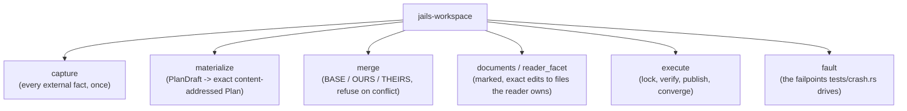

# `jails-workspace`

Capture, exact materialization, verification, and **the one canonical project writer**.

---

## Purpose & Overview

The compiler cannot read the filesystem. This crate captures it once, turns semantic desired bytes into one content-addressed `PlanBundle`, and executes it.

- **`execute` is the only canonical writer.** It locks, rechecks the captured preconditions, publishes exact after-images, and converges on retry.
- **Converging on retry is proved, not asserted.** [`tests/crash.rs`](../../crates/jails-workspace/tests/crash.rs) runs every point in [`fault::POINTS`](../../crates/jails-workspace/src/fault.rs) twice — once with an injected `Err`, once in a child process that `abort()`s inside the trip — and each row asserts its own point actually tripped, so a matrix that stopped reaching one reports a failure rather than a pass.
- **Merge-managed output.** The accepted model renders BASE, capture supplies OURS, the next model renders THEIRS. Clean merges are frozen into the plan; conflicts refuse before any write. The lock advances to THEIRS so hand edits stay deltas.

---

## Why the aborting half of the crash matrix earns its cost

The unwinding half was green while the aborting half was not, and the difference is the whole reason to pay for a child process. An `Err` unwinds, so the staged `NamedTempFile`'s guard removes it. A real crash leaves it on disk — where `verify_preconditions` reads it as *an unmanaged file appeared inside the managed tree* and refuses **permanently**, since nothing removed it and every later plan refused the same way. The project was wedged with jails' own file.

`write_atomic` stages under `.jails-staged-` rather than `tempfile`'s `.tmp` so `sweep_staged` can recognise its own debris, and the sweep runs under the lock, where nothing matching can belong to a live run.

---

## Key Modules

### [`capture`](../../crates/jails-workspace/src/capture.rs)
Reads the reader's trees, the build file, the Boot version. **It takes the *intended* model**, not the one on disk: deciding which trees to read from the pre-patch model meant the command that *declares* a thing never captured what it needed — which is how `add db` came to splice a test import into nothing, and `g command` to register in nothing.

### [`documents`](../../crates/jails-workspace/src/documents.rs)
Lossless, marked adapters: adding `.jails/generated/main/java` to Maven and to Groovy *and* Kotlin Gradle builds, reconciling the dependency set, reconciling settings. Each is an exact `PatchReaderFile` with a captured before-image — arbitrary build-language mutation is deliberately not implied. A Gradle project holding both `build.gradle` and `build.gradle.kts` refuses rather than one being picked.

### [`reader_facet`](../../crates/jails-workspace/src/reader_facet.rs)
The protocol for capabilities that write *project* files rather than Java — CI workflows, Dockerfiles, charts, editor settings. Ejection uses the same operation, but its before-image must be `Missing`: transfer is creation of a new reader-owned source, never reconciliation with an existing one.

---

## How It Connects to Other Crates

- **Consumes [`jails-contracts`](../../crates/jails-contracts/README.md)** and executes what [`jails-compiler`](../../crates/jails-compiler/README.md) produced.
- **Never routes through [`jails-engine`](../../crates/jails-engine/README.md).** Canonical `jails sync` compiles the current model and executes its exact plan directly; it must not create `.jails/objects`, receipts, or a legacy journal.
