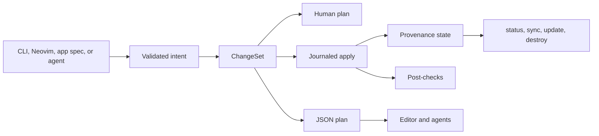

# Jails: a production application compiler for Spring Boot

Research date: 2026-08-21

## Executive conclusion

"1,000× more productive" is not a credible promise for a single edit. It is a useful portfolio goal: eliminate hundreds of repeated decisions, unsafe defaults, and hand-written integration steps across the lifetime of an application. Jails can approach that goal by becoming a **deterministic Spring Boot application compiler plus a resident development loop**, not by adding another collection of Java class generators.

The product is not the crawler blueprint, the inbox blueprint, Maven automation, or a particular package layout. The product is a small, versioned compiler kernel that turns application intent and an explicit production policy into an ordinary Spring Boot repository:

```text
intent + production profile + project state
                    |
                    v
       validated application graph
                    |
                    v
      plan -> ChangeSet -> apply -> verify
                    |
                    v
 ordinary Java, SQL, configuration, tests, and deployment files
```

That distinction is decisive. A generic tool should make many Spring applications faster without becoming a lowest-common-denominator wizard. Jails remains opinionated—Maven, visible SQL, immutable Java, package-by-feature, safe defaults—but those opinions become named, inspectable policies rather than assumptions scattered through templates.

Jails already has the right nucleus:

- conventions and reversible generators;
- capabilities that own dependencies, configuration, Compose services, and tests;
- `doctor`, `why`, `inspect`, `destroy`, `sync`, and `--pretend`-style workflows;
- real Java templates rather than opaque code generation;
- byte-level golden tests for generated applications;
- a CLI-first design that can serve terminals, Neovim, and coding agents.

The missing leverage is between those commands and after the first scaffold. Today a developer still has to wait on Maven, manually navigate generated layers, interpret unstructured output, wire production concerns repeatedly, evolve generated code safely, and remember what Jails created. The highest-return sequence is:

1. Make `jails dev` a fast, resident, measured feedback loop.
2. Give every mutating command one `ChangeSet` engine, provenance lock, journaled crash recovery, and a machine-readable plan.
3. Generate the CLI schema and diagnostic events for Neovim and agents; stop duplicating command knowledge.
4. Replace one-file template dispatch with a context-aware generator engine that produces and evolves complete slices.
5. Define and enforce a versioned production application contract.
6. Add package-by-feature and a small declarative application model.
7. Add exact-version dependency source navigation as soon as the typed location/editor protocol exists.
8. Prove the generic kernel with a small reference service, then two deliberately different verticals: a safe crawler and a production-shaped support inbox.
9. Only then add versioned packs and automated upgrades.

The intended experience is closer to Rails in *workflow*, while keeping Java’s static types and Spring’s ecosystem:

```text
jails new orders --profile production-api
cd orders
jails dev

# edit .jails/app.toml or use a conventional generator
jails app apply

# press save
# compile -> restart -> health -> affected tests -> diagnostics, usually in seconds
```

The goal is not “Rails syntax in Java.” Borrow Rails’ conventions, coherent generators, reloading, console, routes, database workflow, and reversible operations. Do not copy its dynamic runtime or try to hide Java behind a second programming language.

## What the repository says today

This proposal is based on the live Jails source, the projects under `ideas/`, the source checkouts catalogued in `deps/deps.tsv`, and primary project documentation linked at the end.

### Strong foundations to preserve

- [`src/add.rs`](src/add.rs) already computes a capability plan before writing dependencies, plugins, files, Compose services, and properties. This is the seed of a universal change intermediate representation.
- [`src/template.rs`](src/template.rs) uses ordinary source templates and validates substitution keys. Templates stay readable and testable.
- [`tests/golden.rs`](tests/golden.rs) exercises complete generated trees byte-for-byte. This is exactly the right place to test blueprints and packs.
- [`src/why.rs`](src/why.rs), [`src/doctor.rs`](src/doctor.rs), and [`src/inspect.rs`](src/inspect.rs) establish an excellent principle: explain the system instead of making the developer reverse-engineer it.
- [`spring.md`](spring.md) already recommends moving from global layers to package-by-feature and Spring Modulith boundaries when an application gains a second domain. The generators should embody that advice.
- [`deps/deps.tsv`](deps/deps.tsv) is a valuable offline source corpus. It can become version-aware dependency source intelligence instead of remaining a maintenance script alone.

### Friction and correctness gaps worth fixing first

1. **Toolchain compatibility must remain a resolved policy.** Dogfooding found that the project defaulted to unreleased Java 27 even though JDK 27 general availability is scheduled for 2026-09-15. Jails now defaults to the Java 25 LTS, derives CI/image releases from the POM, and leaves newer GA/EA choices explicit. This closes the immediate defect; a framework/JDK compatibility catalog and upgrade policy are still needed. See the [OpenJDK 27 schedule](https://openjdk.org/projects/jdk/27/spec/) and [Spring Boot system requirements](https://docs.spring.io/spring-boot/system-requirements.html).

2. **The fast Maven daemon is normally bypassed.** [`src/run.rs`](src/run.rs) prefers a project `mvnw` over `mvnd`. Spring Initializr projects contain `mvnw`, so the repository’s pinned `mvnd` often does not accelerate generated applications.

3. **Watch mode is polling plus a second compile.** The current watch loop scans Java modification times every 750 ms, starts `spring-boot:run`, and invokes a separate Maven `compile` when a file changes. This is functional, but it is not a coordinated resident loop and it does not measure save-to-healthy latency.

4. **Command knowledge is duplicated.** [`jails.nvim/lua/jails/init.lua`](jails.nvim/lua/jails/init.lua) manually lists command names, artifact kinds, capabilities, runtimes, and options. It already omits the live `toxiproxy` capability. Any copied list will drift again.

5. **Mutation has no universal ownership record.** Capability additions have a plan, generators have artifacts, and rename/destroy have their own paths. There is no common record of which invocation created a file, its original hash, whether the developer edited it, or how to reverse it safely.

6. **An edited-file warning can be inaccurate across Jails versions.** The database capability compares an existing file to what the *current* template would render. Without the original generator version and hash, an old untouched Jails file can look user-edited after the template changes.

7. **Inspection is not yet an editor protocol.** Route and bean JSON contains source paths but not a complete location/diagnostic contract with line, column, severity, code, and suggested action.

8. **The package layout stays layer-first.** That is pleasant for a toy application but degrades navigation and ownership as features accumulate, exactly as `spring.md` predicts.

9. **The current console is classpath-aware, not application-aware.** It cannot inspect a live Spring context, retrieve beans, query configured data sources, or exercise application transactions like a Rails console.

10. **A low dependency count has become a constraint.** Two Rust dependencies are admirable, but product value should win when a small, mature crate materially improves file notifications, JSON/TOML protocols, atomic state, or terminal behavior.

### A small local comparison

The checked-in Minicom examples are useful, even though they are not a benchmark. The Rails controllers and route file total 14 lines, while the equivalent Spring controllers, configuration, and application class total 63 lines: about 4.5× the surface for this tiny case. See [`ideas/minicom-public/rails`](ideas/minicom-public/rails) and [`ideas/minicom-public/spring`](ideas/minicom-public/spring).

Generators can erase most of those keystrokes. They cannot, by themselves, erase slow compile/restart cycles, scattered navigation, dependency research, or the cost of wiring a coherent feature. Those are the next constraints.

### What the strongest Spring applications under `ideas/` add

Four local repositories sharpen the target. None should be copied wholesale; together they expose the production concerns that a generic Jails project must make cheap and coherent.

| Repository | What to learn from it | What not to copy blindly |
|---|---|---|
| `ideas/grimmory` | Boot 4.1/Java 25 toolchains, security and OIDC, typed configuration, Flyway, Actuator, Docker/Compose/Helm, migration checks, release automation, broad test coverage | its increasingly mixed feature/technical package layout, preview-language dependency, or JPA persistence |
| `ideas/kafka-ui` | version catalogs, reactive remote integration, OAuth/LDAP/RBAC, audit and masking, Prometheus, Testcontainers, CVE/CodeQL/E2E pipelines, documented dependency conflict resolution | WebFlux for applications that do not need it, or Boot 3.5 APIs without checking Boot 4 equivalents |
| `ideas/spring-petclinic` | the smallest canonical Boot 4.1 baseline, focused test starters, real MySQL/PostgreSQL integration tests, reproducible builds, Compose development services, understandable feature packages | its deliberately simplified security, operations, API, and deployment story |
| `ideas/mateclaw` | large-module organization, BOM management, ArchUnit, Flyway, ShedLock, feature flags, approval/audit workflows, plugin boundaries, security regression tests | its domain breadth, integration density, MyBatis/JPA-style choices, or lack of a complete checked-in delivery pipeline |

The combined lesson is not “support every starter.” It is that a production accelerator needs a coherent answer for eight cross-cutting concerns:

1. compatible framework/JDK/build selection;
2. architecture and dependency boundaries;
3. validated external configuration and secret handling;
4. explicit schema evolution and transactional persistence;
5. authentication, authorization, tenant isolation, and audit where selected;
6. health, metrics, logs, correlation, and operational diagnostics;
7. a layered test strategy using real infrastructure at the right boundary;
8. reproducible packaging, CI checks, deployment assets, and upgrades.

Jails should encode these as a **production application contract**, not as one giant blueprint. A tiny internal service may select only the baseline profile; an internet-facing multi-tenant API selects additional policies. Every selected policy contributes dependencies, owned configuration, generated verification, inspection rules, and release-gate checks through the same `ChangeSet` engine.

### The generic unit is a policy-backed capability

Today a capability mostly answers “which dependency, property block, Compose service, and helper files should be present?” Preserve that simple mental model, but strengthen its contract:

```rust
trait CapabilitySpec {
    fn requirements(&self, ctx: &ProjectContext) -> Requirements;
    fn contributions(&self, ctx: &ProjectContext) -> Vec<Contribution>;
    fn invariants(&self, ctx: &ProjectContext) -> Vec<Invariant>;
    fn verifications(&self, ctx: &ProjectContext) -> Vec<Verification>;
    fn upgrade(&self, from: Version, to: Version, ctx: &ProjectContext) -> ChangeSet;
}
```

This is an internal design boundary, not a runtime plugin API. A capability becomes production-worthy only when it owns five things:

- prerequisites and compatibility constraints;
- deterministic source/configuration/deployment contributions;
- invariants that `doctor`, `inspect`, and `check` can explain;
- generated tests or executable checks proving the integration;
- a versioned upgrade/removal story with provenance.

For example, `security` is incomplete if it only adds a `SecurityFilterChain`. Depending on the chosen profile it should also prove denied-by-default routes, actuator exposure, password/token policy, test helpers, secret origins, and production configuration. Likewise `observability` is incomplete if it merely adds Actuator; it needs explicit endpoint exposure, health groups, metrics export policy, correlation fields, and verification.

This gives Jails a reusable multiplication point: application specs, blueprints, CLI generators, Neovim, and agents all compose the same closed capability definitions rather than each learning how to build Spring applications independently.

## Product principles

1. **Optimize save-to-confidence, not generation count.** The meaningful timer starts when a file is saved and ends when the app is healthy, the relevant tests pass, and the editor has precise diagnostics.
2. **One intent, one plan, one apply engine.** CLI, Neovim, and an agent should all submit the same intent and receive the same `ChangeSet`.
3. **Make the happy path conventional and the escape hatch ordinary Java.** Generated applications remain normal Maven/Spring projects.
4. **Generate complete vertical behavior.** A useful generator owns domain type, persistence, API, validation, migration, fixtures, and tests as one slice—not seven unrelated stubs.
5. **Never silently overwrite user logic.** Provenance and content hashes decide whether a file is owned, untouched, adopted, conflicted, or user-owned.
6. **Offline and deterministic first.** Network calls, AI assistance, live crawling, and catalog updates are explicit. Default tests use fixtures.
7. **Safe and finite defaults.** This is especially important for crawlers, background jobs, webhooks, authentication, and public APIs.
8. **Machine-readable by design.** Human output is a view over structured events, not a separate implementation.
9. **Measure before adding exotic acceleration.** Fix process structure and Maven selection before adopting agents, alternate JVMs, or complex hot-swap stacks.
10. **A modular monolith is the default deployment unit.** Boundaries and events should be explicit, but microservices are not a productivity feature.
11. **Production-ready is a selectable, executable contract.** Do not use the phrase for a template that merely starts; name the profile, show its guarantees, and run the checks that prove them.
12. **Capabilities own lifecycle, not just installation.** A capability includes compatibility, invariants, verification, provenance, upgrade, and removal.
13. **Keep the generic core domain-blind.** Core IR knows resources, routes, configuration, migrations, jobs, events, checks, and artifacts—not conversations, books, or crawl selectors.
14. **Prefer policy profiles over option soup.** Offer a few coherent, inspectable profiles with explicit overrides rather than dozens of independent booleans that create untested combinations.
15. **Generators should remove decisions, not merely keystrokes.** Infer safe choices from the project, explain them in the plan, generate complete behavior, and ask only for information that cannot be derived reliably.
16. **Smart means deterministic and context-aware.** AI may propose an intent, but the generator, migration, dependency, ownership, and verification decisions must be reproducible and testable offline.

## Prioritized bets

| Priority | Bet | Why it comes now | Rough solo effort | Definition of useful |
|---|---|---|---:|---|
| P0 | Toolchain resolution | The current default can be impossible on stable JDKs | 2–3 days | A new project deterministically targets the GA JDK pinned for its selected framework line |
| P0 | Resident `jails dev` loop | Improves every minute of every Java task | 2–3 weeks | Save-to-healthy and focused-test feedback normally land in a few seconds |
| P0 | CLI schema and event protocol | Unblocks reliable Neovim and agent integrations | 1–2 weeks, parallel | No command/capability lists are hand-copied in the editor plugin |
| P0 | `ChangeSet` + provenance + recovery | Makes all higher-level automation safer | 3–5 weeks | Every write can be planned, explained, journaled, recovered after a crash, and given an explicit inverse where possible |
| P1 | Context-aware generator engine | Removes recurring application plumbing safely, including later evolution | 3–5 weeks for the engine and first slices | One intent produces a compiling vertical slice with dependencies, migration, API, tests, examples, and provenance; later field changes are safe forward plans |
| P1 | Production contract + reference service | Defines what Jails promises before broadening generation | 2–3 weeks for v1 | A generated reference API passes architecture, config, security, DB, observability, test, image, and CI conformance checks |
| P1 | Feature-first layout + Modulith verification | Removes navigation and ownership entropy | 2–3 weeks | A feature is one directory with a verified public boundary |
| P1 | Declarative app model | Multiplies generator value across complete slices | 3–5 weeks | One small spec produces a working resource/workflow and tests without owning user logic |
| P1 | Spring-aware shell/request/data loop | Replaces repeated debug scaffolding | 2–3 weeks | Beans, transactions, routes, fixtures, and requests are available from one local workflow |
| P1 | Affected/continuous tests | Shortens the confidence loop | 2–3 weeks | Conservative focused tests run on save; `jails check` remains the full gate |
| P1 | Exact-version dependency source MVP | Removes “how does this library really work?” latency | 1–2 weeks | Exact-version source is one command or editor action away; full conflicts/examples/indexing can follow |
| P2 | Crawler blueprint | Proves deterministic specs, jobs, fixtures, and provider seams | 3–6 weeks by slice | First typed extraction in under five minutes |
| P2 | Support-inbox blueprint | Proves product-scale modular vertical generation | 4–8 weeks by slice | A secure, tested walking skeleton in minutes, not a fake demo |
| P3 | Versioned packs and upgrades | Lets the ecosystem compound without destabilizing core | 4+ weeks | Locked, capability-scoped packs pass inspection, golden tests, and explicitly trusted/sandboxed Maven verification |

These are relative estimates, not commitments. Implement vertical slices and stop when measured value is weak. The numbered “Bet” sections below are a narrative/dependency grouping, not a rank; this priority table and the gated roadmap are authoritative.

---

## Bet 1: a resident, measured `jails dev` loop

### Desired command surface

```bash
jails dev
jails dev --test affected
jails dev --test nearest
jails dev --debug-port 5005
jails dev --profile local
jails dev --events jsonl
jails dev --no-compose

jails bench dx
jails bench dx --compare .jails/benchmarks/baseline.json
```

`jails run --watch` can remain as a compatibility alias, but `dev` should communicate that this is a coordinated development session rather than a repeated command.

### Session state machine

```text
preflight
   |
   v
dependencies ----failure----> actionable diagnostic
   |
   v
compile -> application -> health-ready
   ^           |              |
   |           |              v
change -> classify -> compile/reload -> affected tests -> idle
   |                                      |
   +--------------- diagnostic <----------+
```

The supervisor should own the whole process group and lifecycle:

1. Resolve the toolchain and verify ports.
2. Start only required Compose capabilities.
3. Wait for dependency health, showing the slow dependency by name.
4. Start one long-lived Maven/DevTools application process.
5. Watch source, resource, migration, configuration, and build files with native notifications plus a polling fallback.
6. Classify a change:
   - Java source: compile, let DevTools restart, wait for health, run affected tests.
   - static resource/template: copy or let the framework live-reload without a full compile when possible.
   - `application*.yml`: restart and re-run configuration diagnostics.
   - migration: validate checksum, migrate the dev database, restart only if needed.
   - `pom.xml`: stop once, resolve once, restart once.
7. On SIGINT, terminate children in order, flush the event log, and optionally leave dependencies running according to a documented policy.

Spring Boot DevTools already provides classpath-triggered restart and LiveReload; Jails should orchestrate compilation, health, tests, and diagnostics around it rather than reinvent class loading. See the [Spring Boot DevTools reference](https://docs.spring.io/spring-boot/reference/using/devtools.html).

### Maven policy

- Use `mvnd` for the interactive development session when it is installed and compatible. Apache describes it as keeping daemon JVMs and Maven classloaders warm for faster subsequent builds; see [mvnd documentation](https://maven.apache.org/tools/mvnd.html).
- Use the checked-in Maven Wrapper for reproducible `jails check`, CI, and release commands.
- Make the decision visible:

```text
build engine: mvnd 1.0.6 (interactive)
verification engine: ./mvnw 3.9.x (reproducible)
reason: project wrapper exists; mvnd selected by dev policy
```

- Add `jails why --topic build-engine` and `jails toolchain` so selection is explainable without colliding with `why`’s existing optional logfile positional.
- Consider the [Maven Build Cache Extension](https://maven.apache.org/extensions/maven-build-cache-extension/) only as an opt-in capability after correctness tests. Cache hits must be visible, local development must be benchmarked, and clean wrapper builds remain the release gate.
- Treat [HotswapAgent](https://github.com/HotswapProjects/HotswapAgent) as an optional measured experiment for structural class changes, not a default dependency. First make DevTools and the process topology excellent.

### Structured events

Human lines and editor diagnostics should be rendered from events such as:

```json
{"schema":1,"type":"compile.started","session":"01J...","changeSet":["src/main/java/com/acme/Order.java"]}
{"schema":1,"type":"compile.finished","durationMs":843,"success":true}
{"schema":1,"type":"app.ready","durationMs":1172,"url":"http://localhost:8080","health":"UP"}
{"schema":1,"type":"test.finished","scope":"affected","passed":12,"failed":0,"durationMs":631}
```

Errors add a standard location:

```json
{
  "schema": 1,
  "type": "diagnostic",
  "severity": "error",
  "code": "JAVA-COMPILE",
  "message": "cannot find symbol",
  "location": {
    "kind": "project",
    "path": "src/main/java/com/acme/Order.java",
    "line": 24,
    "column": 17
  },
  "related": [],
  "help": "jails why --topic diagnostic --code JAVA-COMPILE"
}
```

### Measurement

`jails bench dx` should record locally, with no telemetry upload:

- cold dependency resolution;
- cold and warm compile;
- application boot to health;
- no-op rebuild;
- one-file save to health;
- focused unit and integration test time;
- resident memory and spawned process count.

Save JSON under `.jails/benchmarks/` and show a small comparison. Do not claim improvements without these numbers.

Initial targets for a small generated application:

- warm compile under 1.5–2 seconds;
- save-to-healthy under 3 seconds;
- focused unit feedback under 2 seconds;
- no redundant concurrent Maven build;
- one Ctrl-C leaves no orphan app or watcher process;
- a failed dependency health check identifies the service, probe, last output, and suggested command.

The exact thresholds should be calibrated on the user’s machine and tracked as budgets, not universal guarantees.

### Verification corpus

- Java compile success/failure and recovery without restarting `jails dev`.
- Resource-only edit that avoids unnecessary Java compilation.
- `pom.xml` change that performs exactly one controlled restart.
- migration success, checksum conflict, and database unavailable.
- DevTools absent: explain and fall back to an intentional full restart.
- occupied app/debug port.
- SIGINT during compile, during test, and during application startup.
- app process exits zero after emitting a fatal startup error; Jails must still classify the session as failed.
- rapid save storm debounced into one stable compilation.

Quarkus’ [continuous testing](https://quarkus.io/guides/continuous-testing) and [Dev UI](https://quarkus.io/guides/dev-ui) are useful references for a development mode that is a first-class product, not a shell script.

---

## Bet 2: one `ChangeSet` engine for every mutation

Jails cannot safely become a blueprint compiler until every write has the same semantics.



### Proposed internal contract

The exact Rust names can change, but the semantics should be explicit:

```rust
struct ChangeSet {
    schema: u32,
    id: String,
    intent: IntentSummary,
    operations: Vec<Operation>,
    checks: Vec<Check>,
}

enum Operation {
    CreateFile { path: PathBuf, content: Vec<u8>, owner: Owner },
    PatchFile { path: PathBuf, expected_hash: Hash, edits: Vec<Edit> },
    DeleteOwnedFile { path: PathBuf, expected_hash: Hash },
    AddDependency { coordinate: Coordinate, version_source: VersionSource },
    AddPlugin { coordinate: Coordinate, configuration: XmlFragment },
    SetProperty { path: ConfigPath, value: Value },
    AddComposeService { name: String, spec: ComposeService },
}
```

The important properties are:

- paths are normalized, relative, and confined to the project;
- all conflicts are detected before the first persistent write;
- `--pretend` and apply use the exact same rendered `ChangeSet`;
- operations carry expected hashes, not “best effort” string matching;
- writing commands can emit `--output json` without scraping prose;
- repeated application is either a no-op or an explicit, reviewable upgrade;
- post-check failure distinguishes committed files from check status and reports the available inverse/recovery action; it never implies a multi-file rollback that did not occur.

### Provenance lock

Commit a deterministic `.jails/state-v1.json` or `.jails/state-v1.toml` containing no secrets or machine-specific absolute paths:

```json
{
  "schema": 1,
  "projectId": "support",
  "artifacts": {
    "src/main/java/com/acme/conversations/Conversation.java": {
      "owner": "feature:conversations/resource:conversation",
      "createdBy": "jails app apply",
      "toolVersion": "0.x.y",
      "template": "core/java-record@2",
      "originalHash": "sha256:...",
      "lastAppliedHash": "sha256:..."
    }
  }
}
```

Ownership states should be visible:

```text
owned-clean       content matches last applied hash
owned-modified    developer changed an owned file
adoptable         conventional file exists but has no provenance
user-owned        Jails must not change it
orphaned          provenance exists but file does not
template-stale    clean file has a newer compatible template available
conflicted        requested operation cannot preserve local work automatically
```

Add:

```bash
jails status
jails status --json
jails adopt path/to/file --as feature:orders/resource:order
jails diff --generated
jails repair --pretend
```

Never infer adoption merely because a file happens to match today’s template. Make it explicit.

### Preflighted, journaled, crash-recoverable apply

1. Validate project and intent.
2. Render every output in memory.
3. Read and hash every target.
4. Detect all conflicts.
5. Write new content to a project-local staging directory on the same filesystem and flush it as required by the platform.
6. Persist and flush a journal in a `prepared` state, containing before-images or recoverable references plus the full intended operation order.
7. Rename individual staged files atomically where the platform permits, flush affected parent directories where supported, and record/flush progress after each operation.
8. Write and flush the provenance file via atomic replacement, flush its parent directory where supported, then mark and flush the transaction `committed`.
9. Run non-destructive post-checks and record their result separately from file-transaction commit.
10. Before any later mutating command, detect an incomplete journal and automatically finish or restore it according to its durable state; never start another mutation on top of it.
11. On an ordinary failure, restore before-images and report any operation that could not be restored.

Transaction staging/journals live in a project-local, permission-restricted, gitignored `.jails/.transactions/` area. They never use unresolved symlinks, are size-bounded, and are cleaned only after a durable commit/recovery decision.

A sequence of per-file renames is **not** an atomic multi-file transaction. The promise is deterministic preflight plus crash recovery. External side effects such as starting Compose or downloading artifacts do not belong in the file transaction; plan them as a separate, explicit phase and label their compensation/recovery limits. A later `destroy` is an inverse plan subject to ownership and current-content checks, not a magical rollback of history.

### Port existing commands in this order

1. `generate` and `destroy`.
2. `add`, `remove`, and `sync`.
3. `rename`.
4. `new` and blueprints.
5. migrations and upgrades.

The current `add::Plan` can be adapted rather than discarded.

### Acceptance criteria

- Every writing command supports `--pretend --output human` and `--pretend --output json`.
- The JSON plan and applied operations have stable IDs and schemas.
- Injected failure or process death after every journal/write/rename boundary is recovered before the next mutation to either the complete before-state or complete committed state.
- An edited generated file is never overwritten or deleted without a conflict and user decision.
- An untouched file generated by an older Jails release is recognized by its recorded `lastAppliedHash`, not a current-template comparison; `originalHash` remains only the creation record.
- `generate`, `add`, and `app apply` are idempotent.
- Paths containing spaces and Unicode work; traversal and symlink escapes are rejected.
- State output is deterministic across machines.

---

## Cross-cutting foundation: smarter generators that erase boilerplate

Jails already has an unusually strong `scaffold`: one field model drives the record, repository port, JDBC and in-memory adapters, request/response types, service, controller, migration, fixture, and tests. That shared source of truth is the right idea. The next step is not dozens of unrelated artifact kinds; it is a generator engine that understands project context, composes complete artifact graphs, and evolves them safely.

The dogfood increment now proves this direction beyond CRUD: both manifests declare ordinary typed Kafka events, executable create use cases, typed equality queries, leased durable work, production/local security profiles, scope-bearing request boundaries, CI, and images. The crawler also selects a generic bounded fetch port. Jails derives Java records/imports, application ports, transactional implementations, MVC adapters, visible named-parameter PostgreSQL adapters, realistic examples, and focused plus real-container tests from one field model. Running both full manifests exposed generic composition/runtime bugs that shallow golden tests missed: Spring `@Import` values must merge, test examples and assertions must share one value model, transactional components must be proxyable, nullable JDBC transforms must wrap the raw value before dereferencing, PostgreSQL `UPDATE ... FROM` return columns must be qualified, and a validated hostname must be DNS-pinned through connection. This is useful evidence, not a reason to add crawler or inbox concepts to core. The next leverage is a generic workflow/composition IR, transactional outbox semantics, output provenance, and drift repair.

### From template selection to intent compilation

The current mental model is close to:

```text
artifact kind + name + fields -> template functions -> files
```

The stronger generic model is:

```text
user intent
  + discovered project context
  + selected capability/profile policy
  + existing application graph and provenance
                    |
                    v
           resolved generation model
                    |
                    v
       artifact graph + invariants + checks
                    |
                    v
                 ChangeSet
```

The resolved model should answer once, before rendering:

- which Maven module, source set, base package, and feature own the change;
- which Boot/JDK APIs and test annotations are valid for this project;
- which capabilities and dependencies are present, missing, incompatible, or implied;
- whether persistence is JDBC, in-memory-only, or another explicitly supported adapter;
- which table, route, bean, type, migration, configuration key, and test names already exist;
- which files are Jails-owned, safely patchable, adopted, conflicted, or user-owned;
- which production-profile invariants apply;
- which generated checks must pass before the intent is considered complete.

Renderers receive this typed model. They should not rediscover project state, inspect the filesystem ad hoc, or make independent naming and dependency decisions.

### A small set of high-value intents

Keep low-level kinds for experts and composition, but optimize the default commands around work developers actually need:

```bash
jails generate resource Customer id:uuid@pk email:string!@unique
jails generate usecase SuspendCustomer customerId:uuid! reason:string!
jails generate query ActiveCustomers status:CustomerStatus! --page cursor
jails generate client Billing --base-url app.clients.billing.base-url
jails generate event CustomerSuspended customerId:uuid! occurredAt:instant!
jails generate job PurgeExpiredSessions --schedule app.jobs.purge.cron
jails generate field Customer displayName:string? --migration
jails generate factory Customer
```

Each intent expands only as far as the project context warrants:

- `resource` creates a usable vertical slice, not empty controller/service/repository stubs;
- `usecase` creates input/output contracts, a transaction boundary, endpoint or message adapter when requested, error mapping, and focused tests;
- `query` creates typed parameters/results, visible SQL, mapping, pagination rules, and a real-database test;
- `client` creates immutable validated configuration, the Boot-version-correct HTTP client, explicit timeouts, error translation, a WireMock test, and observability hooks selected by policy;
- `event` creates the contract and local publisher/listener seams, adding broker-specific adapters only when that capability is selected;
- `job` creates bounded execution, configuration, metrics, idempotency/locking seams where required, and failure tests—not just `@Scheduled`;
- `field` understands the existing resource and emits a forward schema/code/test evolution plan;
- `factory` derives valid defaults and typed overrides from the same field/constraint model used by production code.

These are generic application concepts. Domain blueprints merely submit several such intents and connect them.

### Infer aggressively, guess conservatively

Generators save the most time when the common command is short. Jails should infer:

- feature and package from the nearest owned type or explicit application graph;
- table and column names from one naming policy;
- imports and nullability from resolved field types;
- validation annotations, SQL constraints, sample values, fixture values, and test cases from one constraint model;
- migration sequence and dependency additions from current project state;
- test slice from the generated boundary;
- route pluralization and conventional status codes from a versioned API policy;
- Boot 3 versus Boot 4 APIs from the effective POM, never from the Jails build version;
- whether a generated adapter should be the Spring bean from the active persistence capability.

It must stop and require explicit input for ambiguous or dangerous decisions:

- rename versus drop-and-add;
- destructive schema changes or data conversion;
- aggregate ownership and cross-feature dependencies;
- tenant/security boundaries;
- retry and idempotency semantics;
- public route compatibility;
- external side effects;
- edits to user-owned logic.

Every inference appears in `plan` with a reason and origin:

```text
route: POST /api/customers
  inferred from: resource policy v1 + pluralization(customers)
persistence: jdbc
  inferred from: capability db@2, active adapter jdbc
test: @WebMvcTest(CustomerController.class)
  inferred from: Spring Boot 4.1 test policy
migration: V004__add_customer_display_name.sql
  inferred from: applied max V003; nullable additive field
```

`--explain` expands this reasoning; JSON exposes stable reason codes. A user can override a supported choice explicitly, and the override is recorded in the application model so the next generator does not ask again.

### Generate complete code, not ceremonial layers

The quality bar is “less boring code remains,” not “more files were generated.” A smart generator should:

- omit a layer that adds no boundary or behavior;
- prefer records, constructor injection, compact immutable configuration, and visible SQL;
- generate mappings mechanically from one model rather than hand-maintained field copies;
- create realistic success, validation, not-found, conflict, authorization, and persistence tests appropriate to the intent;
- add executable HTTP examples and valid fixtures;
- add required dependencies/capabilities in the same plan;
- compile and run the smallest relevant verification automatically after apply;
- leave obvious extension seams without `TODO` methods that only throw `UnsupportedOperationException`;
- never generate speculative abstractions “for later.”

Measure **authored lines and decisions after generation**, not generated line count. If a developer must immediately repair imports, align DTO fields, add a migration, invent fixtures, wire a bean, or create the first meaningful test, the generator is incomplete.

### Safe composition and evolution

Creation is a minority of application work. The engine needs three modes:

1. **Create**: produce a new owned artifact graph.
2. **Extend**: add behavior through known structural anchors or new owned files.
3. **Evolve**: compare desired intent with provenance/current source and produce forward migrations plus compatibility changes.

Do not broadly rewrite arbitrary Java text. Prefer, in order:

1. regenerate untouched owned mechanical artifacts;
2. add a new owned file implementing a stable user-owned interface;
3. patch a recorded structural anchor with an expected hash;
4. ask jdtls/OpenRewrite for a semantic edit where their contract is available;
5. stop with a conflict and an exact manual migration guide.

Examples:

- adding a nullable field updates the domain record, request/response mapping, named JDBC bindings, fixture, factory, tests, and creates a new migration;
- changing a field to required first plans nullable expansion, backfill seam, validation switch, then later contraction—never a one-step destructive migration;
- adding a use case creates a new service method or dedicated handler without regenerating hand-written service logic;
- changing a route reports client/example compatibility impact before applying;
- destroying an intent removes only unchanged owned artifacts and refuses to strand imports, registrations, migrations, or capability users.

### One field model, many consistent outputs

Promote the existing field parser into a versioned semantic model used everywhere:

```rust
struct FieldModel {
    id: StableId,
    name: JavaName,
    java_type: JavaType,
    sql_type: Option<SqlType>,
    nullability: Nullability,
    constraints: Vec<Constraint>,
    relation: Option<Relation>,
    exposure: Exposure,
    example: ExampleValue,
}
```

The domain record, validation, request/response type, SQL DDL, query binding, row mapping, OpenAPI metadata if selected, fixture, factory, and tests must derive from this one model. Cross-output invariants should make drift structurally impossible—for example, every selected SQL column has exactly one named write binding and one row mapping, and every required request field has both validation and a negative test.

Stable field IDs matter for evolution: a rename preserves identity and becomes a rename migration; a removed ID is a deletion requiring an explicit destructive workflow. Names alone cannot distinguish those cases.

### Generator conformance suite

Every high-level intent needs more than golden text snapshots:

- golden tree and second-run no-diff test;
- clean compile under every supported Boot/JDK pair;
- context matrix: with/without DB, security, Modulith, broker, and production profile as applicable;
- collision tests for routes, beans, types, tables, configuration keys, and migration versions;
- property-based field combinations covering nullability, constraints, composite keys, enums, values, and references;
- create/extend/evolve/destroy lifecycle tests with user edits and old Jails provenance;
- real PostgreSQL integration test for generated SQL;
- generated test mutation check: deliberately break one generated invariant and prove its test fails;
- filesystem fault-injection through the common `ChangeSet` journal;
- boilerplate budget: count manual edits required to reach the documented example and reject regressions.

### Acceptance criteria

- A conventional resource command needs only a name and field declarations; it compiles, migrates, starts, and has meaningful tests without hand wiring.
- Generator output changes correctly with effective Boot version, active capabilities, module, feature layout, and production profile.
- Adding a field or use case updates every mechanical consumer from one semantic model and preserves user-owned logic.
- All inferred decisions are visible and machine-readable; ambiguous destructive decisions are never guessed.
- A generated slice contains no dead placeholder, unused dependency, unregistered adapter, disabled test, or unexplained TODO.
- Low-level artifact kinds and high-level intents share renderers and `ChangeSet` operations rather than becoming two generator implementations.
- Crawler, inbox, and the reference service use the same intent vocabulary and generator engine.

---

## Bet 3: a stable CLI/editor/agent protocol

### Generate command knowledge from the CLI

Add:

```bash
jails schema --json
jails schema --json --command generate
jails capabilities --json
jails kinds --json
jails version --json
```

The schema should be derived from Clap definitions plus Jails metadata and include:

- commands, aliases, options, conflicts, defaults, and examples;
- artifact kinds and their field grammar;
- capabilities and compatibility constraints;
- project-context requirements;
- whether a command streams or mutates, plus its inverse-plan and crash/external-side-effect recovery limits;
- input/output JSON schema versions;
- relevant file patterns for editor completion.

Delete the copied command lists from the Neovim plugin once a compatible Jails version is detected. Cache the schema by Jails binary path and version so completion stays instant and offline. Retain a tiny bootstrap fallback only for old binaries.

### One output convention

Use a global contract:

```bash
jails <command> --output human
jails <command> --output json
jails <long-running-command> --output jsonl
```

- `json` is one bounded result.
- `jsonl` is a stream of versioned events.
- Existing command-specific `--json` flags remain compatibility aliases for `--output json` until a documented major-version cleanup.
- stdout contains the selected protocol only; logs and progress go to stderr in structured or human form.
- nonzero exit codes have stable categories, while the detailed error remains in the output body.
- locations use a typed object: `project` carries a project-relative path, `external-file` carries a local absolute path plus `readOnly: true`, and `virtual` carries a stable URI. All may add line/column when known. This lets dependency sources under Maven/checkouts work without pretending they are in the project. Absolute external paths are local-session data and are omitted/redacted from committed state or deliberately exported context.

Preserve the existing command grammar while introducing the protocol. Existing `console`, `db`, `completion <shell>`, and `why [logfile]` forms remain valid. Extend `console --spring`; use the new `schema` command for editor metadata; put topical explanations behind `why --topic`; and give destructive dev-data operations a distinct namespace. Every rename or deprecation needs an alias period and a schema-visible replacement.

### Neovim experience

The CLI remains the source of truth. The plugin becomes a thin, responsive client:

```vim
:Jails                 " searchable command/action palette
:JailsDev              " attach/open resident event stream
:JailsTestNearest
:JailsTestAffected
:JailsRelated          " record <-> repo <-> service <-> controller <-> tests
:JailsRoutes           " picker; jump to exact declaration
:JailsBeans            " picker; jump to exact declaration
:JailsWhy              " context-aware explanation under cursor
:JailsDependencySource " exact-version source under coordinate/symbol
:JailsDebug             " attach to reported debug port
```

Required behaviors:

- compile/test/doctor diagnostics populate Neovim’s diagnostic API and quickfix list;
- routes, beans, migrations, capabilities, and generated ownership have pickers with exact jump locations;
- a successful generator opens only its primary user-owned artifact, not every generated support file;
- long-running sessions use a terminal or event client without blocking the editor;
- cancellation terminates the actual Jails process group;
- the plugin displays protocol-version incompatibility rather than guessing.

### Coordinate with jdtls instead of fighting it

Jails owns conventions and the authoritative Maven/dev session; jdtls/nvim-jdtls owns semantic Java editing. Define their boundary:

- `jails about --json` reports the exact project root, Maven modules, source/test roots, resolved JDK, and workspace identity so Neovim starts one correctly keyed jdtls workspace;
- after a committed POM, module, generated-source, or classpath `ChangeSet`, Jails emits one `classpath.changed` event and the plugin requests one jdtls project refresh—never a refresh per staged file;
- generation returns the changed Java files and supported source actions so the plugin can request organize-imports and formatting after commit;
- jdtls provides semantic diagnostics, rename/extract/import actions, DAP, and Java test adapters; Jails supplies fast convention-aware routes/beans/related-file navigation and renders its Maven/test/doctor events into the same diagnostics UI;
- while `jails dev` is active, jdtls incremental analysis may continue but editor autocmds must not start a second Maven compile. The session advertises which process owns build/test execution;
- key the jdtls workspace by canonical project path + module set + JDK major, detect stale/corrupt workspaces, and provide an explicit cleanup/reimport action rather than silently deleting state;
- refresh and multi-module fixtures verify opening a submodule, changing `pom.xml`, generating a source root, attaching DAP, and running the test under the cursor.

### Agent-ready, not agent-dependent

An agent should create or revise `.jails/*.toml`, request a JSON plan, and ask Jails to apply and verify it. The agent should not need to patch Maven XML, Compose, migrations, and seven Java layers independently.

Do not put a model API key or free-form code-writing model inside Jails core. Deterministic validation, plan, apply, diff, and test are the product. AI can propose an intent or a crawler selector schema once; the checked-in deterministic artifact remains the authority.

### Acceptance criteria

- Adding a capability to the Rust enum makes it available in schema-driven Neovim completion without a Lua edit.
- All route and bean records include an exact path and best-known line.
- A deliberately malformed Java file produces the same diagnostic location in terminal JSON and Neovim.
- Protocol fixtures test backward-compatible additions and explicit rejection of unsupported major versions.
- An agent can generate a resource, inspect the plan, apply it, and run verification using JSON alone.

---

## Bet 4: correct toolchains by construction

Fix this before promoting any “one-command” experience.

### Resolution policy

```bash
jails toolchain
jails toolchain resolve --spring-boot 4.1
jails toolchain install-hint
jails new shop --java 25
jails new experiment --java 27-ea
```

1. Pin a deterministic default target in each Jails release’s tested Spring Boot/JDK compatibility mapping; Java 25 is the conservative default in this project’s current timeframe. Identical Jails version + Boot line + command must generate the same POM on different machines.
2. Report newer installed compatible GA JDKs as available choices, but use one only after an explicit `--java` selection or committed project setting—not because it happens to be installed.
3. Require an explicit `-ea` selection for an unreleased JDK and print the risk.
4. Never silently skip verification because the local compiler cannot target the generated version.
5. Record the resolved JDK, Maven Wrapper, Boot BOM, and Jails version in `jails about --json` and benchmark output.
6. Ship the tested compatibility matrix in the Jails release and optionally refresh authoritative metadata to *report* newly available choices. A metadata refresh cannot silently change the release’s default; a Jails upgrade or explicit selection does that. Offline resolution must still work.

Example diagnostic:

```text
JAVA-TARGET-UNAVAILABLE
  requested: Java 27
  status: early-access; GA scheduled 2026-09-15
  installed: Java 26
  Spring Boot 4.1 tested range: 17–26
  fix: jails new shop --java 25
  experiment: jails new shop --java 27-ea
```

### Acceptance criteria

- A default `jails new` never selects an unreleased Java target.
- Every supported Boot/JDK pair has a real generated-project compile test in CI.
- Unsupported explicit pairs fail before files are written.
- Offline mode explains the age/source of its compatibility data.
- EA projects are visibly marked in `jails.toml`, `about`, and `doctor`.

---

## Cross-cutting foundation: the production application contract

Before Jails generates richer domain behavior, define what `--profile production-api` means and make the promise executable. This is not a certification that every generated application is secure or scalable. It is a precise baseline of generated defaults and checks that removes recurring setup work without pretending to replace architecture review.

### Profiles, not a matrix of accidental combinations

```bash
jails new orders --profile production-api
jails profile show production-api
jails profile plan production-api --output json
jails profile verify
jails profile diff
```

Start with three closed, versioned profiles:

| Profile | Intended shape | Adds to the baseline |
|---|---|---|
| `service` | internal stateless HTTP service | MVC, validation, ProblemDetail, typed config, health, structured logs, focused tests, container image |
| `production-api` | internet-facing transactional API | PostgreSQL/Flyway, security-deny-by-default, API version policy, audit hooks, metrics export, integration tests, CI and deployment checks |
| `worker` | scheduled/queued background process | bounded concurrency, graceful shutdown, retry/idempotency policy, job metrics, lock/lease option, failure integration tests |

Profiles compose capability specs; they do not bypass them or run arbitrary scripts. Store the selected profile and version in `jails.toml`. An override is explicit, recorded, explained by `why`, and covered by a compatibility test if Jails supports the combination.

Do not add `fullstack`, `microservice`, `enterprise`, or `cloud` profiles until each name has a bounded meaning and a release fixture. Meaningless profile names are marketing, not compiler input.

### Contract v1

A `production-api` reference project should make the following observable guarantees:

| Concern | Generated default | Executable evidence |
|---|---|---|
| Build | pinned Boot/JDK/Maven Wrapper, reproducible timestamps, dependency convergence | clean offline-capable build after cache warm-up; compatibility matrix fixture |
| Architecture | package-by-feature, explicit public module surface | Modulith/ArchUnit boundary test |
| API | validated inputs, version strategy, RFC 9457 `ProblemDetail`, bounded pagination | MVC contract and error-shape tests |
| Configuration | immutable `@ConfigurationProperties`, startup validation, `.env.example`, no committed secrets | context failure tests for missing/invalid values; secret scan |
| Data | visible SQL, Flyway forward migrations, explicit transactions and indexes | PostgreSQL Testcontainers tests and migration-from-previous-version test |
| Security | deny by default, least actuator exposure, service-layer authorization seam | unauthenticated/unauthorized/authorized integration tests |
| Observability | liveness/readiness, metrics endpoint policy, request correlation, useful startup metadata | management-context and correlation tests |
| Resilience | explicit timeouts; retries only for classified idempotent operations | WireMock/Toxiproxy failure tests where a remote client exists |
| Runtime | graceful shutdown and bounded task execution | shutdown/in-flight work test |
| Delivery | layered non-root image, Compose for development, CI build/test/image/security gates | image smoke test and workflow lint fixture |
| Maintenance | provenance, dependency/source explanation, drift and upgrade plan | `jails status`, `profile verify`, and upgrade golden tests |

The contract should distinguish four statuses:

- `guaranteed`: generated and verified by Jails;
- `configured`: generated, but dependent on deployment values;
- `user-owned`: Jails generated a seam and the application owns the policy;
- `not-selected`: outside the active profile.

That vocabulary prevents `jails inspect production` from implying more than the evidence supports.

### Reference service before showcase blueprints

Add a deliberately boring `tests/reference/production-api` fixture: one feature, one PostgreSQL table, one secured create/read workflow, one outbound HTTP client, one scheduled maintenance task, and no frontend. It should exercise every contract row while remaining small enough to understand in an hour.

This fixture is the compatibility canary for every supported Boot/JDK pair and the source for documentation snippets. Petclinic proves framework idioms; the Jails reference service must prove Jails' stronger production policy. Grimmory, Kafka UI, and MateClaw remain pattern mines and adversarial comparison cases, not golden templates.

Release a profile only when its fresh generated tree passes:

```text
format -> compile -> architecture -> unit/slice -> PostgreSQL integration
       -> migration upgrade -> security -> observability -> image smoke -> doctor
```

### Generic extension seam

The application graph should use a small vocabulary that works across domains:

```text
Application
  Feature
    Resource / Value / UseCase / Query
    Route / Client / Event / Job
  Capability
  Policy
  Verification
  Artifact
```

Crawler concepts such as selectors and scope rules lower into this graph. Inbox concepts such as conversations and assignment lower into it. Neither belongs in the core `ChangeSet` or profile engine. If a third, unrelated reference application cannot use the same IR without new domain words in core, the abstraction is not yet generic.

### Genericity is a release gate

Every proposed core change must pass this test before implementation:

1. Can it be named without mentioning a showcase domain?
2. Is it useful to at least three materially different Spring applications?
3. Does it represent a Spring/build/application concern rather than business behavior?
4. Can a project decline it without weakening unrelated capabilities?
5. Does it lower through the same intent, capability, `ChangeSet`, provenance, and verification path?
6. Does the generated application remain understandable and operable without Jails installed?

If the answer to 1–3 is no, it belongs in a blueprint or application-owned code. If the answer to 4–6 is no, the design is too coupled for core.

Concretely, Jails core may understand `Feature`, `Route`, `Client`, `Resource`, `Query`, `Event`, `Job`, `Policy`, and `Verification`. It must not acquire core enums or special mutation paths named `Crawler`, `Inbox`, `Conversation`, `Book`, `KafkaUi`, or any future showcase product. Blueprints are declarative compositions of generic primitives and may ship separately from the core release cadence once the pack format is safe.

### Acceptance criteria

- `profile plan` lowers through exactly the same capability and `ChangeSet` machinery as manual commands.
- Every profile guarantee names at least one executable check; prose-only guarantees are rejected from the contract table.
- A generated reference service passes from a fresh clone on every supported Boot/JDK pair.
- Removing or overriding a profile capability reports which guarantees become `not-selected` or `user-owned`.
- Profile versions are immutable; changed policy ships as a new version with an explicit upgrade plan.
- No profile introduces a Jails runtime library or makes the generated application require Jails in production.
- No profile or core IR type contains showcase-domain concepts; a repository-level architecture test pins this boundary.

---

## Bet 5: package-by-feature with verified boundaries

Layer-first generation is compact for one aggregate, but it spreads each new feature across controllers, services, repositories, DTOs, and models. Jails should make package-by-feature the default once an application opts into features, while continuing to support the current layout.

### Command surface

```bash
jails add modulith
jails generate feature conversations

jails generate scaffold Conversation \
  id:uuid@pk \
  workspaceId:uuid!@ref=workspaces.id \
  status:ConversationStatus! \
  assigneeId:uuid? \
  version:long! \
  --feature conversations \
  --tenant workspaceId

jails modules
jails modules verify
jails modules graph
jails inspect feature conversations
```

Suggested generated shape:

```text
src/main/java/com/acme/conversations/
  Conversations.java                 # small public facade
  ConversationView.java              # public read contract
  ConversationAssigned.java          # public domain event
  package-info.java                   # module description/allowed dependencies
  internal/
    Conversation.java
    ConversationService.java
    JdbcConversationRepository.java
    ConversationQueries.java
    web/ConversationController.java
```

The public module root contains only contracts intentionally available to other features. Implementations and framework adapters live below `internal`. Spring Modulith can verify that other features do not reach into internals and can test a module in isolation. See [application module verification](https://docs.spring.io/spring-modulith/reference/verification.html) and [module integration tests](https://docs.spring.io/spring-modulith/reference/testing.html).

### Generate use cases, not generic updates

CRUD is useful for reference data. Product behavior deserves explicit workflows:

```bash
jails generate usecase AssignConversation \
  workspaceId:uuid! conversationId:uuid! assigneeId:uuid! expectedVersion:long! \
  --feature conversations \
  --route "PUT /api/workspaces/{workspaceId}/conversations/{conversationId}/assignment" \
  --emits ConversationAssigned
```

This should generate or amend:

- an input record and typed outcome;
- a transactional application service method;
- endpoint mapping and typed response;
- validation, not-found, forbidden, and optimistic-conflict handling;
- a domain event;
- unit, MVC, module, and concurrency tests.

Use `usecase` because Jails already uses `command` for Picocli. Use `domain-event` because `event` already means Kafka integration.

### Persistence conventions without building Hibernate again

Borrow the productive part of Active Record—conventions and compact associations—without hidden lazy queries or runtime-only model errors.

```bash
jails generate query Inbox \
  --feature conversations \
  --params "workspaceId:uuid!,status:ConversationStatus?,assigneeId:uuid?,cursor:instant?" \
  --returns ConversationSummary \
  --sql src/main/resources/queries/inbox.sql
```

Generate:

- typed parameter and result records;
- visible, editable SQL;
- a `JdbcClient` implementation with explicit row mapping;
- stable keyset cursor ordering;
- a real PostgreSQL integration test.

For tenant-scoped resources:

- repository methods require the tenant key; do not generate an unscoped `findById(id)`;
- relationships between tenant resources use composite tenant foreign keys where practical;
- lookup outside the current workspace returns 404 to avoid existence disclosure;
- mutations include optimistic `version` by default;
- list endpoints use cursor pagination;
- `--on-delete` is explicit and restrictive by default;
- optional PostgreSQL row-level-security policies run under a non-owner application role and have isolation tests. Table owners and roles with `BYPASSRLS` are not protected by normal RLS policy, so the generated deployment shape matters; see the [PostgreSQL RLS documentation](https://www.postgresql.org/docs/current/ddl-rowsecurity.html).

### Acceptance criteria

- A second feature requires no manual rearrangement of global layer packages.
- `jails modules verify` fails when one feature imports another feature’s internal class.
- `jails inspect feature` shows public API, internal components, routes, tables, events, and incoming/outgoing dependencies.
- Generated database integration tests run; no `@Disabled` and no TODO placeholder is allowed in a blueprint release.
- Typed query SQL remains visible and its tenant predicate, index use, result mapping, and cursor stability are tested against the real target database.

---

## Bet 6: a declarative application model and blueprint compiler

Individual generators answer “make a class.” A product compiler answers “make this application behavior true.” Use a small model for the conventional 80%, then let ordinary Java and SQL own the rest.

### Proposed application spec

```toml
# .jails/app.toml
schema = 1

[application]
name = "support"
base_package = "com.acme.support"

[[feature]]
name = "conversations"

[[feature.resource]]
name = "Conversation"
tenant = "workspaceId"
fields = [
  "id:uuid@pk",
  "workspaceId:uuid!@ref=workspaces.id",
  "contactId:uuid!@ref=contacts.id",
  "status:ConversationStatus!",
  "assigneeId:uuid?",
  "lastMessageAt:instant!",
  "version:long!"
]
indexes = [
  "workspace_id,last_message_at desc,id desc"
]

[[feature.usecase]]
name = "AssignConversation"
input = [
  "workspaceId:uuid!",
  "conversationId:uuid!",
  "assigneeId:uuid!",
  "expectedVersion:long!"
]
route = "PUT /api/workspaces/{workspaceId}/conversations/{conversationId}/assignment"
emits = ["ConversationAssigned"]
```

### Command surface

```bash
jails app validate
jails app plan
jails app plan --output json
jails app apply
jails app diff
jails app status
jails app explain feature.conversations.resource.Conversation
```

An interactive generator can edit this spec, but the spec is the durable source:

```bash
jails generate resource Conversation --feature conversations ... --record-in .jails/app.toml
```

### Compiler phases

1. Parse and schema-validate.
2. Resolve names, types, relationships, ownership, and capability requirements.
3. Validate architecture rules: tenant scope, cycles, unsupported type mappings, route conflicts, reserved SQL identifiers, and migration hazards.
4. Lower the model to a versioned blueprint DAG.
5. Lower the DAG to the universal `ChangeSet`.
6. Present human/JSON plan.
7. Apply through the journaled transaction and update provenance.
8. Compile, run module verification, migrations, and generated tests.

### Migration rules

- Applied migrations are immutable. A model change creates a new forward migration; it never rewrites `V001`.
- Additive safe changes can be planned automatically.
- Renames require an explicit `renamed_from` or command so they are not mistaken for drop-and-add.
- Destructive changes require a two-phase expand/migrate/contract recipe and explicit acknowledgment.
- Data backfills are named runners/jobs with progress and restart semantics, not raw SQL smuggled into startup.
- The state lock records which spec node created each migration, but a migration remains user-visible SQL.

### User-code boundary

The compiler owns stable contracts and mechanical adapters. It must not repeatedly regenerate the heart of a hand-edited service.

Prefer these patterns:

- generate a clean implementation once, then mark it user-owned;
- generate interfaces, records, configuration, and tests that can evolve safely;
- place replaceable mechanical adapters in owned files with provenance;
- add new methods through structured patches only when the expected hash or AST anchor is known;
- surface a conflict and migration guide when safe composition is impossible.

Do not solve this with enormous files containing “do not edit between markers.”

### Blueprint DAG

A blueprint is a versioned graph of requirements and artifacts, not a script that performs arbitrary writes:

```text
inbox-core
  -> db
  -> security
  -> modulith
  -> feature:contacts
  -> feature:conversations
  -> migration:inbox-core
  -> verification:postgres
```

The plan should distinguish:

- required capabilities already present;
- capabilities to add;
- files to create or patch;
- migrations and their ordering;
- checks to run;
- optional local services;
- conflicts and decisions that need user input.

### Acceptance criteria

- One resource plus one use case can be described in tens of declarative lines and yields a compiling, tested vertical slice.
- The second identical `app apply` produces no diff.
- Changing a user-owned service produces a conflict or leaves it untouched; never a silent overwrite.
- A field rename produces a new forward migration only when its identity is explicit.
- Invalid tenant relationships and route collisions fail during plan, before any write.
- CLI, Neovim, and an agent receive the same plan IDs and outcomes.

Spring CLI’s [catalogs and user-defined actions](https://docs.spring.io/spring-cli/reference/key-concepts.html) show how reusable project actions can be packaged. JHipster’s [JDL](https://www.jhipster.tech/jdl/intro/) demonstrates the leverage—and complexity risk—of an application model. Jails should start much smaller, remain Maven/Spring-native, and keep the generated code ordinary.

---

## Bet 7: application-aware shell, request, data, and test loops

### Spring-aware local shell

```bash
jails console --spring
jails console --spring --profile dev
jails runner scripts/backfill.java --profile dev
```

The shell should boot the application context in non-web mode unless requested, preload common imports, and expose small helpers:

```java
ctx                         // ConfigurableApplicationContext
bean(OrderService.class)
beans("*Repository")
jdbc().sql("select ...").query()
tx(() -> { ... })
config("app.features.orders")       // Jails helper rejects known-sensitive keys
```

Guardrails:

- local profiles only by default;
- refuse a production-looking database host or active production profile unless explicitly overridden;
- redact secrets in Jails-owned banners, helpers, diagnostics, and exception rendering;
- disable persistent JShell history by default; an explicitly enabled history is local, permission-restricted, and warns before recording;
- close the context and pools cleanly;
- never expose the shell as a remote HTTP endpoint;
- record enough startup diagnostics to explain bean/configuration failures.

This is a convenience tool, not a sandbox. An arbitrary JShell expression runs with the application’s full local permissions and can read the environment, inspect beans, query the database, open files, or print credentials despite helper redaction. Print that warning at startup and before any production override. Jails can constrain its own helpers and defaults; it cannot make arbitrary in-process Java secret-safe.

The current classpath JShell remains a useful fast mode. `--spring` is the deliberate, slower application-aware mode.

### Request and fixture workbench

```bash
jails request GET /api/conversations --as member@example.test
jails request POST /api/conversations @fixtures/create-conversation.json
jails request replay .jails/requests/last.json
jails seed dev
jails data reset --profile dev --confirm
jails fixture capture conversation 019...
```

This should use the running `jails dev` endpoint when available, discover its actual port, print timing and correlation ID, and save a redacted replayable request only when asked. Authentication presets are generated test/dev adapters, never backdoors enabled in production. `data reset` is a separate destructive namespace, refuses non-local profiles/hosts by default, prints the exact database identity, and requires explicit confirmation.

### Focused tests

```bash
jails test path/to/ConversationServiceTest.java:73
jails test --nearest
jails test --affected
jails test --failed
jails test --watch
jails check
```

Start conservatively:

1. Parse Surefire/Failsafe XML for last failures.
2. Map a test file or line to its class/method.
3. Use naming, package, imports, feature ownership, and changed files for an affected set.
4. When uncertain, run the feature/module tests rather than guessing narrowly.
5. Keep `jails check` as the authoritative full suite and CI gate.

Do not hide flaky failures or pretend the affected set is proof of global correctness. Show why each test was selected:

```text
ConversationServiceTest#assignsConversation
  selected: directly imports changed ConversationService

ConversationModuleTest
  selected: changed file belongs to feature conversations
```

### Acceptance criteria

- A developer can retrieve a configured Spring bean and perform a rollback-only query without adding debug code.
- The shell refuses remote/production configuration by default; Jails-owned output/helpers redact known secrets, persistent history is off, and the banner makes arbitrary-expression access explicit.
- `request` discovers the dev port and preserves correlation IDs in app/event output.
- nearest and last-failed tests map reliably to Maven selectors.
- affected mode explains its selection and escalates to a module suite when its index is uncertain.
- no generated integration test is disabled to make a build look green.

---

## Bet 8: turn `deps/` into exact-version source intelligence

The local upstream checkouts are valuable research material, but a checkout at current upstream HEAD is not necessarily the source of the artifact in the project’s Maven graph. Fidelity must be explicit.

### Command surface

```bash
jails deps tree
jails deps why org.springframework:spring-jdbc
jails deps source org.springframework.jdbc.core.simple.JdbcClient
jails deps source org.springframework.jdbc.core.simple.JdbcClient#sql
jails deps examples org.springframework.jdbc.core.simple.JdbcClient
jails deps conflicts
jails deps licenses
jails deps update-index
```

Resolution order:

1. Resolve the actual effective Maven coordinate and version.
2. Prefer the matching `-sources.jar` in the local Maven repository.
3. Optionally download that exact source artifact when network use is allowed.
4. Fall back to a matching tag/commit in a `deps.tsv` checkout.
5. Fall back to current upstream source only with a prominent `upstream-head, version mismatch possible` label.

Every result should include provenance:

```json
{
  "coordinate": "org.springframework:spring-jdbc:7.0.0",
  "symbol": "org.springframework.jdbc.core.simple.JdbcClient",
  "source": "m2-sources-jar",
  "fidelity": "exact-version",
  "location": {
    "kind": "virtual",
    "uri": "jar:file:///local/maven-cache/.../spring-jdbc-7.0.0-sources.jar!/org/springframework/jdbc/core/simple/JdbcClient.java",
    "line": 78,
    "readOnly": true
  }
}
```

### Neovim integration

`JailsDependencySource` should resolve the coordinate or Java symbol under the cursor, open the exact source read-only, and show fidelity. `JailsDependencyExamples` can search tests/examples in that same version or tagged checkout. This removes browser archaeology while keeping source truth visible.

### `why` should answer practical questions

```text
$ jails deps why com.fasterxml.jackson.core:jackson-databind
selected 2.20.0 by Spring Boot dependency management
requested directly: no
paths:
  application -> spring-boot-starter-json -> jackson-databind
overridden: no
source available: exact version in ~/.m2
```

### Acceptance criteria

- `source` never presents upstream HEAD as the exact project version.
- dependency management, direct declarations, plugins, and transitive paths are distinguished.
- offline mode works from local Maven sources and cloned repositories.
- paths and source data stay local unless the user explicitly opts into download/update.
- Neovim can jump from an imported class to its exact-version source and back.

---

## Bet 9: versioned packs and safe upgrades

Do this only after `ChangeSet` and provenance are reliable. Otherwise packs multiply unsafe writers.

### Pack v1 has no lifecycle hooks, but it is still untrusted code-producing input

A pack may contain:

- schema fragments;
- templates;
- blueprint DAGs;
- capability metadata;
- validations;
- golden fixtures and generated-project tests;
- documentation and compatibility ranges.

It may not define arbitrary shell, JavaScript, Rust, Maven, or OpenRewrite lifecycle hooks during plan/apply. Nevertheless, a template can emit Java and a dependency/plugin declaration can cause code to execute during Maven verification. “Data-only” is a format property, not a safety boundary.

```bash
jails pack add acme/jails-support@8f52c1a
jails pack list
jails pack inspect acme/jails-support
jails pack approve acme/jails-support --cap dependencies,templates
jails pack test acme/jails-support --sandbox
# On a platform with no suitable sandbox, this must be a separate trust decision:
jails pack approve acme/jails-support --cap build-execution
jails pack test acme/jails-support --trusted
jails new support --from acme/jails-support/inbox
jails pack update acme/jails-support --pretend
```

Lock packs by immutable content hash and record publisher/signature provenance, Jails schema, and Spring Boot compatibility. A hash proves identity, not trust. Installation is inspect-only until the user approves its declared capabilities, separately including source templates, dependency additions, Maven plugin additions, external downloads, build execution, and semantic recipes. A pack update becomes a `ChangeSet` with the same conflict and recovery rules as core and must not inherit newly requested capabilities silently.

Enforce path, file-count, byte, expansion, CPU/time, and subprocess limits. Render/validate without network. `pack test --sandbox` fails closed when an adequate sandbox is unavailable. Running generated Maven/OpenRewrite verification unsandboxed requires both prior `build-execution` capability approval and the explicit `--trusted` invocation; dependency downloads separately require the `external-downloads` capability. Signatures and publisher metadata improve provenance but never replace inspection and capability approval.

### Framework upgrades

```bash
jails upgrade spring-boot --to 4.1 --pretend
jails upgrade spring-boot --to 4.1
jails upgrade status
```

Use Jails for dependency/property/configuration changes and [OpenRewrite](https://github.com/openrewrite/rewrite) recipes for semantic Java migration where appropriate. Always show recipe versions, files, and expected checks first. An upgrade succeeds only after the generated application compiles and its verification suite passes; a recipe run is not itself success.

### Acceptance criteria

- Installed pack content is immutable and hash-verified.
- Pack publisher/signature status and the exact approved capability set are visible in the lock and every update plan.
- A pack cannot write outside its rendered `ChangeSet`.
- Pack compatibility fails during plan, not halfway through generation.
- Inspect/render never executes generated code; Maven/OpenRewrite execution is sandboxed or separately approved as trusted execution.
- Core golden tests and a real Maven build validate every published blueprint fixture.
- Upgrades never edit an applied migration or silently overwrite a modified generated file.
- A failed verification preserves the full plan/logs and reports the exact file recovery or external compensation path; it does not claim rollback for effects it cannot control.

---

## Bet 10: make Jails “Rails for crawlers,” not another crawler engine

### Product thesis

Jails should own the developer contract:

- one declarative crawl spec;
- a generated typed record and extractor contract;
- quarantined captures, explicitly reviewed fixtures, and fast offline tests;
- safe scope/limit defaults;
- one event and job model;
- Spring configuration, scheduling, persistence, metrics, API, and sinks;
- commands to develop, explain, run, pause, resume, and diagnose.

Jails should **not** initially own Chromium, anti-bot behavior, or a distributed crawl frontier. Use a cheap in-process HTTP + jsoup path for static pages and hermetic tests. Escalate `render: auto` to a replaceable CDP or Firecrawl-compatible sidecar only when policy permits and required content is absent. Lightpanda or Chrome can sit behind that boundary.

This preserves the quick Java 21+ edit loop and lets the fetch engine evolve without changing application records, events, specs, or sinks.

### Command surface

```bash
# One cohesive capability, not a dependency shopping exercise
jails add crawler

# Domain shape plus a small spec and test
jails generate crawler products \
  name:string price:decimal url:uri \
  --seed https://shop.example/products

# Capture into quarantine, review, then work offline
jails crawl capture products https://shop.example/products
jails crawl capture review
jails crawl capture accept --fixture page-001
jails crawl dev products

# Optional one-time assistance; checked-in output is deterministic
jails crawl learn products --fields name,price,url
jails crawl record products

# Slice 1: foreground run
jails crawl run products --limit 25

# Slice 3: durable/background operation
jails crawl run products --background
jails crawl status <job-id>
jails crawl tail <job-id> --output jsonl
jails crawl pause <job-id>
jails crawl resume <job-id>
jails crawl checkpoint <job-id>
jails crawl cancel <job-id>
jails crawl run products --fresh

# Existing Jails mental model
jails inspect crawler products
jails why --topic crawl-url --crawler products https://shop.example/logout
jails doctor crawler
jails destroy crawler products

# Later capabilities
jails add crawler-browser --engine lightpanda
jails add crawler-sink postgres
jails add crawler-sink kafka
jails generate crawler-api
jails generate watch pricing --crawler products --every 15m --diff price
```

Keep the core verbs narrow: `scrape` one page, `crawl` a frontier, `map` URLs, `batch` independent inputs, and `stream` events/items. Do not expose downloader factories, thread pools, robots servers, browser factories, or scheduler wiring to ordinary users.

### One editable spec

```yaml
# src/main/resources/crawlers/products.crawl.yml
version: 1
name: products
seeds:
  - https://shop.example/products

scope:
  preset: same-host
  deny:
    - /logout
    - /cart
    - /assets/**

limits:
  pages: 100
  depth: 2
  duration: 10m
  bytes: 100mb

fetch:
  render: auto
  robots: respect
  concurrency: 4
  per_host_rps: 2
  timeout: 30s
  max_body: 4mb
  retry:
    attempts: 3
    statuses: [429, 503]
    backoff: jitter

follow:
  - a.product[href]
  - a[rel=next]

extract:
  each: .product-card
  record: com.acme.catalog.Product
  key: url
  fields:
    name:
      css: h2
      value: text
      required: true
    price:
      css: .price
      value: text
      convert: money
      required: true
    url:
      css: a
      value: attr:href
      convert: uri
      required: true

sink: stdout
```

For the common case, the only Java owned by the developer is:

```java
public record Product(String name, BigDecimal price, URI url) {}
```

`--advanced` can add one `ProductsTransform implements PageTransform<Product>` for authenticated workflows or state machines. It should not be the default.

### Deliberately small generated tree

```text
src/main/java/com/acme/catalog/Product.java
src/main/resources/crawlers/products.crawl.yml
src/test/resources/crawlers/products/
  page-001.html
  page-001.capture.json
src/test/java/com/acme/catalog/ProductsCrawlerTest.java
```

Optionally generate a sink migration or API when requested. Do **not** generate a controller, service, executor, queue, cache, retry policy, metrics wrapper, browser factory, scheduler, repository, and DTO collection for every crawler. A `jails-crawler-starter` owns those mechanics.

This is the key lesson from Java crawler projects. WebMagic can express a crawler as one `PageProcessor` or annotated POJO, while the basic crawler4j example makes application code assemble storage, politeness, limits, fetching, robots, controller, factory, seeds, and threads. See [WebMagic’s small API](https://github.com/code4craft/webmagic/blob/67816a19d68a4fec4657bf1336227e046e251df2/README.md#L49-L100) and [crawler4j’s controller setup](https://github.com/yasserg/crawler4j/blob/68f5c1e4fb86542e74d31c0bcb4b1ae14ba2ea71/crawler4j-examples/crawler4j-examples-base/src/test/java/edu/uci/ics/crawler4j/examples/basic/BasicCrawlController.java#L13-L80).

### Separate pure extraction from I/O

The extractor must run against a captured HTML/DOM fixture without Spring, Docker, DNS, or a browser:

```bash
jails crawl test products
jails crawl test products --fixture page-001
jails crawl dev products
```

`crawl dev` watches the spec, record, transform, and fixture, then reports:

```text
fixture page-001.html
  each .product-card                  24 matches
  name h2                             24/24 present
  price .price -> money               23/24 converted
  price item 17                       ERROR "Call for price"
  url a[href] -> uri                  24/24 converted

result: 23 valid, 1 invalid, 0 network requests, 118 ms
```

Network refresh is an explicit `capture`. Captures store status, final URL, selected headers, charset, timestamp, renderer tier, and content hash. New captures land in a bounded, gitignored quarantine with a retention deadline. A best-effort scanner removes known cookies, authorization, tokens, form fields, configured selectors, and secret patterns, but it cannot prove that arbitrary DOM text, URLs, inline scripts, pixels, or response bodies contain no credential or personal data. `jails crawl capture review` shows findings/diff, and only an explicit `accept --fixture ...` writes a minimal reviewed fixture into the commit-ready tree. Screenshots, response bodies beyond the selected fixture, and network-body traces are opt-in and remain quarantined by default.

Webclaw’s network-free extraction core is the right separation; see its [local/cloud tools and extraction design](https://github.com/0xMassi/webclaw/blob/3af47044b04d/README.md#L220-L358).

### Fetch ladder and provider boundary

```text
fixture -> embedded HTTP/jsoup -> browser sidecar -> typed page event
              cheap/default        only by policy
```

Internal extension points can be small:

```text
Fetcher     URI + policy -> fetched response
Renderer    fetched response + waits -> rendered document
Extractor   document + spec -> typed items and diagnostics
Frontier    canonical URLs + decisions -> durable work
Sink        typed event/item -> delivery result
```

`render: auto` should:

1. fetch over plain HTTP;
2. parse and attempt required extraction;
3. inspect explicit signals such as a configured render-required selector or missing required content;
4. emit `RendererEscalationRequested` with the reason;
5. use a bounded, pooled, isolated sidecar session;
6. wait for named selectors or network state, never generated sleeps;
7. run the same extractor on the rendered document.

Static pages must never launch a browser. A provider switch from Lightpanda to Chrome or a Firecrawl-compatible service should be configuration, not an application code change.

Crawlberg’s Java README advertises Panama FFM on Java 21+, but its checked-in Maven build targets Java 25 and uses preview/native-access settings. A REST/sidecar adapter avoids locking Jails to native/JDK friction before compatibility is proven. See its [Java API](https://github.com/xberg-io/crawlberg/blob/7294bf263357/packages/java/README.md#L79-L160) and [current POM target](https://github.com/xberg-io/crawlberg/blob/7294bf263357/packages/java/pom.xml#L37-L40).

### Canonical event model

Keep `jails-crawler-core` Spring-free and use immutable records:

- `CrawlStarted`
- `UrlQueued`
- `UrlRejected(url, ruleId, reason)`
- `PageFetched(url, status, safeSelectedHeaders, contentHash, fetchTier, timing)`
- `RendererEscalated(url, reason, provider)`
- `ItemExtracted<T>(url, item, itemKey, contentVersion, ordinal)`
- `PageFailed(url, category, retryable, attempt, correlationId)`
- `CrawlCheckpointed`
- `CrawlFinished(summary)`

Every event carries schema version, job ID, monotonic sequence, stable event ID, timestamp, seed, canonical URL, depth, parent URL, and trace ID where applicable. Synchronous result, batch result, SSE, JSONL, and Kafka are views/sinks over the same event source—not separate crawler implementations.

Recovery is at-least-once. Checkpointed terminal URL state is not intentionally requeued, but work that was in flight at a crash may fetch, extract, emit, or deliver again. Keep three identities distinct:

- immutable event/delivery ID, normally job ID + durable sequence, identifies one emitted event for transport deduplication;
- domain item key, defined in the spec from stable fields such as SKU or canonical product URL, identifies the same logical item across jobs/recrawls;
- content version hash, computed from canonical extracted fields, identifies a version of that logical item.

Ordinal is only a last-resort per-page fallback and is explicitly labelled unstable; a semantic `watch` requires a declared domain key. Jails-controlled sinks can transactionally deduplicate delivery IDs and upsert/diff by domain key + content version. External sinks receive the appropriate idempotency key, but Jails cannot promise no duplicate effect unless that receiver honors it or Jails owns the transactional effect ledger.

The Spring starter supplies configuration binding, scheduling, Actuator/Micrometer, local/durable state adapters, and sinks. This keeps extractor unit tests fast and Spring upgrades isolated.

### Every run is a bounded job

The job record should contain:

- immutable spec version/hash and resolved provider versions;
- state and state-transition reason;
- frontier/checkpoint cursor;
- page/depth/byte/duration budgets and consumption;
- success/failure/rejection/retry counts;
- last event sequence;
- start/finish/heartbeat timestamps;
- resumability and cancellation status.

Support `status`, `tail`, `pause`, `resume`, `checkpoint`, and `cancel` from the same contract locally and in production. Crawl4AI’s streaming and saved crawler state and Draco’s bounded async job/status/cancel API are useful precedents; see [Crawl4AI deep crawling](https://github.com/unclecode/crawl4ai/blob/7e801521428e/docs/md_v2/core/deep-crawling.md#L490-L634) and [Draco jobs and trace data](https://github.com/0xchasercat/draco/blob/72f6bf3b94a4/README.md#L195-L285).

### Explain decisions

```text
$ jails why --topic crawl-url --crawler products https://shop.example/logout
REJECT https://shop.example/logout
  normalized: unchanged
  scheme: https ✓
  destination: globally routable, policy-checked, pinned for connect ✓
  scope: same host ✓
  rule 3: path /logout matches deny rule  <- decision
  fetched: no
```

Emit typed reasons for:

- URL parsing and normalization;
- scope accept/reject/pass;
- robots and HTTP-method policy;
- public/private address decisions;
- redirect decisions;
- dedupe/cache decisions;
- retry classification and delay;
- browser escalation;
- selector match/conversion counts;
- sink delivery failure.

Heritrix’s composable `ACCEPT`/`REJECT`/`PASS` policies and first-class byte/document/time limits are strong ideas, even though Jails should avoid its XML/Groovy job configuration. See [Heritrix job configuration](https://github.com/internetarchive/heritrix3/blob/38f88e5b16b9b42ca5dcdd70de48c44bfee1616d/docs/configuring-jobs.rst).

### Non-negotiable safe defaults

- exact seed host scope unless widened explicitly;
- `robots.txt` respected;
- only HTTP(S), with GET/HEAD by default;
- allow only globally routable resolved destinations by default; reject all IPv4/IPv6 special-use space, including loopback, private, link-local, multicast, documentation, benchmark, CGNAT, and cloud-metadata ranges, plus Unix/local socket schemes;
- resolve each destination, apply policy to every returned address, and connect to a selected validated address while preserving the original HTTP `Host`, TLS SNI, and certificate hostname verification; key connection pools by original authority + pinned address and never validate one lookup then let the client silently re-resolve another address;
- repeat the same pinned-resolution procedure for every redirect; constrain or disable user-supplied forward proxies because they otherwise become an egress bypass;
- put browser sidecars behind an enforcing egress proxy or network namespace that applies the same destination policy. Application-level CDP interception alone is insufficient: cover redirects, subresources, WebSockets, service workers, downloads, DNS, and all browser-created connections;
- block unsafe methods and cross-origin navigation/submission at both the crawl policy and enforcing egress/provider boundary;
- TLS verification enabled;
- finite pages, depth, duration, bytes, response body, redirects, queue, concurrency, and per-host rate;
- bounded decompression ratio and parsed DOM size;
- retry only classified failures, honor `Retry-After`, add jitter, and cap total time;
- separate cookie jars per job/session unless a named shared session is explicit;
- redact known secrets from logs/events/errors; treat DOM fixtures, screenshots, URLs, scripts, and network bodies as potentially sensitive even after best-effort scanning;
- no request-supplied JavaScript, local paths, browser flags, CDP endpoints, or code hooks on a public API;
- no cross-domain forms or unsafe methods without a separately reviewed capability.

Crawlberg’s [SSRF policy](https://github.com/xberg-io/crawlberg/blob/7294bf263357/docs-site/src/content/docs/concepts/ssrf-defense.md#L5-L37) is useful prior art. Crawl4AI’s v0.9 security work is a warning about executable hooks, paths, browser arguments, and CDP URLs crossing an API trust boundary; see its [security release notes](https://github.com/unclecode/crawl4ai/blob/7e801521428e/docs/blog/release-v0.9.0.md#L13-L60).

### Optional generated API

Only when requested:

```text
POST   /crawl-jobs/products       -> 202 + job ID
GET    /crawl-jobs/{id}           -> state and summary
GET    /crawl-jobs/{id}/events    -> SSE with resume sequence
GET    /crawl-jobs/{id}/errors    -> paginated failures
DELETE /crawl-jobs/{id}           -> cancellation request
```

Bind loopback in development. When exposed, require the application’s authentication and authorization. Requests accept declarative scalar limits/options only; executable transforms and provider endpoints remain checked-in server configuration.

### Delivery slices

#### Slice 1: useful static crawler

Build `add crawler`, `generate crawler`, `capture`, `dev`, `run`, `inspect`, `why`, `doctor`, and `destroy`. Use embedded HTTP/jsoup, exact-host BFS, stdout JSONL, safe limits, and fixture tests.

Acceptance:

- first clean Markdown/text extraction from an existing app in under 60 seconds;
- first typed item in under five minutes;
- no more than 20 authored lines for a common extractor beyond the generated record/spec;
- fixture feedback under two seconds with zero network access;
- no manual POM edits, Spring beans, executor, robots server, or queue;
- Ctrl-C emits a final summary and explicitly reports that Slice 1’s foreground frontier is non-resumable;
- destroy is a provenance-aware inverse plan, refuses changed files, and states the recovery limits before deletion.

#### Slice 2: deterministic dynamic pages

Add `render: auto`, pooled CDP sidecar, selector/network-idle waits, opt-in quarantined screenshot/network trace on failure, named isolated sessions, `capture --rendered`, `learn`, and `record`.

Acceptance:

- static fixture/site never launches the sidecar;
- a known SPA escalates for an explicit machine-readable reason;
- an assisted extraction/action is saved as a versioned deterministic spec/script and runs with no model;
- two jobs cannot share cookies unless the same named session is explicit;
- captures remain gitignored/quarantined with bounded retention, best-effort secret findings are shown, and promotion to a committed fixture requires explicit review; screenshots/network bodies are opt-in;
- unsupported Lightpanda pages switch to Chrome through configuration alone.

Crawl4AI can generate a reusable CSS schema once, and Lightpanda can turn an agent session into a deterministic script. Borrow “teach once, replay without AI,” not model-per-page extraction. See [Crawl4AI schema learning](https://github.com/unclecode/crawl4ai/blob/7e801521428e/docs/md_v2/core/quickstart.md#L105-L181) and [Lightpanda CDP/session/recording examples](https://github.com/lightpanda-io/browser/blob/accb34eaa4d2/README.md#L102-L223).

#### Slice 3: durable jobs

Add the first durable frontier/checkpoint store (embedded file/database locally, PostgreSQL capability in production), background runs, pause/resume/cancel, durable event sequence, retry classifications, and Actuator metrics.

Acceptance:

- process termination then resume does not intentionally requeue checkpointed terminal URLs; an in-flight fetch may repeat and is observable as such;
- frontier and event sequence survive restart;
- all budgets stop gracefully with a final reason;
- 429 honors `Retry-After`;
- queue, memory, response, and concurrency remain bounded;
- every rejected or failed URL has a machine-readable reason;
- stable event/item IDs let Jails-controlled sinks deduplicate after recovery, while uncontrolled receivers retain documented at-least-once semantics.

#### Slice 4: productization

Add JDBC, Kafka, OpenSearch, S3, WARC, and webhook sinks; schedules/recrawl; diff/watch; optional admin UI; and worker deployment.

Acceptance:

- a sink is one `jails add` plus config and includes health and Testcontainers/WireMock tests;
- the same spec runs in fixture, embedded, sidecar, and worker modes;
- append/delivery sinks deduplicate by immutable event ID; materialized sinks identify items by the spec’s domain key and version them by canonical content hash;
- watch requires a stable domain key and emits semantic field/content diffs across its versions; ordinal-only extractors fail watch validation until a key is configured;
- local dependencies use the existing Jails Compose workflow.

### Fixture and edge-case corpus

Default tests are hermetic; live network tests are explicitly tagged. Cover:

- `<base>`, relative and protocol-relative URLs;
- fragments and configurable query canonicalization;
- Unicode/IDN hosts;
- redirect chains, loops, and redirect to private address;
- malformed links and invalid encodings;
- concurrent duplicate discovery;
- `robots.txt`, sitemap, crawl delay policy;
- 429/503 with valid/invalid `Retry-After`;
- non-HTML documents and content-type mismatch;
- oversized/chunked bodies, compression bombs, charset detection;
- authentication/session isolation;
- browser-initiated private-network and redirect requests;
- cancellation during fetch, render, extraction, and sink delivery.

### Explicit anti-goals

- No Katana-style surface of hundreds of flags. Use named profiles (`polite`, `site`, `archive`, `browser`) and one validated spec; reserve CLI overrides for common run limits.
- No Crawlab/StormCrawler master-worker topology in Slice 1.
- No Nutch XML containing implementation class names.
- No default-unbounded crawling, robots-off behavior, or cross-domain scope.
- No global mutable frontier state or user-authored locks/executors.
- No arbitrary sleeps generated for browser flows.
- No LLM extraction on every page.
- No raw HTML/URL-only primary API; typed items/events are primary and raw artifacts are optional/bounded.

---

## Bet 11: a production-shaped support inbox blueprint

### Scope it as a walking skeleton, not an Intercom clone

The purpose is to prove that Jails can compress a real product architecture into minutes without generating a misleading toy. The blueprint through its collaboration stage should support:

- workspaces and members;
- contacts and inboxes;
- conversations and messages;
- core assignment and state transitions;
- collaboration-stage per-member read state, SSE, and a minimal widget;
- a typed HTTP API;
- PostgreSQL migrations and tenant isolation;
- deterministic tests for idempotency and concurrency;
- optional mail/webhooks, durable work, search, audit, and operations as later stages.

Start as a modular monolith with PostgreSQL. Do not require Redis, Kafka, Elasticsearch/OpenSearch, object storage, or a separate worker deployment until a feature or measured threshold needs them.

Chatwoot is valuable evidence for the eventual concerns—web processes, background workers, PostgreSQL, Redis, email, and object storage—but copying its complete deployment on day one would erase Jails’ productivity win. See [Chatwoot](https://github.com/chatwoot/chatwoot) and its [deployment architecture](https://developers.chatwoot.com/self-hosted/deployment/architecture). [Chaskiq](https://github.com/chaskiq/chaskiq) is another Rails-based product reference. Use these to discover domain concerns, not as line-by-line templates.

### Command surface

```bash
# New project at a chosen stage
jails new support --blueprint inbox --through core
cd support
jails dev

# Existing project, inspect first
jails blueprint apply inbox --stage core --pretend
jails blueprint apply inbox --stage core
jails blueprint apply inbox --stage collaboration
jails blueprint apply inbox --stage integrations
jails blueprint apply inbox --stage operations

# Or a deliberate one-shot composition
jails blueprint apply inbox \
  --through operations \
  --tenant workspace \
  --auth jwt \
  --jobs db-scheduler \
  --realtime sse \
  --search postgres

jails blueprint status inbox
jails blueprint diff inbox
jails inspect feature conversations
jails modules verify
```

Initially this is a built-in, versioned recipe compiled through `ChangeSet`, not a reason to build the plugin system first. Record selected options, recipe version, stages, and owned hashes in the normal Jails state.

### Core domain and invariants

| Table | Purpose | Critical fields/invariants |
|---|---|---|
| `workspaces` | tenant root | stable UUID, name, timestamps |
| `members` | human/agent identity in a workspace | `(workspace_id, principal_id)` unique; stable auth-provider subject, role/status |
| `contacts` | external customer identity | email/external ID unique **within workspace**, never globally |
| `inboxes` | channel/team entry point | belongs to workspace; type/config separated from secrets |
| `inbox_members` | who can operate an inbox | composite workspace-scoped references |
| `conversations` | aggregate root | workspace, inbox, contact, status, priority, assignee, `last_message_at`, optimistic `version` |
| `messages` | ordered content/events | workspace, conversation, sender/type/body, provider ID, idempotency key, created timestamp |
| `conversation_reads` | per-member cursor | `(workspace, conversation, member)`, last-read message/time |
| `event_publications` | framework-owned durable domain-event publication | event ID/type/payload/schema/completion; supplied by the selected Spring Modulith registry |
| `audit_events` | security/operation record | actor, action, target, correlation, metadata, time; no body/secret by default |

`conversation_reads` arrives in collaboration and `audit_events` in operations. The framework publication table is enabled in core when durable Modulith events are selected. They are shown together so the final transaction and isolation model is coherent from the start.

Tenant-facing lookup/index paths begin with `workspace_id`. Global worker/scheduler claims legitimately need separate indexes such as `(status, available_at, id)` or engine-native claim indexes; those execute under a narrowly privileged worker role with explicit RLS policy and never become tenant API lookup paths. Relationships between tenant-owned tables should include the workspace in their foreign key where this prevents accidental cross-tenant references. The application role is not the table owner. If PostgreSQL RLS is enabled, policies are a second boundary—not a substitute for explicit workspace parameters in Java.

Core invariants:

- a contact email is unique per workspace;
- a conversation, contact, inbox, assignee, and message can never cross workspaces;
- an inbound provider event/idempotency key produces at most one logical effect;
- a reply atomically inserts the message, updates conversation ordering/version, and records an event for later delivery;
- assignment uses an expected version so two agents cannot silently overwrite one another;
- message order has a stable tie-breaker, normally `(created_at, id)`;
- read state belongs to a member; never use one global `message.is_read` bit;
- external network delivery never occurs inside the business database transaction.

HTTP idempotency is scoped, not global. Store a receipt keyed by `(workspace_id, authenticated_principal_or_client, operation, idempotency_key)` with a canonical request hash, safe response/result reference, status, creation time, and explicit retention/expiry. Concurrent first use is serialized by the database. Reuse with the same request hash returns the retained result; reuse with a different payload returns 409; another principal/workspace can never retrieve that result. Provider receipts use the analogous `(workspace, provider, inbox, provider_event_id)` scope. After expiry, the API documents whether a reused key is new rather than pretending indefinite memory.

### Generated feature shape

```text
src/main/java/com/acme/support/
  workspace/
    Workspaces.java
    WorkspaceView.java
    package-info.java
    internal/...
  contacts/
    Contacts.java
    ContactView.java
    package-info.java
    internal/...
  conversations/
    Conversations.java
    ConversationView.java
    MessageCreated.java
    ConversationAssigned.java
    package-info.java
    internal/
      Conversation.java
      Message.java
      ConversationService.java
      JdbcConversationRepository.java
      JdbcMessageRepository.java
      ConversationQueries.java
      web/ConversationController.java
src/main/resources/
  db/migration/V001__inbox_core.sql
  queries/inbox.sql
src/test/java/com/acme/support/...
```

Each direct feature package is a Spring Modulith module. Root facades, views, and domain events form its intentional public API. Implementations stay in `internal`.

### Exact workflows, not CRUD-shaped guesses

Generate these use cases by stage:

- core: `CreateConversation`, `ReplyToConversation`, `AssignConversation`, `CloseConversation`, and `ReopenConversation`;
- collaboration: `MarkConversationRead` plus realtime subscription/replay behavior.

Representative commands:

```bash
jails generate usecase ReplyToConversation \
  workspaceId:uuid! conversationId:uuid! senderId:uuid! body:text! idempotencyKey:string! \
  --feature conversations \
  --route "POST /api/workspaces/{workspaceId}/conversations/{conversationId}/messages" \
  --emits MessageCreated

jails generate usecase AssignConversation \
  workspaceId:uuid! conversationId:uuid! assigneeId:uuid! expectedVersion:long! \
  --feature conversations \
  --route "PUT /api/workspaces/{workspaceId}/conversations/{conversationId}/assignment" \
  --emits ConversationAssigned
```

Every generated use case includes typed outcomes and tests for validation, unauthorized/forbidden behavior, tenant-hidden not found, optimistic conflict, and duplicate idempotency input where relevant.

### Minimal API

```text
POST /api/workspaces/{workspace}/conversations
GET  /api/workspaces/{workspace}/conversations?status=&assignee=&cursor=
GET  /api/workspaces/{workspace}/conversations/{id}
POST /api/workspaces/{workspace}/conversations/{id}/messages
PUT  /api/workspaces/{workspace}/conversations/{id}/assignment
PUT  /api/workspaces/{workspace}/conversations/{id}/state
PUT  /api/workspaces/{workspace}/conversations/{id}/read
GET  /api/workspaces/{workspace}/agent-events?inbox={inbox}  # collaboration: member stream
POST /widget/sessions                               # collaboration: scoped bootstrap
GET  /widget/conversations/{conversation}/events   # collaboration: contact-safe stream
POST /api/inbound/{provider}/{inbox}                # optional integration stage
```

The inbox query uses visible SQL and stable keyset pagination over `(last_message_at, id)`. It should select the needed summary in one deliberate query rather than serializing entities and triggering hidden association loads.

### Domain events and durable effects

```bash
jails generate domain-event MessageCreated \
  workspaceId:uuid! conversationId:uuid! messageId:uuid! occurredAt:instant! \
  --feature conversations

jails generate listener FanOutMessageCreated \
  --on MessageCreated \
  --feature realtime \
  --durable

jails events incomplete
jails events retry <publication-id>
```

`jails add modulith` should configure module verification and, when durable event publication is selected, exactly one Spring Modulith publication registry, migration, observation, and incomplete-event operation path. Its [event publication registry](https://docs.spring.io/spring-modulith/reference/events.html) is strong prior art for completing listeners after the business transaction without pretending delivery is exactly once.

Keep ownership unambiguous:

- the Modulith registry is the durable source for domain-event publication and internal module listeners;
- an external-delivery listener idempotently materializes provider-specific rows such as `webhook_deliveries` keyed by `(event_id, subscription_id)`;
- db-scheduler owns only execution timing, leases, and retries and carries the delivery row ID, not a second copy of the domain event;
- creation of the delivery row and its schedulable reference is one transaction when the engine supports it; otherwise a recovery sweeper treats every unleased due delivery row as runnable so a crash between materialization and notification cannot strand work;
- provider delivery attempts and results live on provider-specific delivery/attempt tables;
- do not add a parallel generic outbox table when the Modulith registry is selected. A future alternative outbox provider replaces that role behind one interface rather than running beside it.

Promise at-least-once processing. Every listener, job, email, and webhook attempt needs a stable domain/delivery ID. Jails can guarantee deduplication only in a transactionally controlled ledger/effect; SMTP and arbitrary webhook receivers can still observe a duplicate after an ambiguous timeout unless they support the supplied idempotency ID.

### Durable jobs

Keep the current `generate job` meaning for scheduled/best-effort work and add a distinct durable form:

```bash
jails add jobs --engine db-scheduler

jails generate durable-job DeliverWebhook \
  deliveryId:uuid! \
  --feature webhooks \
  --retry exponential \
  --max-attempts 10

jails jobs pending
jails jobs failed
jails jobs inspect <execution-id>
jails jobs retry <execution-id>
```

[`db-scheduler`](https://github.com/kagkarlsson/db-scheduler) is a reasonable PostgreSQL-first default: it avoids requiring Redis/Kafka and supports persistent, clustered execution. Pass stable IDs rather than serializing rich domain objects. The key contract is transactionally staging work with the business change, recovery after process death, bounded retries, idempotency, and visible terminal failure.

Acceptance:

- a rolled-back transaction creates no deliverable work;
- a committed transaction eventually becomes runnable;
- killing the process does not lose the job;
- retry reuses the stable delivery ID; Jails-controlled test receivers/ledgers deduplicate it, while uncontrolled receivers are documented as at-least-once;
- terminal failure appears in CLI, health, metrics, and inspection.

### Stage 1: core

Adds `db`, `api`, `security`, `testkit`, `modulith`, and observability basics plus the seven core domain tables, the selected framework publication table, all core workflows (create/reply/assign/close/reopen), API, migrations, and tests.

Representative acceptance tests:

- two workspaces may have contacts with the same email;
- attempts to read or mutate another workspace’s record return 404;
- an intentionally unscoped raw query is blocked under the non-owner/RLS-enabled application role;
- duplicate idempotency scope + key + canonical request hash returns the retained original logical result; the same key with a different payload returns 409;
- inbox list is one stable keyset-paginated query;
- stale assignment version returns 409 and changes nothing;
- reply atomically inserts message, advances the conversation, and records its event;
- a fresh clone starts dependencies, migrates, and passes `jails check`.

### Stage 2: collaboration and widget

Adds per-member read cursors, `MarkConversationRead`, a persisted collaboration event log, two separately authorized SSE views, a minimal `/widget.js`, and a local demo page. Assignment and close/reopen remain core workflows; this stage only exposes their already-persisted events through collaboration surfaces.

```bash
jails add realtime --transport sse
jails generate stream AgentInboxEvents \
  --scope workspaceMember,inboxMembership --feature realtime
jails generate stream WidgetConversationEvents \
  --scope contactSession,conversation --public-dto WidgetEvent --feature realtime
```

SSE is the default for server-to-browser inbox updates because the core traffic is server-push. WebSockets remain optional for typing/presence or bidirectional low-latency needs.

Shared SSE behavior:

- bounded per-client queue and defined overflow behavior;
- heartbeat;
- cleanup on completion, timeout, and network disconnect;
- persisted monotonic event sequence, stable event ID, retained-log window, and `Last-Event-ID` at-least-once replay;
- a resume request older than the retained window receives an explicit replay-unavailable response and snapshot/resync cursor; it never silently begins at “now”;
- concurrency/connection limits and metrics;
- no in-memory emitter registry as the only durable truth.

Agent stream boundary:

- authenticate the member, workspace membership, requested inbox membership, and role at subscription;
- authorize/filter every event payload again before enqueue, not only the initial URL;
- terminate or re-authorize the stream when membership/role version changes;
- expose agent-safe DTOs only; internal notes require a separate permission and never leak by reusing a generic conversation serializer.

Widget stream boundary:

- `POST /widget/sessions` validates a configured exact embed origin and public inbox identifier, establishes/proves the contact session, and returns a short-lived token scoped to audience `widget`, contact, conversation(s), origin, and session version;
- use fetch-based SSE with the token in an `Authorization` header, kept in widget memory—not a long-lived token in a query string, local storage, or logs;
- allow CORS only for configured exact origins with correct `Vary: Origin`; never wildcard credentials. State-changing cookie-based fallbacks require normal CSRF protection;
- authorize contact + conversation + token/session version for every emitted payload and message mutation;
- render only a dedicated contact-safe `WidgetEvent` DTO, with output encoding/sanitization and no workspace stream, internal note, agent-only metadata, secret, or unrelated contact/conversation ID;
- apply per-origin/contact/conversation rate and connection limits, token expiry/rotation, and immediate session revocation behavior.

The agent and widget endpoints may read the same durable domain-event log, but they are not aliases and never share a workspace-wide serialized payload.

Tests:

- member A reading does not mark the conversation read for member B;
- an agent receives only authorized workspace + inbox events, and membership removal stops/restricts the stream;
- a widget contact receives only its authorized conversation’s `WidgetEvent` payloads; internal notes and another contact’s events never serialize;
- disallowed origins, expired/revoked tokens, altered audience/conversation claims, wildcard-CORS configuration, and missing CSRF protection on a cookie fallback are rejected;
- reconnect requests events after `Last-Event-ID`; retained events are not skipped, but the disconnect boundary may be redelivered and clients deduplicate by stable event ID;
- queue overflow has an explicit event/close policy;
- disconnect releases every resource;
- concurrent assignment yields one successful version update.

### Stage 3: mail, inbound channels, and webhooks

```bash
jails add mail --transport smtp
jails generate mailer ConversationReply --feature email --html --text
jails mail preview ConversationReply --fixture fixtures/conversation-reply.json

jails add inbound-mail --provider postmark
jails generate mailbox ConversationReplyMailbox --feature email

jails add webhooks
jails generate webhook-inbound ProviderEvent \
  --signature hmac-sha256 --feature webhooks
jails generate webhook-outbound ConversationUpdated --feature webhooks
```

Defaults:

- finite SMTP connection/read/write timeouts;
- local Mailpit or equivalent through the normal Compose capability;
- provider-specific inbound adapters because signature and replay rules differ;
- inbound signature covers raw request bytes and a timestamp;
- unique `(workspace, provider, provider_event_id)` receipt;
- outbound delivery table plus attempts, next-attempt time, status, and redacted response excerpt;
- outbound URL allow policy and the same pinned-address SSRF-safe connector as the crawler; webhook workers cannot perform a second unchecked DNS resolution or bypass it through an unconstrained proxy;
- secrets use environment/secret integration, never the blueprint state;
- network calls happen from durable workers after commit.

Tests use WireMock and Toxiproxy for timeout, reset, retry, and recovery:

- network failure never rolls back a saved reply;
- retry reuses a stable delivery ID/idempotency header; the generated cooperative receiver proves deduplication, while SMTP or non-cooperative providers remain explicitly at-least-once;
- invalid or expired signature is rejected;
- replayed/duplicate inbound provider event is idempotent;
- worker death leaves incomplete work inspectable and retryable.

### Stage 4: search, audit, and operations

```bash
jails add search --engine postgres
jails generate search Conversation \
  --projection conversation_search_documents \
  --tenant workspaceId \
  --feature search

jails add audit
jails generate audited Conversation assigned,status,closed --feature audit
```

Start search with a tenant-scoped PostgreSQL projection and GIN-indexed `tsvector`; see [PostgreSQL text search tables and indexes](https://www.postgresql.org/docs/current/textsearch-tables.html). A projection is appropriate because a generated column cannot directly aggregate contact and message rows. Do not add Elasticsearch/OpenSearch until corpus size, query features, or measured database load requires it.

Audit is append-only under the application role and records actor, action, target, workspace, correlation ID, timestamp, and safe metadata. It does not record message/email bodies, credentials, or tokens by default.

Operational commands:

```bash
jails events incomplete
jails events retry <id>
jails jobs failed
jails jobs retry <id>
jails webhooks failed
jails webhooks retry <id>
jails inspect conversation <id> --timeline
jails doctor inbox
```

Tests:

- search ranking and tenant isolation run against real PostgreSQL;
- projection catch-up is idempotent;
- audit insert rolls back with the business transaction;
- normal application role cannot update/delete audit events;
- health/metrics reveal failed durable work without exposing sensitive payloads;
- `jails modules verify` remains green.

### Blueprint-wide release gate

Every inbox fixture generated in Jails CI must have:

- zero `@Disabled`;
- zero generated TODO placeholders;
- zero wildcard CORS;
- zero default credentials usable outside local development;
- passing `jails check`;
- passing real-PostgreSQL integration tests;
- tenant, authorization, concurrency, and idempotency tests;
- a repeatable fresh-clone setup;
- a second blueprint application with no diff;
- `--pretend` listing every dependency, migration, file, patch, local service, and check before mutation;
- provenance-aware upgrades that do not overwrite edited user code or applied migrations.

### Explicit anti-goals

- Do not build a miniature Active Record/Hibernate clone. Keep SQL, transactions, and query cost visible.
- Do not generate generic CRUD for reply, assignment, close, and reopen.
- Do not rely on a `ThreadLocal` tenant ID as the only boundary; async listeners, jobs, SSE, and virtual threads make implicit propagation fragile.
- Do not call SMTP, webhooks, or search services within the business transaction.
- Do not promise exactly-once delivery.
- Do not use bare `@Async` or `@Scheduled` for durable business work.
- Do not use in-memory SSE emitters without replay, heartbeat, cleanup, and backpressure policy.
- Do not put message/email bodies in audit events by default.
- Do not add Redis, Kafka, or Elasticsearch simply because a mature Intercom-like product eventually uses them.
- Do not let a blueprint “pass” by generating skipped integration tests.

---

## Small features that compound the main bets

These are valuable, but they should reuse the foundation rather than become more one-off mutation code.

### Close the generic application lifecycle before adding more showcases

The other proposals identify several small gaps that matter to almost every real application. Fold them into the generic roadmap rather than attaching them to crawler or inbox code:

- `jails test <file>:<line>`, `--failed`, and `--slowest`: the fastest high-confidence inner-loop wins from Grok, Opus, and Kimi;
- `.env` loading plus generated `.env.example`, origin-based masking, and an owned `.gitignore` rule: a local-development convention, never a production secret store;
- `jails generate field` with an explicit forward migration: applications spend far more time evolving resources than creating them;
- `jails generate factory`: valid typed test-data builders prevent constructor churn from dominating tests;
- `jails migrate status` and `jails db seed`: make schema/data state visible and repeatable;
- `requests/*.http` generation and a CLI request runner: keep executable API examples beside the code;
- `jails add ci`, `jails add docker`, and `jails image`: delivery is part of the production contract, not documentation left to each project;
- `jails why` on every Maven/verification failure: diagnostics should not depend on which command launched Maven;
- `jails new --offline`: deterministic project creation when Initializr is unavailable, using a versioned embedded baseline;
- a database-backed queue capability only when the first durable job requires it, shared by retries, mail delivery, webhooks, and crawl frontiers rather than reimplemented per vertical.

These are intentionally conventional. Each must still meet the capability lifecycle bar: plan, provenance, verification, removal, inspection, and upgrade.

### Evolve an existing resource

Creation is the first afternoon; safe evolution is the rest of the project.

```bash
jails generate field Note body:text! --migration
jails generate field Note authorId:uuid!@ref=users.id --migration
```

Or, with the application model, edit `.jails/app.toml` and run `jails app plan`.

The plan should:

- locate the owned record and current field model;
- refuse a duplicate component;
- create a new forward-only `add_body_to_notes` migration;
- update an owned-clean JDBC adapter, DTO, fixture, and tests;
- leave a modified/user-owned adapter untouched and show the required snippets/conflict;
- add representative fixture data only when a valid sample can be generated;
- compile and run the affected feature tests.

Do not ship field removal in v1. Dropping a column requires a data-retention and expand/contract decision, not a convenient flag.

### One bounded context document for agents and support

```bash
jails context
jails context --output json
jails context --include routes,beans,modules,status
```

Compose existing facts rather than inventing a second analyzer:

- `about` and resolved toolchain;
- project layout and capabilities;
- feature/module summary;
- owned/modified/conflicted generated artifacts;
- route and bean locations;
- current dev-session ports/state;
- last failed checks and stable diagnostic codes;
- applicable schema/protocol versions.

Keep it bounded, deterministic, redacted, and locally generated. Do not dump full source files, environment variables, credentials, or an unbounded build log. An agent can request exact snippets separately.

### Scratch mode for tiny Java experiments

```bash
jails scratch new parse-sitemap
jails scratch run parse-sitemap
jails scratch run parse-sitemap --with-project-classpath
```

JDK 25 finalized compact source files and instance `main` methods, and the Java launcher can compile referenced source files in memory. See [JEP 512](https://openjdk.org/jeps/512) and [JEP 458](https://openjdk.org/jeps/458). Cache the resolved project classpath by effective-POM hash, create files under `.jails/scratch/`, and make promotion to a normal source/test explicit.

Scratch is for parsing an example, trying a library, or proving an algorithm. Use the Spring-aware shell/runner when beans, transactions, or the configured database are required.

### A real pre-ship gate

```bash
jails ship --pretend
jails ship
jails ship --allow-downloads
```

This is a read/verify workflow unless an explicit formatting fix is selected:

1. toolchain and `doctor`;
2. generated-state conflicts;
3. format/check formatting;
4. preflight the Maven Wrapper distribution, plugins, and dependency cache, then run clean full verification offline through the wrapper;
5. module verification;
6. migration validation;
7. `notes`/TODO summary;
8. route, test, dependency, and artifact summary.

By default it does not deploy, push, commit, or contact an external service. If the wrapper distribution, plugin, or dependency is absent from the local cache, it fails with exact missing-artifact/repository diagnostics. `--allow-downloads` is the explicit network mode: show the configured repositories first, then allow the Maven Wrapper/build to contact them. It still never deploys, pushes, or commits.

### Explain-and-fix through `ChangeSet`

```bash
jails why --topic diagnostic --code JAVA-COMPILE
jails why startup.log --fix --pretend
```

Rules can suggest precise Jails operations. `--fix` must compile suggestions to a normal `ChangeSet`, show it, and require the same conflict/ownership rules. Never let a regex diagnostic directly rewrite arbitrary source.

Mine recurring local failure categories periodically and add rules only when the detection and remedy have focused fixtures. The aim is to turn known failures into terminal answers, not build an unreliable general code fixer.

### Generate editor snippets from source templates

```bash
jails snippets --format luasnip
```

Where a useful snippet truly matches a Jails Java template, derive it rather than copying it into Lua. Template changes then update the generator and editor contract together. Do not turn every generated class into a giant snippet; most multi-file work still belongs to Jails commands.

### Benchmark JDK AOT caches as an experiment

JDK 25’s JEP 514 simplifies producing an ahead-of-time cache that can accelerate application startup; it does not promise that a cache helps a frequently changing DevTools classpath. See [JEP 514](https://openjdk.org/jeps/514).

```bash
jails bench dx --variant jdk-aot
jails run --aot-cache .jails/cache/app.aot
```

Only promote this after measuring generated Boot applications. The cache key must include JDK, classpath, JVM options, and application artifact hashes; stale caches must be ignored visibly. Training consumes time and extra resources, so this is not “free” and should not delay the resident-loop work.

---

## Delivery roadmap

### Phase 0: remove immediate footguns and record a baseline — 2–3 days

Deliver:

- resolve a supported GA JDK by default and require `27-ea` explicitly;
- make skipped compile verification due to an unavailable target a failure;
- add `jails bench dx` baseline fixtures, even if the first implementation is simple;
- add a test that compares schema-derived capabilities with any compatibility fallback in Neovim, fixing the current `toxiproxy` drift as part of that later implementation;
- define protocol and state schema versioning rules in an ADR.

Gate:

- a clean generated project compiles on the default toolchain;
- benchmark output is stable JSON and records hardware/JDK/build-engine context;
- no source feature work starts with an unreleased default.

### Phase 1: close the daily feedback loop — 2–3 weeks

Deliver in parallel where ownership permits:

- CLI `schema --json` and shared event/diagnostic envelopes;
- `jails dev` process supervisor, native watcher, dependency health, build classification, application health, and Ctrl-C cleanup;
- explicit interactive `mvnd` versus verification-wrapper policy;
- file/line diagnostics for compile, test, routes, and beans;
- Neovim schema cache, command palette, quickfix diagnostics, route/bean picker, and nearest-test action;
- minimal `deps source` resolution from the effective coordinate to an exact local sources JAR, returned as a read-only `virtual` `jar:` URI; if Jails explicitly extracts a `.java` file into a local cache, that extracted path uses `external-file`;
- `test file:line` and `test --failed`; affected tests can follow once the basics are trusted.

Gate:

- one resident Maven/application topology;
- save-to-healthy budget measured and usually under three seconds on the reference fixture;
- exact compile/test diagnostics appear identically in JSON and Neovim;
- adding a CLI capability requires no Lua list edit;
- an imported dependency symbol opens exact-version source when it is locally available and labels every fallback honestly;
- no orphan processes across fault-injection tests.

### Phase 2: make automation safe — 3–5 weeks

Deliver:

- universal `ChangeSet` model and human/JSON renderers;
- preflight conflict detection, staging, flushed transaction journal, atomic per-file/state replacement, and recovery before the next mutation;
- provenance lock and `jails status`;
- port `generate`/`destroy`, then `add`/`remove`/`sync`, then rename;
- fault injection at every write boundary;
- ownership-aware template upgrade proof.

Gate:

- all ported commands use the same plan for pretend and apply;
- injected failure leaves the fixture unchanged or with a complete recoverable journal;
- no modified owned file is overwritten or destroyed silently;
- second application is a no-op.

### Phase 3: define and prove the production contract — 2–3 weeks

Deliver:

- versioned `service`, `production-api`, and `worker` profile schemas, initially with only the capabilities Jails can genuinely verify;
- capability lifecycle contract: requirements, contributions, invariants, verification, provenance, and upgrade version;
- `profile show|plan|verify|diff` through the shared protocol and `ChangeSet`;
- the small `production-api` reference service and its complete conformance pipeline;
- `.env.example`/masking, consistent ProblemDetail, typed configuration validation, explicit health exposure, image smoke test, and CI baseline;
- guarantee statuses in `inspect production`: `guaranteed`, `configured`, `user-owned`, and `not-selected`.

Gate:

- every advertised guarantee maps to executable evidence;
- the reference service passes from a fresh tree across the supported Boot/JDK matrix;
- an override visibly weakens the corresponding guarantee;
- the generated artifact has no Jails production runtime dependency;
- profile reapplication is a no-op and profile upgrade is an explicit plan.

### Phase 4: generate complete features — 3–5 weeks

Deliver:

- feature-first layout option and `add modulith`;
- module inspection/verification;
- application spec v1 with resource, typed query, use case, route, domain event, and migration;
- forward-only add-field evolution;
- Spring-aware shell/runner;
- affected/module test selection with explanations;
- `jails context --json`.

Gate:

- a small resource plus workflow is created from one spec and passes real database tests;
- edited user logic is preserved through spec evolution;
- forbidden module dependency fails a generated verification test;
- the feature can be navigated and tested from Neovim without browsing global layers.

Current dogfood baseline: the two declarative manifests already compose DB,
security, observability, schedules, scaffolds, typed Kafka events, executable
create use cases, typed PostgreSQL queries, PostgreSQL-leased/idempotent work,
JWT production authentication, generic `@scope` request checks, a bounded
SSRF-resistant HTTP fetcher, scope-aware optimistic transitions, pinned CI,
and non-root images without manual Java edits. Both pass real PostgreSQL/Kafka
verification. This remains a
production-shaped generation test, not yet a production-ready crawler or
inbox: finite traversal/robots/cancellation, end-to-end association tenancy,
transactional outbox/provider delivery, and hosted CI execution remain Phase
5/6 work. The
executable boundary is checked in at `examples/ACCEPTANCE.md`; prose claims
must not outrun that gate.

### Phase 5: crawler proof — roughly 3–4 weeks for Slice 1, then measure

Build only the embedded static path, spec, fixture workbench, event stream, explainable scope, and safe limits first. Do not start the browser sidecar until the static slice meets its five-minute/20-line goals.

If it earns continuation, add deterministic dynamic rendering, then durable jobs. Stop before distributed/productization work unless a real workload requires it.

### Phase 6: inbox proof — roughly 4–6 weeks for core + collaboration, then measure

Generate the core modular/PostgreSQL slice and make every tenant, concurrency, idempotency, and real-database test pass. Add SSE/widget only after the core release gate. Mail/webhooks/jobs and operations remain independent stages.

The crawler and inbox should reuse the same primitives—`ChangeSet`, specs, features, events, durable work, diagnostics, test fixtures—not grow two bespoke generator frameworks.

### Phase 7: ecosystem compounding

Only after the first two blueprints prove their seams:

- full dependency-path/conflict/example/license indexing beyond the earlier exact-source MVP;
- versioned, capability-scoped packs without lifecycle hooks;
- OpenRewrite-backed upgrades;
- scratch and pre-ship conveniences;
- extra crawler sinks/inbox channels;
- worker/distributed deployments based on measured thresholds.

## First implementation tickets

These are deliberately small enough to sequence and review:

1. Replace the hard-coded future Java default with a tested Boot/JDK resolver; add explicit EA syntax and diagnostics.
2. Add `--output human|json|jsonl` plumbing and a versioned result/error envelope to one read-only command.
3. Add `jails schema --json` derived from Clap and capability/artifact metadata.
4. Teach Neovim to cache that schema by binary/version while retaining a tested old-binary fallback.
5. Add exact line numbers to route/bean inspection and exercise them in JSON fixtures.
6. Extract process-group supervision and lifecycle events from the current run/watch implementation.
7. Replace the 750 ms Java-only scan with classified native file events plus debounce/poll fallback.
8. Make the dev build-engine decision explicit and benchmark wrapper versus `mvnd` on the golden scaffold.
9. Implement `test file:line` and `test --failed`, then wire Neovim nearest test.
10. Resolve one imported dependency symbol to an exact-version local sources JAR and open it read-only from Neovim.
11. Prototype `ChangeSet` on a single record generator with pretend/apply parity and injected failures.
12. Add `.jails/state-v1.*`, ownership statuses, and provenance-aware destroy for that prototype.
13. Port capability add/remove planning to the common engine without changing generated bytes.
14. Define the internal capability lifecycle contract and migrate one existing capability without changing its generated bytes.
15. Write `production-api` contract v1 as guarantees paired with executable checks; delete any guarantee that cannot yet be proved.
16. Generate the minimal reference service and make it pass configuration, PostgreSQL, security, observability, image, and clean-build checks.
17. Implement `profile show|plan|verify|diff` through the common schema/event/`ChangeSet` path.
18. Add `.env.example`, origin-based masking, and Maven-failure `why` integration as generic profile contributions.
19. Add one feature-first scaffold and one Spring Modulith boundary failure fixture.
20. Implement `generate field` plus a forward migration and `generate factory` through provenance-aware changes.
21. Compile the smallest `.jails/app.toml`—one resource and one use case—through `ChangeSet`.
22. Start crawler Slice 1 only after the feedback, mutation, and production-contract gates pass.

## Success scorecard

### Daily-loop metrics

| Metric | Baseline | Initial target | Why it matters |
|---|---:|---:|---|
| warm Java compile | record per fixture/machine | < 1.5–2 s on small fixture | typing latency |
| save to healthy app | record | < 3 s on small fixture | actual feedback |
| nearest unit result | record | < 2 s when warm | confidence at cursor |
| dev-session commands | count manually | one `jails dev` | context switching |
| orphan processes after cancel | record | zero | trust |
| diagnostic jump accuracy | record | > 99% on fixture corpus | editor usefulness |

### Generation and workflow metrics

- fresh project to first compiling resource: under two minutes, no manual POM/config/Compose edit;
- fresh `production-api` reference service passes every advertised contract check without hand edits;
- every profile guarantee has executable evidence and an honest status; prose-only guarantees: zero;
- supported Boot/JDK/profile combinations passing the release matrix: 100%;
- common crawler to first typed fixture item: under five minutes and no more than 20 authored lines;
- inbox core walking skeleton: under ten minutes of tool time after dependencies are cached, followed by passing real-database tests;
- second identical plan/application: zero file diff;
- every writing command: human and JSON plan before apply;
- no generated blueprint test disabled or left as a TODO;
- percentage of blueprint-generated applications passing fresh-clone verification: 100% for release fixtures.

### Safety and maintainability metrics

- simulated crash points that recover to a complete before-state or committed state before another mutation: 100% inside the declared journaled file boundary;
- modified generated files silently overwritten: zero;
- migration files changed after being recorded as applied: zero;
- default crawler requests escaping declared public scope: zero in the adversarial corpus;
- cross-workspace inbox access succeeding: zero in application and RLS tests;
- duplicate Jails-controlled logical effect after retry/recovery: zero in transactional idempotency fixtures; uncontrolled external delivery is measured and documented as at-least-once;
- command/capability knowledge duplicated in editor code: zero for supported protocol versions.
- showcase-domain types, branches, or mutation paths in Jails core: zero; crawler and inbox compile only from generic capabilities and IR nodes.

### Measure honestly

- Keep measurements local by default; no surprise telemetry.
- Store hardware, OS, filesystem, JDK, Maven engine, dependency-cache state, and fixture commit with latency results.
- Report median and slow-tail, not one best run.
- Do not multiply unrelated speedup ratios into a fake “1,000×” number.
- Prefer end-to-end task time and failure/rework rate over generated line count.

## Decisions to keep saying “no” to

- More isolated stub generators before the resident loop and `ChangeSet` foundation.
- Domain-specific commands, enums, templates, or state in core merely because a showcase needs them; express the reusable primitive or keep the behavior in the blueprint/application.
- A general plugin/runtime-hook system before versioned IR, state, and compatibility rules.
- Arbitrary executable hooks in downloaded packs or public APIs.
- A distributed crawler, browser on every page, or model extraction on every page.
- A full Intercom clone or Redis/Kafka/search cluster in the initial inbox.
- Hidden lazy persistence or a home-grown Active Record clone.
- Silent merge/overwrite of edited generated logic.
- Treating skipped tests as generated test coverage.
- Reimplementing JDT language-server refactoring in Jails; integrate with it and provide fast convention-aware fallbacks.
- Gradle support before the Maven inner loop is excellent, unless a concrete user project makes the priority explicit.
- A GUI before the CLI/event protocol and Neovim client are coherent.
- Production use of dev shells, evaluators, auth shortcuts, or live-network fixtures.
- Protecting a tiny Rust dependency count at the expense of native file notifications, protocol correctness, or safe state.

## Research notes and primary sources

### Rails workflow to borrow

- [Rails generators](https://guides.rubyonrails.org/generators.html): composition, generated tests, fallback lookup, and extensibility.
- [Rails command line](https://guides.rubyonrails.org/command_line.html): coherent `new`, generate/destroy/pretend, server, console/runner, database, routes, and tests.
- [Active Record basics](https://guides.rubyonrails.org/active_record_basics.html), [associations](https://guides.rubyonrails.org/association_basics.html), and [querying](https://guides.rubyonrails.org/active_record_querying.html): conventions and compact relationship/query workflows. Jails should preserve explicit Java types and SQL rather than cloning the runtime.
- [Autoloading and reloading](https://guides.rubyonrails.org/autoloading_and_reloading_constants.html) and [Rails testing](https://guides.rubyonrails.org/testing.html): the feedback-loop behaviors worth matching.
- [Active Job](https://guides.rubyonrails.org/active_job_basics.html), [Action Mailer](https://guides.rubyonrails.org/action_mailer_basics.html), [Action Mailbox](https://guides.rubyonrails.org/action_mailbox_basics.html), and [Action Cable](https://guides.rubyonrails.org/action_cable_overview.html): proof that jobs, outbound/inbound mail, and realtime feel productive when they share conventions and operations.

The lesson from the local Rails examples is not that brevity guarantees correctness. The checked-in Minicom Rails code also has route/name/receiver defects and lacks tenant, idempotency, concurrency, and meaningful tests. Jails should copy workflow compression while making those production invariants explicit and generated.

### Java/Spring feedback and architecture references

- [Spring Boot DevTools](https://docs.spring.io/spring-boot/reference/using/devtools.html): restart triggers, classloader behavior, LiveReload, and property defaults.
- [Spring Boot development-time services](https://docs.spring.io/spring-boot/reference/features/dev-services.html): development-only service connections Jails can integrate rather than duplicate blindly.
- [Spring Boot test slices](https://docs.spring.io/spring-boot/reference/testing/spring-boot-applications.html): focused framework tests for generated boundaries.
- [Quarkus continuous testing](https://quarkus.io/guides/continuous-testing) and [Dev UI](https://quarkus.io/guides/dev-ui): examples of treating development mode as a product surface.
- [Apache Maven Daemon](https://maven.apache.org/tools/mvnd.html) and [Maven Build Cache Extension](https://maven.apache.org/extensions/maven-build-cache-extension/): optional acceleration with different reproducibility/correctness roles.
- [Spring Modulith fundamentals](https://docs.spring.io/spring-modulith/reference/fundamentals.html), [verification](https://docs.spring.io/spring-modulith/reference/verification.html), and [events](https://docs.spring.io/spring-modulith/reference/events.html): modular-monolith boundaries, module tests, and durable event publication.
- [Spring JdbcClient](https://docs.spring.io/spring-framework/reference/data-access/jdbc/core.html): compact explicit SQL access for typed generated queries.
- [OpenRewrite](https://github.com/openrewrite/rewrite) and its [Maven plugin](https://github.com/openrewrite/rewrite-maven-plugin): semantic framework upgrades behind plan/verification.
- [JDK 25 AOT cache ergonomics](https://openjdk.org/jeps/514), [compact source files](https://openjdk.org/jeps/512), and [multi-file source launch](https://openjdk.org/jeps/458): experiments for startup and scratch workflows, not substitutes for the core loop.

### Application compiler and product references

- [Spring CLI key concepts](https://docs.spring.io/spring-cli/reference/key-concepts.html): catalogs and reusable actions.
- [JHipster JDL](https://www.jhipster.tech/jdl/intro/): the leverage and scope risk of a declarative application model.
- [Chatwoot repository](https://github.com/chatwoot/chatwoot) and [deployment architecture](https://developers.chatwoot.com/self-hosted/deployment/architecture): mature support-inbox concerns and operational topology.
- [Chaskiq repository](https://github.com/chaskiq/chaskiq): another Rails-based messaging/product reference.
- [PostgreSQL constraints](https://www.postgresql.org/docs/current/ddl-constraints.html), [row security](https://www.postgresql.org/docs/current/ddl-rowsecurity.html), and [full-text search](https://www.postgresql.org/docs/current/textsearch-tables.html): the first-line data, tenant, and search substrate.
- [`db-scheduler`](https://github.com/kagkarlsson/db-scheduler): PostgreSQL-first durable job execution without an initial queue cluster.

### Crawler references and decisions

| Project | Pattern to borrow | Pattern to avoid or contain |
|---|---|---|
| [WebMagic](https://github.com/code4craft/webmagic/blob/67816a19d68a4fec4657bf1336227e046e251df2/README.md#L49-L100) | one small processor/annotated extraction model | framework-specific object model leaking everywhere |
| [crawler4j](https://github.com/yasserg/crawler4j/blob/68f5c1e4fb86542e74d31c0bcb4b1ae14ba2ea71/crawler4j-examples/crawler4j-examples-base/src/test/java/edu/uci/ics/crawler4j/examples/basic/BasicCrawlController.java#L13-L80) | mature basic crawling concerns | controller/fetcher/robots/factory/thread wiring in application code |
| [Crawlberg](https://github.com/xberg-io/crawlberg/blob/7294bf263357/packages/java/README.md#L79-L160) | typed scrape/crawl/map/batch/stream surface and security knobs | direct native/JDK lock-in before its Java compatibility is proven |
| [Spider](https://github.com/spider-rs/spider/blob/15bda3160d93/README.md#L29-L120) | HTTP-first operation, streaming, same idea from local task to fleet | distributed mode before local semantics are excellent |
| [Webclaw](https://github.com/0xMassi/webclaw/blob/3af47044b04d/README.md#L220-L358) | narrow tools and network-free extraction core | hosted-provider coupling in the application contract |
| [Crawl4AI](https://github.com/unclecode/crawl4ai/blob/7e801521428e/docs/md_v2/core/quickstart.md#L105-L181) | learn a deterministic extraction schema once; streaming/checkpoint ideas | arbitrary hook/browser trust boundary and model-per-page extraction |
| [Lightpanda](https://github.com/lightpanda-io/browser/blob/accb34eaa4d2/README.md#L102-L223) | CDP sidecar, isolated sessions, recorded deterministic scripts | making one browser implementation mandatory |
| [Draco](https://github.com/0xchasercat/draco/blob/72f6bf3b94a4/README.md#L195-L285) | bounded async jobs, cancel, trace, timing | duplicating separate sync/async engines |
| [Heritrix](https://github.com/internetarchive/heritrix3/blob/38f88e5b16b9b42ca5dcdd70de48c44bfee1616d/docs/configuring-jobs.rst) | explainable policy chains and page/byte/time budgets | XML/Groovy operational configuration for ordinary users |
| [Katana](https://github.com/projectdiscovery/katana/blob/b2cd855e5e42/README.md#L80-L199) | scope/resume and composable modes | a flag for every engine detail |
| [Crawlab](https://github.com/crawlab-team/crawlab/blob/0485310def8b/README.md#L84-L186) | eventual operational/job UI | master-worker/database stack in the first slice |
| [Voyager](https://github.com/mattsse/voyager/blob/bd02e410dc59/README.md#L23-L212) | typed state/recovery for advanced browser flows | typed state-machine ceremony for simple extraction |

The local [Monzo crawler write-up](https://github.com/andrealorenzani/monzo-crawler/blob/c872ad833c4e/docs/SOLUTION.md#L1-L32) is a particularly useful negative benchmark: a small Spring crawler still needs hand-wired listeners, polling, queue/cache synchronization, metrics, controller, parsing, normalization, and filtering. Those belong in generated, application-owned capabilities and blueprint composition—not in a Jails production runtime.

## North star

**Describe application intent and select an explicit production policy; let Jails validate it, plan it, apply it with provenance and crash recovery, prove the advertised guarantees, keep it alive while you edit, explain failures, and leave behind ordinary Java, SQL, Maven, and Spring that runs without Jails.**
