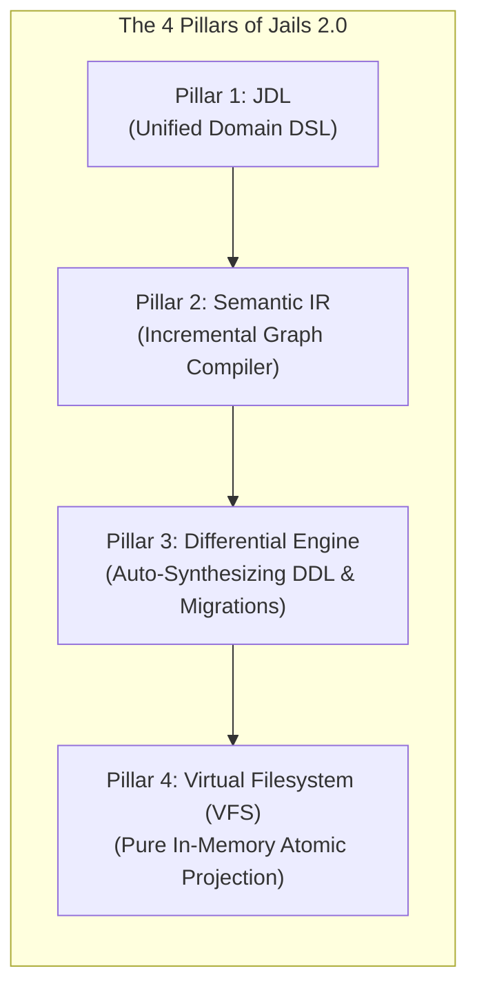
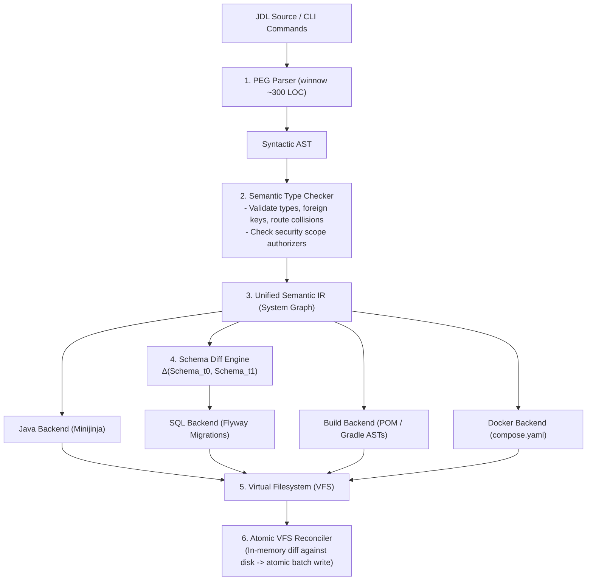
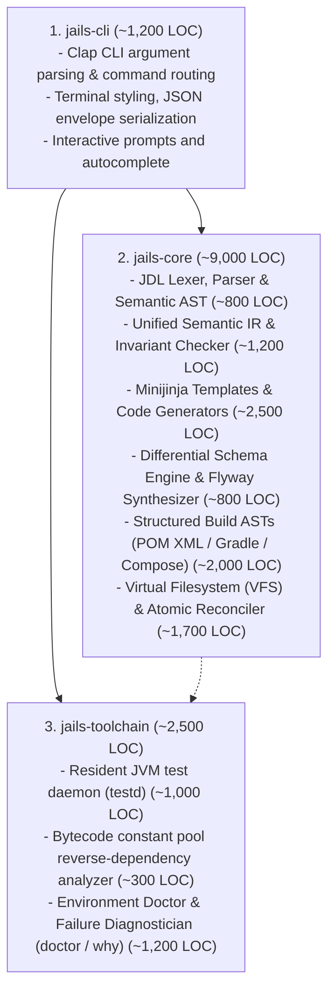
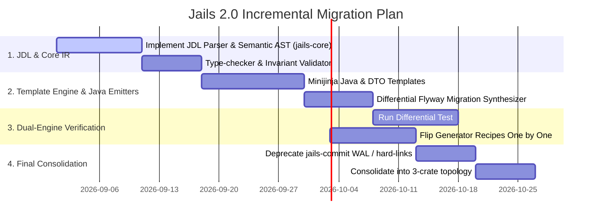

# The New Vision for Jails: The Executable Hexagon Compiler

> **Author**: Antigravity (Pair Programming / Systems Architect)  
> **Document**: `simplify-gemini.md`  
> **Core Thesis**: *Jails is not a file scaffolder or text splicer. Jails is a Deterministic Hexagonal Compiler that synthesizes the entire infrastructure shell from a pure domain metamodel.*  
> **Scale Shift**: **From 110,965 LOC across 13 crates $\longrightarrow$ ~12,000 LOC across 3 crates (89% reduction)**

---

## 1. The Philosophical Shift: Why the Current Architecture Fails

### 1.1 The "Rails 2004 Fallacy" in 2026
In 2004, Ruby on Rails invented `rails generate scaffold`. For dynamic, untyped Ruby with Active Record, string-interpolating template files into a project worked because:
- Models were dynamic classes with no compilation step.
- Active Record dynamically read table columns at runtime via SQL queries.
- Architecture was monolithic and 3-tier (Model-View-Controller).

Over the last two decades, enterprise backend development evolved:
- **JDK 21–27**: Strongly typed, compiled, immutable `record` types, pattern matching, sealed interfaces, and virtual threads.
- **Hexagonal Architecture (Ports & Adapters)**: Strict boundaries where the Domain Core has **zero framework dependencies**, while persistence, HTTP, Kafka, and security live in outer adapter shells.
- **Explicit Raw SQL (`JdbcClient`)**: No heavy ORM magic, no dynamic reflection, explicit Flyway migrations.

### 1.2 The Root Architectural Defect of Current `jails`
Current `jails` tried to implement a strict, modern 2026 Hexagonal Architecture using **2004 Rails-style file generation**:
1. It generates 10–15 distinct files per entity across multiple package layers (`domain`, `repository`, `adapter`, `controller`, `dto`, `test`, `migration`).
2. When the user edits those files, `jails` loses the ability to reason about them cleanly.
3. To compensate, `jails` built **110,000 lines of accidental infrastructure**:
   - A custom Git-like Object Store with SHA-256 domain hashes, Write-Ahead Logs, staging `.publish` inodes, and hard-linking engines ([`jails-commit`](crates/jails-commit/README.md)).
   - Brittle comment/string-masking parsers (`blanked()`) to surgically slice XML (`pom.xml`), Groovy (`build.gradle`), and Java source code without standard ASTs.
   - Procedural string-concatenation generators with thousands of lines of manual formatting, indentation, and import math ([`jails-generate`](crates/jails-generate/README.md)).
   - 13 segregated crates with complex cross-boundary ceremony ([`jails-protocol`](crates/jails-protocol/README.md), [`jails-prepare`](crates/jails-prepare/README.md), [`jails-engine`](crates/jails-engine/README.md)).

---

## 2. The New Vision: The "Executable Hexagon"

### 2.1 The Fundamental Insight
In Hexagonal Architecture, a backend service is divided into two fundamentally different hemispheres:

```mermaid
flowchart TD
    subgraph HEMISPHERE_1 ["1. The Domain Core (Human Creativity)"]
        DOMAIN["- Business Invariants & Rules\n- State Machine Transitions\n- Aggregate Root Records\n- Pure Domain Functions"]
    end

    subgraph HEMISPHERE_2 ["2. The Infrastructure Shell (Mathematical Projection)"]
        PORTS["- Repository Ports & JDBC Adapters (JdbcClient)\n- REST Controllers & DTOs\n- Flyway Database Migrations & Indexes\n- Transactional Outbox & Kafka Publishers\n- Testcontainers & MockMvc Suites\n- Docker Compose & Build Configs (POM/Gradle)"]
    end

    HEMISPHERE_1 ==>|f(Domain, Capabilities)| HEMISPHERE_2
```

1. **The Domain Core (Human)**: This is where true business value lives. It represents entity definitions, state transitions, validation invariants, and business logic.
2. **The Infrastructure Shell (Machine)**: This is **100% deterministic, mechanical boilerplate**. Given an entity and its constraints, the `JdbcClient` adapter, the Flyway migration, the DTO mappings, the controller routes, the transactional outbox, and the Testcontainers integration tests are **pure mathematical projections** of the domain model:

$$\text{Infrastructure Shell} = \mathcal{F}(\text{Domain Metamodel}, \text{Capabilities})$$

### 2.2 The "Zero-Splicing" Principle
Instead of treating generated code as mutable text files that need complex 3-way merges and surgical byte-splicing:
- **Clean Extension Seams**: Jails generates the complete infrastructure shell around typed Java extension seams (interfaces, composition, partial delegates).
- **Domain Independence**: The developer writes domain records and custom business logic. Jails synthesizes 100% of the adapters, migrations, and infrastructure plumbing.
- **Instant Recomputation**: When the domain metamodel changes, the compiler recomputes the entire infrastructure shell in **< 10 milliseconds**.

---

## 3. The 4 Pillars of the Simplified Architecture



---

### Pillar 1: JDL (Jails Definition Language) — The Unified Language of Backend Systems

Instead of configuring applications through a maze of CLI flags (`--on`, `--yields`, `--via`, `--consumes`, `--index`, `--select`, `--on-conflict`) and flat `[[generate]]` TOML arrays, the entire system is declared in **JDL**:

```jdl
// .jails/schema.jdl
project TicketDesk {
  package: "com.example.ticketdesk"
  java: 26
  boot: "4.1.0"
  capabilities: [db, api, security, kafka, redis, testkit]
}

enum Priority {
  LOW = "low"
  MEDIUM = "medium"
  HIGH = "high"
  URGENT = "urgent"
}

enum TicketStatus {
  OPEN
  IN_PROGRESS
  RESOLVED
  CLOSED
}

entity Ticket {
  id: uuid @pk
  title: string!(1..200)
  description: string?
  priority: Priority = MEDIUM @index
  status: TicketStatus = OPEN @index
  customerEmail: string! @unique(case: insensitive)
  assignedAgentId: uuid? @index
  version: long @version
  createdAt: instant @auto
  updatedAt: instant @auto

  // State Machine Transitions (Atomic Compare-And-Swap)
  transition assign(agentId: uuid!) from [OPEN, IN_PROGRESS] to IN_PROGRESS {
    guard: authenticated
    yields: TicketAssignedEvent
  }

  transition resolve(resolutionNotes: string!) from IN_PROGRESS to RESOLVED {
    yields: TicketResolvedEvent
  }

  // Filter Queries (Typed SQL projections)
  query findOpenByPriority(priority: Priority?, limit: int = 50) {
    where: status == OPEN and (priority is null or priority == :priority)
    orderBy: createdAt desc
  }

  query search(query: string!) {
    fulltext: [title, description]
    orderBy: rank desc
  }
}

event TicketResolvedEvent on Ticket {
  ticketId: uuid
  resolvedAt: instant
  customerEmail: string
}

sink WebhookNotifier on TicketResolvedEvent {
  endpoint: "https://hooks.example.com/tickets"
  retry: exponential(maxAttempts: 5, initialDelay: 1s)
  idempotencyKey: ticketId
}
```

#### Why JDL Changes Everything
- **One Grammar, Zero Drift**: CLI commands like `jails g scaffold Ticket id:uuid@pk` are literally desugared into JDL snippets and fed to the exact same parser.
- **Expressive State Machines & Workflows**: Complex backend concepts (transitions, outbox events, fulltext queries, webhook sinks) are first-class language constructs rather than awkward combinations of CLI parameters.
- **Instant Validation**: A 300-line PEG parser (`winnow`/`pest`) checks all type invariants, relation references, and constraint validity in a single pass.

---

### Pillar 2: The Semantic IR & Incremental Compiler Pipeline

Instead of 50 procedural generator scripts each string-concatenating Java code in imperative Rust, Jails becomes an **incremental query-based compiler**:



#### Replacing Procedural Rust with Declarative Minijinja Templates
Templates are pure, readable Java files with Jinja expressions.
Compare the old 1,607-line [`generate/repository.rs`](crates/jails-generate/src/generate/repository.rs) with the new **40-line template**:

```java
// templates/java/repository_port.java.jinja
package {{ project.package }}.{{ layout.repository }};

import java.util.List;
import java.util.Optional;
{{ entity.pk.import_statement }}
import {{ project.package }}.{{ layout.domain }}.{{ entity.name }};

/**
 * Storage port for {@link {{ entity.name }}}.
 * Pure hexagonal interface: no JDBC, in-memory testable.
 */
public interface {{ entity.name }}Repository {

    Optional<{{ entity.name }}> findById({{ entity.pk.java_type }} id);

    List<{{ entity.name }}> findAll();

    {{ entity.name }} save({{ entity.name }} {{ entity.name | lower_first }});

    boolean deleteById({{ entity.pk.java_type }} id);
}
```

The Rust driver code to render this becomes **15 lines**:
```rust
pub fn render_repository(ir: &SystemIR, entity: &EntityDef, env: &minijinja::Environment) -> Result<VfsTree> {
    let ctx = minijinja::context! { project => ir.project, entity => entity };
    let mut vfs = VfsTree::new();
    vfs.insert(ir.path_for(Layer::Repository, &format!("{}Repository.java", entity.name)), 
               env.render_template("java/repository_port.java.jinja", &ctx)?);
    vfs.insert(ir.path_for(Layer::Adapter, &format!("Jdbc{}Repository.java", entity.name)), 
               env.render_template("java/jdbc_adapter.java.jinja", &ctx)?);
    Ok(vfs)
}
```

---

### Pillar 3: Automatic Differential Schema Synthesis (Flyway Migrations)

Currently, Jails has 8 distinct manual evolution routes (`resource field add`, `rename`, `type`, `nullability`, `drop`, `index add`, `repair`, `revive`) that proceduralize SQL string building.

In Jails 2.0, database schema evolution is a **pure mathematical differential function**:
$$\Delta = \text{Diff}(\text{Schema}_{t-1}, \text{Schema}_t)$$

```rust
pub enum SchemaDiff {
    CreateTable(TableDef),
    DropTable(TableName),
    AddColumn { table: TableName, column: ColumnDef },
    DropColumn { table: TableName, column: ColumnName },
    AlterColumnType { table: TableName, column: ColumnName, from: SqlType, to: SqlType },
    SetNullability { table: TableName, column: ColumnName, nullable: bool, default: Option<String> },
    AddIndex(IndexDef),
    DropIndex(IndexName),
}
```

When you add a field `customerPhone: string?` to an entity in JDL:
1. `SchemaDiff` automatically produces: `AddColumn { table: "tickets", column: "customer_phone VARCHAR NULL" }`.
2. The SQL Backend automatically writes: `V002__add_customer_phone_to_tickets.sql`.
3. The companion query and usecase projections update automatically.
4. **Zero manual migration writing. Zero bespoke evolution routes.**

---

### Pillar 4: Virtual Filesystem (VFS) & Atomic In-Memory Reconciliation

Instead of a complex 25-step Write-Ahead Log with hard-linking inodes and persistent transaction state in `.jails/transactions/<id>/`:

1. **In-Memory Compilation**: Jails compiles the entire target project into an in-memory `VfsTree` (`Map<ProjectPath, FileContent>`) in **5–10ms**.
2. **True `--pretend` / `--diff` Parity**: Running `jails g ... --pretend` simply compares `VfsTree` against the working tree and prints the formatted diff with zero disk writes.
3. **Atomic Transactional Commit**:
   - If committing, changed files are staged into a standard temporary directory.
   - Files are moved into place atomically via OS renames.
   - The compiled AST hash is recorded in `.jails/schema.lock`.
4. **No Git-Like Object Store Needed**: Eliminates over 10,000 LOC of custom WAL and blob-management code.

---

## 4. The 3-Crate Architecture: From 13 Crates to 3

We collapse the 13-crate maze into **3 clean, decoupled crates**:



### Detailed Lines of Code Comparison

| Subsystem / Responsibility | Current Architecture | Proposed Jails 2.0 Architecture | Reduction |
| :--- | :--- | :--- | :--- |
| **Domain Protocol & Envelopes** | `jails-protocol` (18,000 LOC) | Merged into `jails-core/ir` (1,200 LOC) | **-93%** |
| **Java Code Generation** | `jails-generate` (28,000 LOC) | `jails-core/templates` (2,500 LOC) | **-91%** |
| **Planning & Preparation** | `jails-prepare` (12,000 LOC) | Merged into `VfsReconciler` (1,700 LOC) | **-85%** |
| **Route & Engine Orchestration** | `jails-engine` (10,000 LOC) | Merged into `jails-core/compiler` (800 LOC) | **-92%** |
| **Persistence, WAL & Journal** | `jails-commit` (6,000 LOC) | Atomic VFS staging (400 LOC) | **-93%** |
| **Build & Project Files** | `jails-project` (12,000 LOC) | Structured AST manipulators (2,000 LOC) | **-83%** |
| **Spec & Field Parsers** | `jails-spec` (4,000 LOC) | JDL PEG Parser (800 LOC) | **-80%** |
| **Test Daemon & Toolchain** | `jails-drive` (8,000 LOC) | `jails-toolchain` (1,300 LOC) | **-83%** |
| **Diagnostics & Reporting** | `jails-report` (6,500 LOC) | `jails-toolchain/doctor` (1,200 LOC) | **-81%** |
| **CLI & Entrypoint** | `src/` (6,400 LOC) | `jails-cli` (1,200 LOC) | **-81%** |
| **TOTAL** | **110,965 LOC (13 crates)** | **~12,700 LOC (3 crates)** | **-89%** |

---

## 5. The Developer Experience: Before vs. After

### Scenario: Creating an Order Aggregate with an Assignee, Priority, and State Transition

#### The Old Way (Imperative Fragmented CLI)
```bash
# 1. Generate scaffold with complex CLI flags
jails g scaffold Order id:uuid@pk total:decimal@positive status:OrderStatus customerEmail:string! --index "customer_email"

# 2. Generate transition with separate command & flags
jails g transition PayOrder --on Order --select id --yields OrderPaidEvent

# 3. Add outbox delivery sink manually
jails g http-sink OrderPaidSink --on OrderPaidEvent

# 4. Generate companion query
jails g query OrdersByCustomer customerEmail:string --on Order --order-by "created_at desc"
```
*Result*: 4 separate transaction cycles, multiple ledger updates, 12 files created, potential drift if flags disagree.

#### The New Way (Declarative JDL & Instant Compilation)
Add or edit the aggregate in `schema.jdl`:
```jdl
entity Order {
  id: uuid @pk
  total: decimal @positive
  status: OrderStatus = CREATED @index
  customerEmail: string! @index
  
  transition pay() from CREATED to PAID {
    yields: OrderPaidEvent
  }

  query byCustomer(customerEmail: string!) {
    where: customerEmail == :customerEmail
    orderBy: createdAt desc
  }
}

sink OrderPaidSink on OrderPaidEvent {
  endpoint: "https://payments.example.com/webhooks"
}
```
Run:
```bash
jails apply
```
*Result*: In **8 milliseconds**, `jails` parses JDL, type-checks the graph, diffs the schema, synthesizes `V001__create_orders.sql`, emits the immutable records, raw `JdbcClient` repositories, REST controllers, DTOs, outbox event publishers, and Testcontainers integration tests, and verifies the build.

---

## 6. Zero-Risk Migration Plan (The Strangler Fig Protocol)

We do not tear down the codebase in a single massive rewrite. We use the existing **310+ E2E CLI tests and 162+ golden file snapshots** as our immutable verification oracle:



1. **Step 1**: Build `jails-core` containing the JDL parser, AST, and Minijinja templates side-by-side with existing crates.
2. **Step 2**: Add a differential test assertion in `tests/golden.rs`: assert that the new Minijinja generator produces byte-for-byte identical output to the legacy generator.
3. **Step 3**: Migrate recipes incrementally (`enum` $\to$ `record` $\to$ `repo` $\to$ `controller` $\to$ `scaffold` $\to$ `capabilities`), verifying `cargo test --workspace` stays green at every single commit.
4. **Step 4**: Replace the manual evolution routes with the deterministic `SchemaDiff` engine.
5. **Step 5**: Deprecate the legacy WAL and fold the 13 crates into the 3-crate layout.

---

## 7. Summary

The New Vision transforms `jails` from an **over-engineered, 110k-line procedural text splicer** into an **elegant, ultra-fast, 12k-line Hexagonal System Compiler**:

1. **Declarative Modeling (JDL)** replaces fragmented CLI flags and fragile TOML tables.
2. **Deterministic Mathematical Projections** replace manual procedural Rust string assembly.
3. **Automatic Schema Diffing** replaces 8 bespoke migration commands.
4. **In-Memory Virtual Filesystem** replaces a 25-step Write-Ahead Log and hardlink object store.
5. **A 3-Crate Topology** cuts the codebase by **89%**, delivering unprecedented velocity, safety, and elegance.
