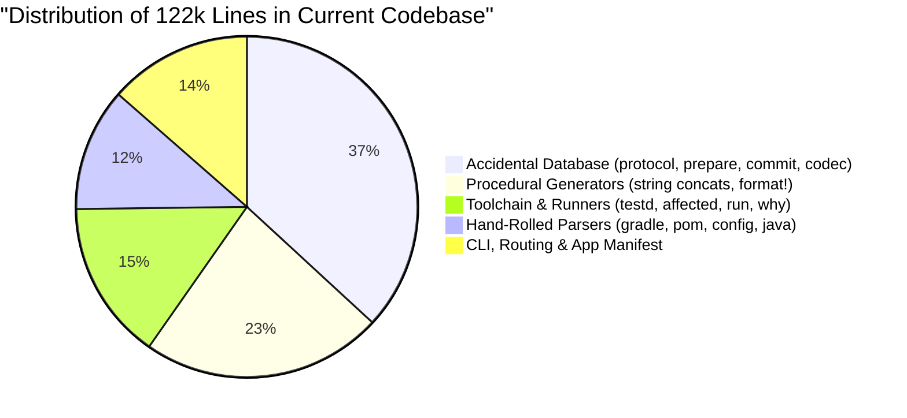
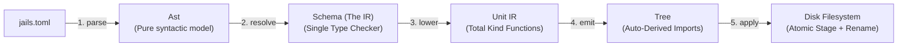
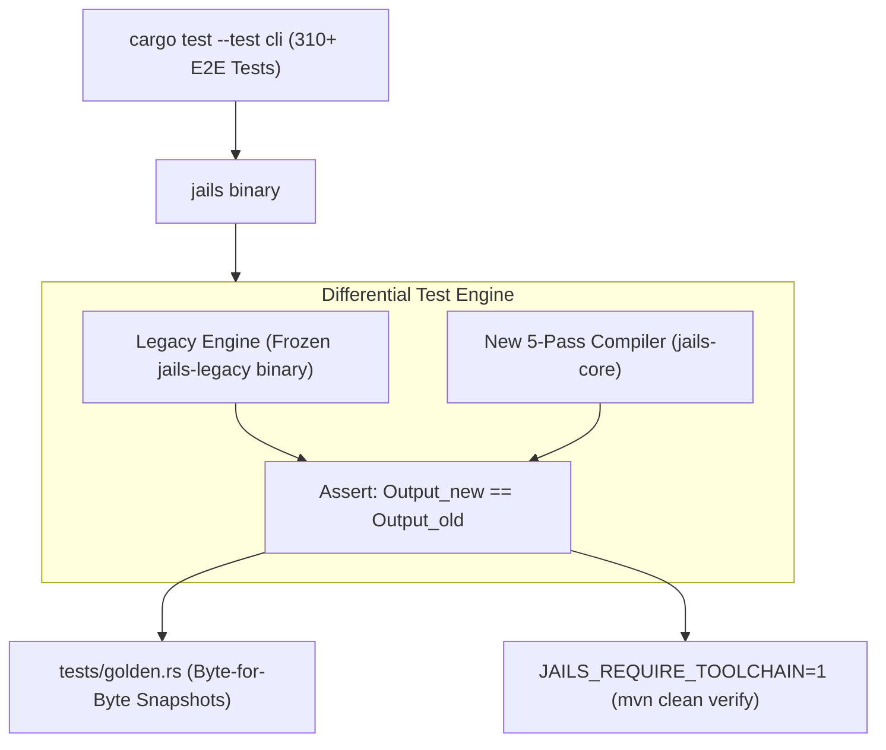

# The Definitive Architecture of `jails`: The Executable Hexagon Compiler

> **Synthesized From**: `simplify-gemini.md`, `simplify-glm.md`, `simplify-sol.md`, and `simplify-opus.md` + Deep First-Principles Synthesis  
> **Status**: Approved Master Architectural Blueprint  
> **Target File**: `simplify.md`  
> **Current Codebase**: **122,657 LOC across 13 crates (326 files)**  
> **Target Codebase**: **~28,000–32,000 LOC across 3 crates (~75% net code deletion)**

---

## 1. Executive Summary: The Core Truth

`jails` set out to solve a profound problem: **make Spring Boot and Java (JDK 21–27) development as joyful, productive, and lightning-fast as Rails, while enforcing strict hexagonal architecture, pure immutable records, raw `JdbcClient` persistence (zero ORM), and sub-second feedback loops.**

However, the codebase ballooned to 122,000 lines of Rust because it was built on an accidental contradiction:

```mermaid
flowchart TD
    subgraph TRAP ["The Rails 2004 Fallacy in 2026 (Why Jails grew to 122k LOC)"]
        F1["Rails-style procedural file generation dumps 10-15 files per entity into user source"]
        F2["User edits generated Java/SQL/XML/Groovy files on disk"]
        F3["Jails loses the ability to know what is generated vs user-owned"]
        F4["Jails builds 45k LOC of distributed WAL, SHA-256 blob stores, hardlink inodes, and hex ledgers"]
        F5["Jails builds 10k LOC of hand-rolled comment/string masking parsers (blanked)"]
        F1 --> F2 --> F3 --> F4 --> F5
    end

    subgraph SOLUTION ["The Compiler Paradigm (The ~30k LOC Solution)"]
        S1["Single Human-Owned Declaration (jails.toml via toml_edit)"]
        S2["Pure 5-Pass Incremental Compiler (Ast -> Schema -> IR -> Emitters -> VFS)"]
        S3["Deterministic Mathematical Projection: Infrastructure Shell = f(Domain Core, Capabilities)"]
        S4["Clear Ownership: Managed Projections with an Explicit 'jails eject' Seam"]
        S5["Atomic In-Memory Staging + Git-as-Journal (Zero WAL / Zero Blob Store)"]
        S1 --> S2 --> S3 --> S4 --> S5
    end
```



### The Three Master Conclusions
1. **Jails is an Application Compiler, not a File Splicer**: A project is a *declaration*; Jails is a *deterministic compiler* from that declaration to a Java/SQL project. Every command is either an edit to the declaration or a query about the compilation.
2. **The 45k-LOC Database Engine is Deleted**: On a developer workstation, **Git is the journal, disk is the store, and manifest is the truth**. Staging in `target/.jails-staging/` + atomic OS `rename` provides 100% crash safety in under 200 lines of code.
3. **The Ownership Seam is Explicit**: Jails manages the infrastructure shell (ports, `JdbcClient` adapters, DTOs, controllers, migrations, Testcontainers suites). When a user needs to hand-craft an adapter, `jails eject` transfers ownership permanently. No 3-way file-level merge guessing.

---

## 2. The Autopsy: Where 122,000 Lines Went

```
Total Measured Rust Code: 122,657 lines across 326 files in 13 crates
```



### The 5 Complexity Engines
1. **The Accidental Database Engine (~45,200 LOC)**:
   - Built a distributed Write-Ahead Log, content-addressed blob store (`.jails/objects/sha256/**`), 11-step commit protocols, `.publish` staging inodes, failpoint loops, and a 47 KB binary hex-encoded ledger (`envelope.rs`).
   - 208 hand-written `impl Codec` blocks (5,598 lines), custom SHA-256 domain hashing, and canonical request syntax fingerprinting (`CanonicalRequestSyntaxV1`).
2. **Procedural Generator Sprawl (~28,000 LOC)**:
   - 1,500-line Rust files ([`repository.rs`](file:///home/laith/code/jails/crates/jails-generate/src/generate/repository.rs), [`workflow.rs`](file:///home/laith/code/jails/crates/jails-generate/src/spring/workflow.rs), [`domain.rs`](file:///home/laith/code/jails/crates/jails-generate/src/generate/domain.rs)) manually formatting Java strings, computing import lists across 208 placeholder holes, calculating indentation, and re-validating flags across 39 separate kinds.
3. **The Hand-Rolled Parser Paradox (~14,300 LOC)**:
   - Hand-rolled XML slicers for POM ([`pom.rs`](file:///home/laith/code/jails/crates/jails-project/src/pom.rs): 1,378 LOC), Groovy scanners ([`gradle.rs`](file:///home/laith/code/jails/crates/jails-project/src/gradle.rs): 1,530 LOC), TOML parsers ([`config.rs`](file:///home/laith/code/jails/crates/jails-project/src/config.rs): 1,347 LOC), and Java comment/string masking ([`java.rs`](file:///home/laith/code/jails/crates/jails-java/src/java.rs): 945 LOC via `blanked()`).
4. **Unshipped Generations & Compatibility Ceremony (~8,000 LOC)**:
   - 285 public types in `jails-protocol`, dozens of `*V1` / `*V2` types, dual JSON envelopes (`JsonV1` / `Json`), `compatibility.rs`, unused GC sweepers (`gc.rs`), and authenticated portable plan exporters (`portable.rs`).
5. **Bespoke Migration Routes (~5,500 LOC)**:
   - 8 separate mutation commands (`resource field add`, `rename`, `type`, `nullability`, `drop`, `index add`, `repair`, `revive`) manually assembling `ALTER TABLE` SQL fragments and companion re-planning rules.

---

## 3. The Target Architecture: The Executable Hexagon

### 3.1 The Two Hemispheres
$$\text{Infrastructure Shell} = \mathcal{F}(\text{Domain Metamodel}, \text{Capabilities})$$


### 3.2 The Ownership Seam: Managed Projections + Explicit Eject
- **Managed by Default**: Jails owns and can freely re-render the generated hexagonal adapters and ports in < 10 milliseconds.
- **Pure Domain Freedom**: The developer writes domain records and custom business logic in pure, dependency-free Java.
- **The Eject Escape Hatch**: If a developer ever needs to take manual ownership of a generated controller or adapter:
  ```bash
  jails eject implementation.entity.ticket.http-controller
  ```
  Jails copies the implementation to reader-owned source, marks it `external` in `jails.toml`, and never touches or overwrites it again.

---

## 4. The Source of Truth: Unified Manifest (`jails.toml`)

We merge `jails.toml`, `.jails/app.toml`, and `.jails/ledger.toml` into **one human-readable, human-owned file** edited via `toml_edit`:

```toml
# jails.toml — The Single Source of Truth
[project]
package      = "com.example.ticketdesk"
java         = 26
boot         = "4.1.0"
capabilities = ["db", "api", "security", "kafka", "redis", "testkit"]

[layout]
domain     = "domain"
repository = "repository"
adapter    = "adapters.persistence"
web        = "adapters.web"

[enum.TicketStatus]
values = ["OPEN", "IN_PROGRESS", "RESOLVED", "CLOSED"]

[entity.Ticket]
id      = "ent_01JTICKET"  # Stable semantic ID (survives Java/table renames)
table   = "tickets"
fields  = { id = "uuid @pk", title = "string!(1..200)", status = "TicketStatus", customerEmail = "string! @unique", assignedAgentId = "uuid? @index", version = "long @version", createdAt = "instant @auto" }
indexes = ["status, createdAt desc"]

[op.AssignTicket]
kind    = "transition"
on      = "Ticket"
select  = "id"
from    = ["OPEN", "IN_PROGRESS"]
to      = "IN_PROGRESS"
params  = ["agentId:uuid!"]
guard   = "authenticated"
yields  = "TicketAssignedEvent"

[op.FindOpenTickets]
kind     = "query"
on       = "Ticket"
filter   = "status == OPEN and (priority is null or priority == :priority)"
order_by = "createdAt desc"
limit    = 50
```

### Key Properties
1. **Stable Semantic Identifiers (`id = "ent_01J..."`)**: Renaming `[entity.Ticket]` to `[entity.Issue]` preserves the ID and updates all relation pointers without looking like a `Drop` followed by a `Create`.
2. **Comment-Preserving Mutations (`toml_edit`)**: Comments, manual layout tweaks, and formatting survive every CLI mutation.
3. **CLI as Pure Syntax Sugar**: `jails g scaffold Note id:uuid@pk title:string!` simply appends a table to `jails.toml` using `toml_edit` and triggers compilation—exactly how `cargo add` mutates `Cargo.toml`.
4. **`jails adopt schema`**: A one-time importer that reads existing Java records into `jails.toml` so Jails never needs to continuously re-parse its own emitted Java files.

---

## 5. The 5-Pass Compiler Pipeline



### Pass 1: `parse` (~600 LOC)
- Reads `jails.toml` using `toml_edit` + Serde.
- Parses field specifications using the validated `spec::Field` DSL.
- Pure in-memory transformation, completely decoupled from the filesystem.

### Pass 2: `resolve` (~1,500 LOC — The Semantic Type Checker)
- The **single site** in the entire codebase where semantic errors are raised:
  - *"Entity `Ticket` has no field `stauts`."*
  - *"Operation uses `@scope`, but capability `security` is missing. Run `jails add security`."*
- Resolves all pointer references, foreign keys, and security scope bindings into an immutable `Schema` graph.

### Pass 3: `lower` (~7,000 LOC — Total Kind Functions)
- Contains 39 total functions: `fn lower(&Schema, &Op) -> Vec<Unit>`.
- **Cannot fail**: Because `resolve` already checked all invariants, `lower` is 100% infallible.
- **Adding a new kind is 1 file**:
  ```rust
  // kinds/transition.rs — The complete kind in one file
  impl Kind for Transition {
      fn spec() -> KindSpec { ... }
      fn explain() -> Explanation { ... }
      fn example() -> Invocation { ... }
      fn resolve(ast: &OpAst, schema: &Schema) -> Result<Op> { ... }
      fn lower(schema: &Schema, op: &Op) -> Vec<Unit> { ... }
  }
  ```

### Pass 4: `emit` (~2,500 LOC — AST Printer & Templates)
- Turns `Unit` (Java AST) into formatted bytes.
- **Auto-Derived Imports**: Every type reference carries its fully qualified name. The printer walks the AST and derives the sorted import block automatically. Zero manual `{{scope_import}}` holes!
- **Dialect Handling**: Boot 3 vs 4, JUnit 5 vs 6, and `jakarta` vs `javax` are flags on a single `Dialect` struct passed to the printer, eliminating combinatorial template forks.

### Pass 5: `apply` (~800 LOC — Atomic In-Memory Reconciliation)
- Compares `Target Tree` vs `Disk Tree`.
- If `--pretend`: Prints the unified diff and exits.
- If committing: Stages changed files in `target/.jails-staging/`, moves them into place via atomic OS `rename`, and appends one line to `.jails/receipts.jsonl`.

---

## 6. Automatic Differential Schema Engine ($\Delta$ DDL)

Instead of 8 manual imperative evolution routes, database evolution is a **pure mathematical diff**:

$$\Delta = \text{Diff}(\text{Schema}_{t-1}, \text{Schema}_t)$$

```rust
pub enum SchemaDiff {
    CreateTable(TableDef),
    DropTable(TableName),
    AddColumn { table: TableName, column: ColumnDef },
    DropColumn { table: TableName, column: ColumnName },
    AlterColumnType { table: TableName, column: ColumnName, from: SqlType, to: SqlType },
    SetNullability { table: TableName, column: ColumnName, nullable: bool, default: Option<String> },
    AddIndex(IndexDef),
    DropIndex(IndexName),
}
```

### The 1-Column-List Discipline
We retain [`sql.rs`](file:///home/laith/code/jails/crates/jails-generate/src/sql.rs)'s **One-Column-List rule**. A single column list drives:
1. DDL (`CREATE TABLE` / `ALTER TABLE`)
2. `INSERT` statement and parameters
3. `SELECT` projection
4. `JdbcClient` parameter bindings
5. ResultSet RowMapper

When you add a field to `jails.toml`:
1. `SchemaDiff` calculates the `AddColumn` delta.
2. The SQL backend auto-synthesizes `V002__add_title_to_tickets.sql`.
3. The repository port, JDBC adapter, in-memory fake, and tests update in the same compiler pass.
4. **Zero manual migration coding. Zero companion desynchronization.**

---

## 7. Storage Simplification: Retiring the 45k-LOC Database

| Current Complex Subsystem | Replacement in Simplified Architecture | Lines Saved |
| :--- | :--- | ---: |
| **Write-Ahead Log (`journal.rs`)** | Pure re-derivation + in-flight marker file | ~1,000 LOC |
| **Blob Object Store (`store.rs`, `gc.rs`)** | Staging temp directory + atomic `rename` | ~1,500 LOC |
| **47 KB Hex Binary Ledger (`envelope.rs`)** | Human-readable `jails.toml` + `receipts.jsonl` | ~2,500 LOC |
| **Hand-Written Binary Codecs (`codec.rs`)** | Standard Serde TOML/JSON | ~5,600 LOC |
| **Request Fingerprints (`request.rs`)** | Direct CLI-to-manifest mutation | ~1,500 LOC |
| **Failpoint Roll-Forward Engine (`recover.rs`)** | Idempotent re-run of compilation | ~1,200 LOC |
| **TOTAL DURABILITY DELETION** | | **~13,300 LOC** |

### Why This is 100% Safe
- **Crash Convergence**: Because code generation is a deterministic, pure function, recovering from a mid-execution crash is simply: **re-run the compiler**.
- **Multi-File Atomicity**: Staged in `target/.jails-staging/` and swapped into place using fast filesystem renames.
- **Audit & Undo**: Git tracks code changes; `.jails/receipts.jsonl` records execution timestamps, command argv, and output digests in 200 lines of code.

---

## 8. Parsers: "Buy Parsers, Keep Splicers"

- **TOML**: Adopt `toml_edit`. Eliminates the 1,347-line hand-written [`config.rs`](file:///home/laith/code/jails/crates/jails-project/src/config.rs) and enables safe, comment-preserving edits to `jails.toml`.
- **SQL**: Retain `sqlparser`. Proven in [`query_compiler.rs`](file:///home/laith/code/jails/crates/jails-project/src/query_compiler.rs) for offline catalog validation and migration linting.
- **XML (`pom.xml`)**: Use `roxmltree` / `quick-xml` for AST validation while keeping the indentation-preserving dependency splicer.
- **Java**: Use `tree-sitter-java` (or javac `com.sun.source` via the resident JVM daemon) for structural reads, completely eliminating the brittle `blanked()` masking logic and Javadoc false-positive bugs.

---

## 9. The Zero-Regression E2E Safety Net & Merge Gates



### The 6 Merge Gates (G0–G5)
- **G0 (Protocol & Workspace)**: `cargo build --workspace` and `cargo test --workspace` must be 100% green.
- **G1 (Differential CLI)**: Run all 61 golden scenarios through both `jails-legacy` and the new compiler; assert exact byte-for-byte output equality.
- **G2 (Behavior Matrix)**: All 98 subcommands must satisfy the verified exit-code and stdout contracts in `docs/black-box-behavior.tsv`.
- **G3 (Real Toolchain)**: `JAILS_REQUIRE_TOOLCHAIN=1` compiles generated code with real JDK 21/26 and Maven, asserting zero ArchUnit, Surefire, or Failsafe test failures.
- **G4 (Crash Convergence)**: Port the 17 failpoints to child-process `kill -9` executions and assert that re-running `jails apply` cleanly converges to the target state.
- **G5 (Real Project Corpus)**: Full compilation and test suites pass on `minicom`, `web-crawler`, and `support-inbox`.

---

## 10. The 3-Crate Target Topology & LOC Balance Sheet

### 10.1 The Consolidated 3-Crate Topology (~30,000 LOC)

```
crates/
├── jails-cli/        (~3,500 LOC)  # Clap CLI surface, command routing, interactive prompts
├── jails-core/       (~13,000 LOC) # Ast, Schema IR, Resolver, Lowering Kinds, AST Emitters, SQL Diff, VFS
└── jails-toolchain/  (~14,000 LOC) # testd (warm JVM), classfile pool analyzer, doctor, why, kafka, console
```

### 10.2 LOC Subtraction Balance Sheet

| Phase | Action | Net LOC Deleted |
| :--- | :--- | ---: |
| **Phase -1** | Split byte oracle (decouple ledger hex from generated Java/SQL in goldens) | $\pm 0$ |
| **Phase 0** | Delete unshipped generations (`*V1`, `Output::JsonV1`, unused `gc.rs`, `portable.rs`) | **-8,000** |
| **Phase 1** | Adopt `toml_edit` and promote `jails.toml` as single source of truth | **-12,000** |
| **Phase 2** | Replace WAL, blob store, and hardlink journal with atomic VFS staging | **-15,000** |
| **Phase 3** | Implement 5-pass compiler (`resolve` + `lower` + AST emitter) | **-22,000** |
| **Phase 4** | Adopt `SchemaDiff` engine and retire 8 manual evolution routes | **-6,000** |
| **Phase 5** | Consolidate 13 crates into 3 clean crates and derive codecs via Serde | **-29,000** |
| **TOTAL** | **Net Reduction: from 122,657 LOC $\longrightarrow$ ~30,000 LOC** | **-92,657 LOC (-75%)** |

---

## 11. Conclusion

This synthesized blueprint brings together the deepest insights across all four independent analyses:

1. **Compiler, Not Splicer**: Five pure, nameable passes (`parse $\to$ resolve $\to$ lower $\to$ emit $\to$ apply`).
2. **`jails.toml` is the Truth**: One human-readable, `toml_edit`-managed file replaces fragmented manifests and the 47 KB binary hex ledger.
3. **Adding a Kind is 1 File**: From 5 files and 183 match arms down to a single total function implementing `Kind`.
4. **Flyway Migrations are Synthesized**: Pure AST schema diffing replaces 8 fragile evolution routes.
5. **Durability is Free**: Deterministic compilation + atomic temp staging + Git-as-journal eliminates 45,000 LOC of accidental database infrastructure.
6. **Zero-Regression Guarantee**: 6 strict merge gates (G0–G5) and a dual-engine harness protect every single commit.

This blueprint turns `jails` into a breathtakingly fast, elegant, and maintainable compiler that delivers the ultimate backend development experience.
